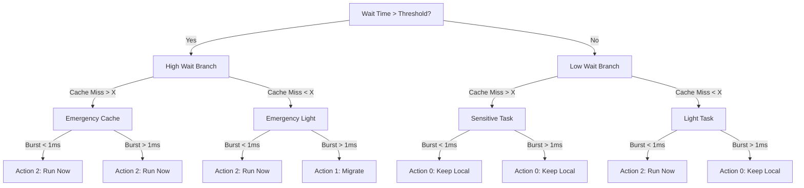

# SCX_RDTAI: Real-time Decision Tree AI Scheduler

`scx_rdtai` is an advanced experimental scheduler built on the `sched_ext` framework. It utilizes a **Hybrid AI Architecture** where a high-level user-space controller (the "Brain" in Rust) continuously optimizes scheduling policies and updates a Q-Table, while a low-level kernel-space engine (the "Muscle" in BPF) executes millisecond-to-nanosecond scale scheduling decisions via a dynamic multi-level Decision Tree.

---

## 1. Core Architecture

The scheduler is divided into two primary execution planes:

```mermaid
graph LR
    subgraph User Space (Rust Brain)
        Tuner[RL Tuner & Optimizer] -->|Saves/Loads| QTableBin[Q-Table file: /var/lib/scx_rdtai_qtable.bin]
        Tuner -->|Pushes Policies| QMap[BPF Q-Table Map]
    end
    subgraph Kernel Space (BPF Muscle)
        QMap -->|Lookup| DecisionTree[4-Level Decision Tree]
        TaskEvent[Task Enqueue/Wakeup] -->|Telemetry| DecisionTree
        DecisionTree -->|Action Output| DSQ[Dispatch Queues]
    end
```

### A. The BPF Kernel Engine (Muscle)
* Runs entirely within the Linux kernel using eBPF `struct_ops`.
* Intercepts task lifecycle hooks (enqueue, dequeue, dispatch, tick, etc.).
* Evaluates real-time telemetry metrics per-task and walks the Decision Tree in nanoseconds to choose execution targets.

### B. The Rust Controller (Brain)
* Runs as a user-space daemon.
* Periodically pulls performance statistics and state-action rewards from the BPF maps.
* Updates the **Q-Table** using reinforcement learning (Q-Learning / SARSA principles) and pushes the updated actions back into the BPF map.
* Persists the learned policy to `/var/lib/scx_rdtai_qtable.bin` between runs.

---

## 2. Real-time Telemetry Metrics

To route tasks intelligently, BPF tracks three primary hardware and runtime metrics:

| Metric | Target Measurement | Optimization Goal |
|---|---|---|
| **Wait Time (ns)** | How long a runnable task has been waiting in a queue. | **Starvation Prevention:** Pushes long-waiting tasks into higher priority bands to avoid stutter. |
| **Cache Misses** | Integrated with the Hardware Performance Monitoring Unit (PMU). | **Locality Protection:** Keeps cache-heavy/sensitive tasks on the same CPU to prevent cache thrashing. |
| **Burst Time (ns)** | Active execution time slice duration before yielding. | **Workload Type Profiling:** Distinguishes interactive tasks (short bursts) from batch tasks (long bursts). |

---

## 3. The 4-Level Decision Tree

When a task requires scheduling, the BPF component performs a **Tree Walk** based on the current telemetry bounds:



### Tree Output Actions:
* **Action 0 (Keep Local):** Prioritizes cache locality. Dispatches the task to the same CPU/core where it ran last, leveraging warm L1/L2 caches.
* **Action 1 (Migrate):** Prioritizes load balancing. Moves the task to a sibling CPU or another domain/NUMA node to prevent hot-spotting.
* **Action 2 (Run Now):** Prioritizes responsiveness. Bypasses normal queues to run the task immediately, maximizing interactivity.

---

## 4. Reinforcement Learning & Q-Table

The user-space tuner employs a Reinforcement Learning model to dynamically adapt scheduling choices.

* **State Space:** Telemetry metrics are quantized into a state index representing a combination of (Wait Time bucket, Cache Miss category, Burst Time profile).
* **Action Space:** The 3 actions corresponding to the Decision Tree leaves (Keep Local, Migrate, Run Now).
* **Reward Function:** Evaluated every execution cycle, checking for task completion latency, load imbalance, and CPU execution efficiency.
* **Q-Table Persistence:** The learned values are stored in `/var/lib/scx_rdtai_qtable.bin`. This allows the scheduler to boot with previous knowledge instead of learning from scratch every time.

---

## 5. How to Run

Because `scx_rdtai` loads BPF code directly into the kernel, it must be run with **root privileges** (`sudo`).

### Run via Cargo (Development)
```bash
# Debug build
sudo cargo run --bin scx_rdtai

# Optimized release build (Recommended for performance testing)
sudo cargo run --release --bin scx_rdtai
```

### Run the Compiled Binary (Production)
```bash
# Debug version
sudo ./target/debug/scx_rdtai

# Release version
sudo ./target/release/scx_rdtai
```

---

## 6. How to Monitor & View Real-Time Decisions

### A. Trace Decisions per Thread
To inspect what the Decision Tree is doing to each individual task in real-time, launch the scheduler in **verbose mode (`-vv`)**:
```bash
sudo ./target/release/scx_rdtai -vv
```
Then, in a separate terminal, read the kernel debug trace pipe:
```bash
sudo cat /sys/kernel/debug/tracing/trace_pipe | grep rdtai
```
*Example Output:*
```text
rdtai: task gcc[410292] TA: 2 (State: 11, wait: 20045, burst: 1500, cache: 3)
rdtai: task vscode[410310] TA: 0 (State: 3, wait: 120, burst: 98000, cache: 94)
```

### B. Global Stats Monitor
To see overall scheduler health, load migration counts, and queue statistics, run in monitor mode:
```bash
sudo ./target/release/scx_rdtai --monitor 1
```
*(Shows updates every 1 second).*
