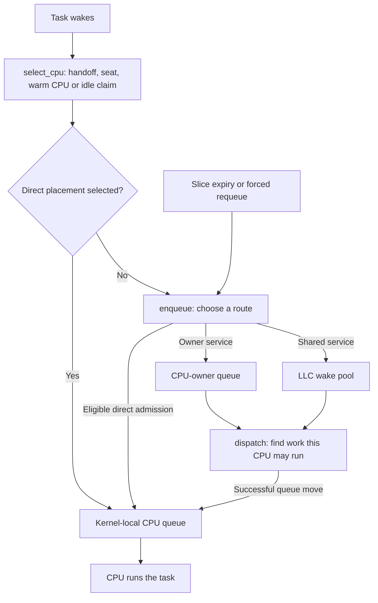
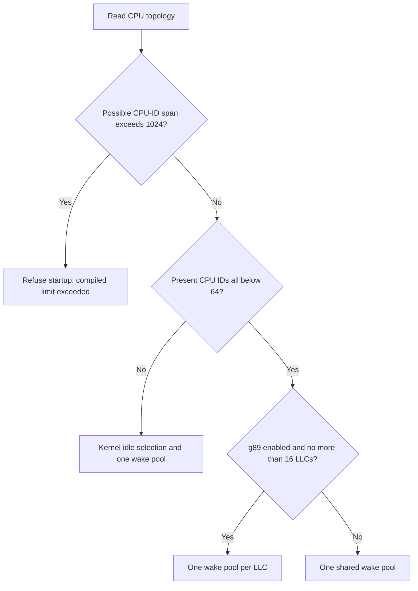

# scx_cake design

This document describes the scheduling policy in this checkout.
See [README.md](./README.md) for commands, flags and toggle defaults.
Historical experiments in `STATE.md` may describe different behavior.

## The basic idea

Cake tries to serve waiting tasks promptly without moving them away from useful
cache data unnecessarily. It uses task activity, CPU availability and hardware
topology. It does not identify games by name.

A **CPU** here is a logical CPU. **SMT siblings** share a physical core.
An **LLC** is a last-level cache shared by a group of CPUs.
A **DSQ** is a dispatch queue provided by `sched_ext`.

Cake uses three kinds of queue:

| Queue | Purpose |
|---|---|
| Kernel-local queue | Work admitted directly to a particular CPU, or moved there by dispatch |
| CPU-owner queue | Work associated with one CPU; other eligible CPUs can steal it |
| LLC wake pool | Shared work that CPUs near the same cache can serve |

The default is one wake pool per LLC when the topology fits. Hardware fallbacks
and `g89=0` use one shared wake pool.

## Where work goes

The diagram shows possible routes. It groups decisions rather than showing
every condition in the callbacks. Affinity restrictions apply throughout.



### CPU selection

Selection considers an eligible serial handoff, a returning stage task's seat,
a cache-warm home CPU, and other idle CPUs.

- A serial handoff can keep communicating tasks together when the local queues
  are empty and the current task is expected to yield soon.
- A **seat** associates a pipeline-stage task with a logical CPU. A returning
  holder can displace an eligible non-stage occupant. It cannot displace every
  class of task or override affinity.
- Warm placement preserves useful cache data when the CPU is eligible.
- Other choices prefer whole idle cores, suitable unheld seats, cleaner
  interrupt targets and platform core rankings.

A **stage task** has an estimated mean burst of at least 64 microseconds.
This is an activity classification, not recognition of a game or render thread.
Task storage keeps placement history. A seat is neither an exclusive reservation
nor ownership of both SMT siblings.

An idle-mask snapshot is only a candidate list. A successful atomic idle claim
establishes idle admission. Serial handoffs and seat retakes have their own
eligibility rules and can place behind a current occupant.

### Enqueue

If selection did not insert the task directly, enqueue handles it:

- Kernel-thread wakes can use direct local admission. An unpinned kernel-thread
  wake with no idle target can use the pool when `g86=1`.
- Unpinned wakes whose estimated mean wait exceeds twice their mean CPU burst
  normally enter the pool. A wake racing with its own switch-out stays in its
  owner queue. The comparison uses quantized lifetime counters.
- A wake behind a well-served occupant can try direct idle admission, then
  fall back to the pool.
- Forced requeues and displaced seat occupants can enter a pool.
- Ordinary continuations stay in their owner queue. Pinned tasks remain
  restricted to their allowed CPU.

Notifications can kick an eligible CPU or request preemption.
A kick does not guarantee that a task starts immediately.

### Dispatch

Dispatch first tries an offered task from another LLC. It then considers the
CPU-owner queue and local wake pool. Virtual runtime and how long the pool has
gone unserved determine which is tried first; a failed move can try the other.

A held seat with an empty owner queue may defer service to another eligible,
idle, unheld CPU on the same LLC. Overdue pool work can override this deferral.

If local service fails, Cake can forward a kick to an eligible CPU, steal from
other owner queues and check other LLC pools. If no work is found, a runnable
previous task may receive a renewed slice. Only a successful queue move proves
that dispatch consumed work; counts, marks and peeks are advisory.

## Hardware discovery and fallbacks

The loader reads possible/present CPU IDs, online topology, SMT siblings and
LLC membership at startup. The build does not bake in its host's topology.



CPU-ID span is different from online CPU count: sparse numbering and possible
offline CPUs can increase the span. Wide present-ID layouts disable the narrow
claim, seat and per-LLC pool paths. Cache-aware steal tables cover CPU IDs below
128; wider layouts use the generic ring walk.

Core rankings use complete capacity data, then available complete preferred-core
hints. Missing information does not rank unknown cores below known ones.
Rankings are preferences, not measured speed ratios. Advertised maximum frequency
is reporting information. Narrow placement can use these rankings; wide
placement retains the kernel fallback.

`llcsplit=1` is a test scaffold. It divides the host's core IDs into two groups
while keeping SMT siblings together. It changes the topology given to the
policy, not the hardware or the cost of communicating between caches.

## Interrupt-aware placement

Cake prefers CPUs with less interrupt work, while keeping noisy CPUs usable
when suitable cleaner capacity is unavailable.

| Signal | How Cake obtains it |
|---|---|
| Sustained interrupt load | Sample handler-time shares at a 1–16 second interval |
| A handler running now | Paired IRQ/softirq entry and exit hooks track depth |
| An imminent timer tick | Compare tick information with a usable startup wake-hop estimate |

These are placement hints. They cannot guarantee an interrupt-free run.
The loader attaches each exit hook before its matching entry hook and handles
partial attachment failures.

## CPU time and fairness

Virtual runtime tracks charged CPU service using reciprocal nice-level weights.
Wake keys and a shared frontier order service; a peer check limits unusual
frontier advances. This does not mean tasks always run in strict global
virtual-runtime order.

For the adaptive task slice, all times below are in nanoseconds:

```text
runtime = task's accumulated CPU runtime
age     = current time - task creation time
n       = voluntary switch count | 1

slice = max(1464,
            min(2 * floor(runtime / n),
                floor(age / (2 * n)),
                1500000))
```

The `| 1` operation makes the denominator odd and nonzero. The implementation
computes the same result with one division.

The adaptive floor is fixed at **1,464 ns** and the cap is **1.5 ms**.
Some paths, including local kernel-thread wake admission, use the fixed
**3 ms** slice instead. A slice is an execution budget, not an exact promise
about preemption timing.

The startup handoff probe does not set the slice floor. Its usable p99 estimate
helps tick look-ahead. There is no display or game frame-clock sampling loop.

## Settings and lifecycle

[README.md](./README.md#toggle-settings) lists the supported settings. The
source retains these construct names:

| Identifier | Meaning |
|---|---|
| G85 | Seat ownership rules |
| G86 | Idle-claim retry and kernel-thread pool fallback |
| G87 | Wakee-sized protection and preemption margins |
| G88 | LLC topology tracking; historical identifier, not a toggle |
| G89 | Per-LLC pools and locality-aware routing |

The loader sets toggles before loading BPF. They cannot be changed in place.
`probe` adds instrumentation; `-v` adds logging. They are independent.

Unknown launcher options are warned about and ignored. Valid options still
apply. The README explains invalid values and inspection-mode exceptions.

After privileged setup, the loader drops its calling thread's capabilities.
A kernel-requested restart re-executes the binary with its original arguments.
Ctrl+C requests shutdown; the polling loop releases the scheduler link, returning
service to the default kernel scheduler. Cake requests a five-second
runnable-stall watchdog.

## Starvation fallback (24 ms)

`WAKE_STARVE_WALL_NS` is a fixed 24 ms policy threshold. Each wake pool keeps a
service timestamp, refreshed when it is served or observed empty. If that
timestamp is more than 24 ms old, dispatch can prioritize the pool, override
seat deferral and let another LLC help serve it.

Normal dispatch can serve tasks much sooner. This check does not measure each
task's waiting time, arm a timer or guarantee service within 24 ms.
Historical notes relate the value to eight 3 ms slices; it is not calculated
from current task behavior or hardware. Those notes do not establish that
24 ms is the best threshold for the current policy.

## Known limits

- Lifetime wait/run comparison products can overflow at large counter values.
  This classification does not measure the current wake's delay alone.
- Delayed queue-mark or remote-offer publication can delay cross-LLC service.
- Serial-handoff eligibility uses CPU-ID span rather than online CPU count.
- The fixed starvation threshold has the limits described above.
- Tests and kernel-verifier acceptance do not establish performance on every
  workload, topology or kernel.

Use the current code and retained measurements for claims about a specific build.
