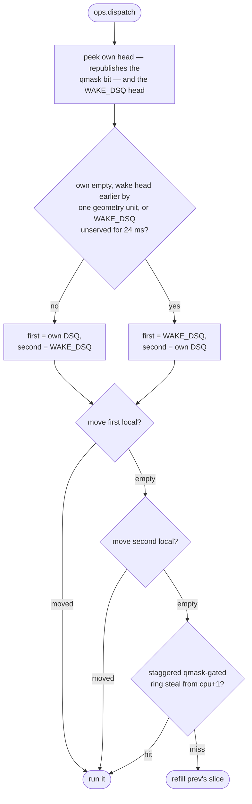

# scx_cake — model of operation

**The full design: every rule, constant, and invariant, at mechanism level.**

One `SCX_OPS_DEFINE`, eight callbacks, plus four irq/softirq tracepoints
feeding the live in-handler bit (§G35; a failed hook degrades to chronic-sink
steering), no knobs, no per-task storage; runs on Linux 6.12+, and kernels
with the 7.1 kfuncs take the fastest paths (§R.27).

Overview: [`README.md`](./README.md) ·
rationale per `§`: the registry in [`STATE.md`](./STATE.md) ·
history: `git log`; `STATE.md` wins on conflict.

---

## Queues

| queue | detail |
| --- | --- |
| one custom vtime DSQ per CPU (`ops.init`) | `dsq_id == cpu` |
| one global `WAKE_DSQ` (id `MAX_CPUS`) | any blocking CPU finds a queued wake |
| kernel local DSQs | direct admission and kthread wakes |

---

## Shared state — `struct cake_state`, 128 B slots

128 B slot alignment keeps the adjacent-line prefetcher pair from
false-sharing.

| field | contents |
| --- | --- |
| `frontier` | vtime high-water; conditional store from `ops.running` |
| `run[cpu]` | `stamp` (run start, read remotely), `sum` (`sum_exec_runtime` snapshot), `hint` (WOKE + handoff confidence) |
| `wake_served` | ktime `WAKE_DSQ` was last served |
| `qmask` | one bit per CPU, "may hold work", gating the steal ring |

**Topology is rodata; IRQ sinks are LIVE:** the loader re-splits per-CPU
handler-time share on its run loop (1 s, backing off to 16 s while stable)
and bumps `cake_sink_gen`; the next ranked pick rebuilds the nonsink mask in
BPF (§G30, §G33).

**`cake_frame_ns`** is the observed ENGINE cadence (band 25–2000 Hz —
vsync/VRR pin it at or near the panel, uncapped engines outrun any panel),
voted per-CPU in `ops.running`. Only a thread that sleeps more than half its
life votes; two comparable crowds promote the FASTER cadence deterministically
instead of flapping (§G27.1).

**`cake_frame_slice_ns`** = min(¾ × floor, `SLICE_NS` (3 ms)) is the geometry
unit every patience window shifts from; vote-free hosts keep the slice
exactly (§G27).

**`cake_starved(p)`** = mean wait > mean run (`run_delay/pcount` vs
`sum_exec_runtime/nvcsw`) — the wake-vs-continuation key.

---

## Interrupt avoidance

**A bad target** is chronically loud (`cpu_irq_hot`) or inside a handler
right now (§G33, §G35). Four irq/softirq `tp_btf` hooks keep a per-CPU
in-handler depth; only the owning CPU writes it, and cross-CPU reads race
benignly — a stale read costs one placement.

**Every placement path tests the target.** The serial handoff, the cache-warm
`prev_cpu` claim, the saturated-handoff return, and the idle-SMT-sibling kick
decline a bad target. An idle pick retries once toward a clean CPU; when only
a bad target is idle its claim stands — an idle CPU behind a microsecond
handler still beats queueing.

**The ranked pick** runs on the nonsink mask, rebuilt in BPF when
`nonsink_gen` trails `cake_sink_gen` (§G30, §G33).

**Tick look-ahead (§G36):** the timer is the one interrupt scheduled ahead of
time. The idle picks and the sibling kick also skip a CPU whose next tick
fires within `cake_wake_hop_ns`, the loader's hop-probe p99. Zero (a failed
probe) turns the predictor off; a stopped nohz (tickless idle) tick reads
far-future and never trips.

---

## select_cpu

First match wins:

1. **Serial-handoff co-location** (saturated hint, no SYNC, ≥75% idle, both
   queues empty, occupant yielding).
2. **Cache-warm idle `prev_cpu`** (non-SYNC, unstarved, not a bad target).
3. **Ranked pick:** `scx_bpf_select_cpu_and` on the nonsink mask,
   `select_cpu_dfl` as fallback.

On an idle pick a SYNC self-CPU return is re-ranked, the qmask guard defers
to an older claim, else direct-dispatch local. Saturated: converge on the
callback CPU when SYNC or deeply slept and its queues are empty.

---

## enqueue

**Kthread wake** — local DSQ of an idle CPU, else `task_cpu`, `SLICE_NS`.

**Wake arm** (`WAKEUP && nr_cpus_allowed > 1 && starved`):

| condition | destination |
| --- | --- |
| self-race | home |
| empty non-RT home | home, claimed if the wakee is a sleeper, the home idle-owned, or the occupant behind the frontier |
| backlogged `WAKE_DSQ` | home |
| else | `WAKE_DSQ` |

Notify: claim preempt, an idle SMT sibling, any idle CPU, or preempt.

**Continuation arm** (all else) — home insert; a multi-CPU wake behind a
non-starved peer diverts to `WAKE_DSQ`; a pinned wake preempts on raw sleep
depth. Then kick an idle CPU.

---

## vtime, slice, preemption

- **Slice** = 2 × burst (`sum_exec_runtime/nvcsw`), floored at
  `cake_handoff_max_ns` (1464 ns), capped at half a frame.
- **Wake key** `max(own, frontier − geom − depth)` on the geometry unit
  `geom = cake_frame_slice_ns`, branchless; `depth` is ¾ of the unused
  geometry for starved sub-geometry bursts, 0 for continuations.
- **`ops.stopping`** charges the `sum_exec_runtime` delta by reciprocal
  weight — no clock read, no divide; `ops.enable` seeds at the frontier.

A preempt fires only when the occupant run gate holds and the test passes.
Units: geom = `cake_frame_slice_ns`, frame = `cake_frame_ns`.

| path | occupant run gate | preempt test |
| --- | --- | --- |
| home claim | ran < geom/32 | occupant live vtime loses to p + geom/2 − ran/2 |
| global wake, no idle CPU | ran ≥ frame/16 | vtime comparison |
| 3-neighbour probe | ran ≥ frame/4 | vtime comparison |
| pinned wake | — | raw sleep depth |

The global-wake and probe rows never preempt a starved occupant; no row
fires on zero live vtime.

---

## dispatch

Peek own head (republishing the qmask bit) and `WAKE_DSQ`. Own first unless
the wake head wins by one geometry unit or `WAKE_DSQ` went unserved for
`WAKE_STARVE_WALL_NS` (24 ms); then the other; then the staggered
`qmask`-gated ring steal from `cpu+1` (multi-CCD: same-CCD → cache-tier →
all). Else refill prev's slice.

---

## Deliberately absent

- no flags or runtime config
- one master algorithm per hot path, no cold paths
- no per-task storage
- no timers, no balancer
- no overflow bucket, no rescue path
- no `cpuperf` hints

> [!IMPORTANT]
> Vtime order plus the wall-clock escalation prevent starvation.
