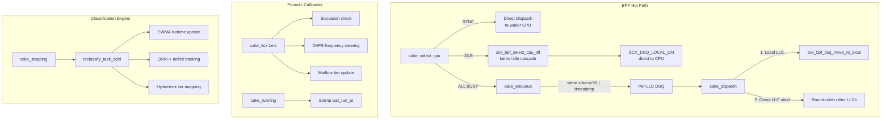
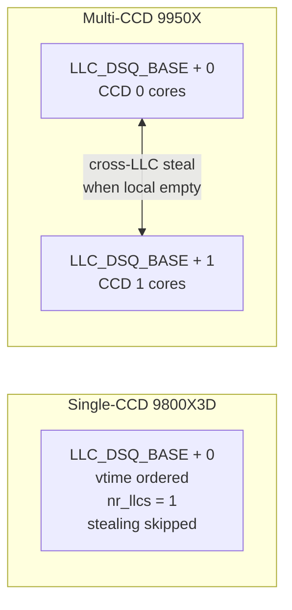

# scx_cake: CAKE DRR++ Adapted for CPU Scheduling

[](https://opensource.org/licenses/GPL-2.0)
[](https://kernel.org)
[]()

> **ABSTRACT**: `scx_cake` is an experimental BPF CPU scheduler that adapts the network [CAKE](https://www.bufferbloat.net/projects/codel/wiki/Cake/) algorithm's DRR++ (Deficit Round Robin++) for CPU scheduling. Designed for **gaming workloads** on modern AMD and Intel hardware.
>
> - **4-Tier Classification** — Tasks sorted by EWMA avg_runtime into Critical / Interactive / Frame / Bulk
> - **Zero Global Atomics** — Per-CPU BSS arrays with MESI-guarded writes eliminate bus locking
> - **Kernel-Delegated Idle Selection** — `scx_bpf_select_cpu_dfl()` for authoritative, zero-staleness CPU selection
> - **Per-LLC DSQ Sharding** — Eliminates cross-CCD lock contention on multi-chiplet CPUs
> - **DRR++ Deficit Tracking** — Network CAKE's flow fairness algorithm adapted for CPU task scheduling

---

> [!WARNING]
> **EXPERIMENTAL SOFTWARE**
> This scheduler is experimental and intended for use with `sched_ext` on Linux Kernel 6.12+. Performance may vary depending on hardware and user configuration.

> [!NOTE]
> **AI TRANSPARENCY**
> Large Language Models were used for optimization pattern matching and design exploration. All implementation details have been human-verified, benchmarked on real gaming workloads, and validated for correctness.

---

## Navigation

- [1. Quick Start](#1-quick-start)
- [2. Philosophy](#2-philosophy)
- [3. 4-Tier System](#3-4-tier-system)
- [4. Architecture](#4-architecture)
- [5. Configuration](#5-configuration)
- [6. Performance](#6-performance)
- [7. Vocabulary](#7-vocabulary)

---

## 1. Quick Start

```bash
# Prerequisites: Linux Kernel 6.12+ with sched_ext, Rust toolchain

# Clone and build
git clone https://github.com/sched-ext/scx.git
cd scx && cargo build --release -p scx_cake

# Run (requires root)
sudo ./target/release/scx_cake

# Run with live stats TUI
sudo scx_cake -v
```

---

## 2. Philosophy

Traditional schedulers (CFS, EEVDF) optimize for **fairness** — if a game and a compiler both run, each gets 50% CPU time. For gaming, this creates two problems:

1. **Latency inversion**: A 50µs input handler waits behind a 50ms compile job
2. **Frame jitter**: Game render threads get preempted mid-frame by background work

**scx_cake's answer**: Classify tasks by _behavior_ (how long they run), not by type or nice value. Short-burst tasks (input, audio) get instant priority. Long-running tasks (compilers) get larger time slices but lower priority. The system self-tunes — no manual configuration needed.

This is the same insight behind network CAKE: short flows (DNS, gaming packets) should not be delayed by bulk flows (downloads). scx_cake applies this to CPU time.

---

## 3. 4-Tier System

`scx_cake` classifies every task into one of four tiers based on its **EWMA** (Exponential Weighted Moving Average) runtime. Classification is automatic and continuous — tasks move between tiers as their behavior changes.

### Tier Gates

| Tier   | Name        | avg_runtime | Typical Workload                                       | Quantum | Starvation |
| :----- | :---------- | :---------- | :----------------------------------------------------- | :------ | :--------- |
| **T0** | Critical    | < 100µs     | IRQ handlers, input drivers, audio (PipeWire), network | 0.5ms   | 3ms        |
| **T1** | Interactive | < 2ms       | Compositors, game physics, game AI, short workers      | 2.0ms   | 8ms        |
| **T2** | Frame       | < 8ms       | Game render threads, video encoding                    | 4.0ms   | 40ms       |
| **T3** | Bulk        | ≥ 8ms       | Compilation, background indexing, batch jobs           | 8.0ms   | 100ms      |

> [!TIP]
> **No game task should be in T3**. Game render threads run 2-8ms per frame → T2. Physics/AI run 0.5-2ms → T1. Input handlers run < 100µs → T0. Only tasks doing 8ms+ uninterrupted CPU work (shader compilation, loading screens) land in T3.

### How Classification Works

1. **Initial placement**: Based on `nice` value — `nice < 0` → T0, `nice 0-10` → T1, `nice > 10` → T3
2. **Runtime authority**: After ~3 stops, the EWMA avg_runtime becomes authoritative. A nice -5 task that runs 50ms bursts will reclassify to T3 regardless of nice value.
3. **Hysteresis**: 10% deadband prevents oscillation at tier boundaries. Promotion requires avg_runtime clearly below the gate; demotion is immediate.
4. **Graduated backoff**: Once a tier is stable for 3+ consecutive stops, reclassification frequency drops per-tier: T0 rechecks every 1024th stop, T3 every 16th. Instability resets to full-frequency checking.

### DRR++ Deficit Tracking

Adapted from network CAKE's flow fairness:

- Each task starts with a **deficit** (quantum + new-flow bonus ≈ 10ms credit)
- Each execution bout consumes deficit proportional to runtime
- When deficit exhausts → new-flow bonus removed → task competes normally
- This gives newly spawned threads (game launching a worker) instant responsiveness that naturally decays

### DVFS (CPU Frequency Scaling)

Each tier maps to a CPU performance target via RODATA lookup table:

| Tier  | Target               | Rationale                                             |
| :---- | :------------------- | :---------------------------------------------------- |
| T0-T2 | 100% (max frequency) | Gaming workloads need full performance                |
| T3    | 75%                  | Background work can run slightly slower to save power |

On Intel hybrid CPUs (`has_hybrid = true`), targets are scaled by each core's `cpuperf_cap` to prevent over-requesting frequency on E-cores.

---

## 4. Architecture

### Overview



### Source Files

| File           | Lines | Purpose                                             |
| :------------- | :---- | :-------------------------------------------------- |
| `cake.bpf.c`   | 758   | All BPF ops + classification engine                 |
| `intf.h`       | 200   | Shared structs, constants, fused config macros      |
| `bpf_compat.h` | 118   | Relaxed atomics, De Bruijn CTZ, DSQ peek compat     |
| `main.rs`      | 442   | Rust loader, CLI, profiles, topology detection, TUI |

### Ops Callbacks (7 total)

| Callback                  | Role                                                    | Hot/Cold             |
| :------------------------ | :------------------------------------------------------ | :------------------- |
| `cake_select_cpu`         | SYNC dispatch + kernel idle selection + kfunc tunneling | **Hot**              |
| `cake_enqueue`            | Tier-encoded vtime insert into per-LLC DSQ              | **Hot**              |
| `cake_dispatch`           | Local LLC → cross-LLC steal                             | **Hot**              |
| `cake_tick`               | Starvation check, DVFS, mailbox update                  | **Hot** (1ms period) |
| `cake_running`            | Timestamp `last_run_at`                                 | **Hot** (minimal)    |
| `cake_stopping`           | Calls `reclassify_task_cold`                            | **Warm**             |
| `cake_init` / `cake_exit` | DSQ creation, UEI                                       | **Cold** (once)      |

### Data Structures

**Per-task context** (`cake_task_ctx`, 64 bytes, cache-line aligned):

```
Bytes 0-7:   next_slice (u64)           — Pre-computed tier-adjusted quantum
Bytes 8-11:  deficit_avg_fused (u32)    — [deficit_us:16][avg_runtime_us:16] fused
Bytes 12-15: packed_info (u32)          — [stable:2][tier:2][flags:4][rsvd:8][wait:8][error:8]
Bytes 16-19: last_run_at (u32)          — Timestamp (wraps at 4.2s)
Bytes 20-21: reclass_counter (u16)      — Graduated backoff counter
Bytes 22-63: padding
```

**Per-CPU mega-mailbox** (`mega_mailbox_entry`, 64 bytes, cache-line isolated):

```
Byte 0: flags          — [1:0]=tier, written by cake_tick
Byte 1: dsq_hint       — DVFS perf target cache
Byte 2: tick_counter    — Starvation graduated confidence
Bytes 3-63: reserved
```

**Per-CPU scratch** (`cake_scratch`, 128 bytes):

```
Tunnels select_cpu → enqueue: cached_llc, cached_now (saves 2 kfunc calls)
DSQ iterator storage for legacy peek fallback
```

### DSQ Architecture



- **Vtime encoding**: `(tier << 56) | (timestamp & 0x00FFFFFFFFFFFFFF)` — lower tiers drain first within each LLC DSQ
- **RODATA gate**: `if (nr_llcs <= 1) return;` skips all cross-LLC stealing on single-CCD systems

### Zero Global State

| Anti-pattern                | scx_cake                                   |
| :-------------------------- | :----------------------------------------- |
| Global atomics              | **0**                                      |
| Volatile variables          | **0**                                      |
| Division in hot path        | **0** (shift-based µs conversion: `>> 10`) |
| Global vtime writes         | **0** (per-task only)                      |
| RCU lock/unlock in hot path | **0**                                      |

### Kfunc Tunneling

`select_cpu` caches `cpu_llc_id` and `scx_bpf_now()` in per-CPU scratch. `enqueue` reuses these values, saving ~40-60ns (2 kfunc trampoline entries) on the all-busy path.

### Graduated Confidence

Two independent confidence systems reduce overhead when scheduling is stable:

1. **Tick starvation check**: `tick_counter` tracks consecutive ticks without contention. Skip masks grow from 0 → 1 → 3 → 7, checking every 1st → 2nd → 4th → 8th tick. Any contention resets to full alertness.
2. **Reclassification backoff**: When a task's tier is stable for 3+ consecutive stops, reclassification drops to per-tier intervals (T0: every 1024th, T3: every 16th). A spot-check detects tier-change triggers without full reclassification cost.

---

## 5. Configuration

### Profiles (`--profile, -p`)

| Profile     | Quantum | Starvation | Use Case                              |
| :---------- | :------ | :--------- | :------------------------------------ |
| **gaming**  | 2ms     | 100ms      | **(Default)** Balanced for most games |
| **esports** | 1ms     | 50ms       | Competitive FPS, ultra-low latency    |
| **legacy**  | 4ms     | 200ms      | Older CPUs, battery saving            |
| **default** | 2ms     | 100ms      | Alias for gaming                      |

### CLI Arguments

| Argument                  | Default  | Description                           |
| :------------------------ | :------- | :------------------------------------ |
| `--profile, -p <PROFILE>` | `gaming` | Select preset profile                 |
| `--quantum <µs>`          | profile  | Base time slice in microseconds       |
| `--new-flow-bonus <µs>`   | profile  | Extra deficit for newly woken tasks   |
| `--starvation <µs>`       | profile  | Max run time before forced preemption |
| `--verbose, -v`           | `false`  | Enable live TUI stats display         |
| `--interval <secs>`       | `1`      | TUI refresh interval                  |

### Per-Tier Tuning (Gaming Profile)

| Tier           | Quantum Multiplier | Effective Slice | Starvation Limit |
| :------------- | :----------------- | :-------------- | :--------------- |
| T0 Critical    | 0.75x              | 1.5ms           | 3ms              |
| T1 Interactive | 1.0x               | 2.0ms           | 8ms              |
| T2 Frame       | 1.2x               | 2.4ms           | 40ms             |
| T3 Bulk        | 1.4x               | 2.8ms           | 100ms            |

> [!NOTE]
> **Higher tiers get smaller slices** — T0 tasks (input, audio) run < 100µs and release cores fast. T3 tasks (compilers) get larger slices for cache efficiency. This is the opposite of traditional priority systems where high priority = more CPU time.

### Examples

```bash
# Default gaming profile
sudo scx_cake

# Competitive gaming
sudo scx_cake -p esports

# Gaming with custom quantum and live stats
sudo scx_cake --quantum 1500 -v

# Battery-friendly for laptop gaming
sudo scx_cake -p legacy
```

---

## 6. Performance

### Target Hardware

| Component | Specification                       |
| :-------- | :---------------------------------- |
| CPU       | AMD Ryzen 7 9800X3D (1 CCD, 8C/16T) |
| Kernel    | Linux 6.12+ with sched_ext          |

### Design Targets

- **Sub-microsecond scheduling decisions** — Select CPU + enqueue in ~17ns (SYNC) to ~36ns (all-busy)
- **Zero bus lock contention** — No global atomics means no scaling regression under load
- **Consistent 1% lows** — Tier-encoded vtime prevents frame time spikes from background work
- **Input priority** — Mouse/keyboard handlers reach T0 within 3 stops, get dispatched before all other work

### Benchmarks

- [schbench](https://github.com/brendangregg/schbench) — Scheduler latency microbenchmark
- Arc Raiders — AAA game stress testing (frame rates, 1% lows)
- Splitgate 2 — Competitive FPS latency testing

> [!NOTE]
> Throughput workloads (compilers, render farms) will perform **worse** than CFS/EEVDF. This scheduler explicitly trades throughput for latency — the same tradeoff network CAKE makes for packets.

---

## 7. Vocabulary

### Core Concepts

| Term         | Definition                                                                                                                               |
| :----------- | :--------------------------------------------------------------------------------------------------------------------------------------- |
| **CAKE**     | [Common Applications Kept Enhanced](https://www.bufferbloat.net/projects/codel/wiki/Cake/). Network AQM algorithm this scheduler adapts. |
| **DRR++**    | Deficit Round Robin++. Network algorithm balancing fair queuing with strict priority.                                                    |
| **EWMA**     | Exponential Weighted Moving Average. Tracks runtime with 7/8 decay (~8 bouts to converge).                                               |
| **Tier**     | Classification level (0-3) by avg_runtime. Controls slice, starvation, vtime priority, and DVFS.                                         |
| **Deficit**  | Per-task credit from DRR++. New tasks get bonus credit; exhaustion removes the bonus.                                                    |
| **Quantum**  | Base time slice a task is allotted before a scheduling decision. Multiplied by tier multiplier.                                          |
| **Niceness** | Linux `nice` value (-20 to 19). scx_cake uses it only for initial tier placement; runtime behavior overrides.                            |
| **DVFS**     | Dynamic Voltage and Frequency Scaling. Per-tier CPU frequency steering via `scx_bpf_cpuperf_set`.                                        |
| **Jitter**   | Variance in scheduling latency between consecutive events. Low jitter = consistent frame delivery.                                       |

### Architecture

| Term                    | Definition                                                                                       |
| :---------------------- | :----------------------------------------------------------------------------------------------- |
| **Fused Config**        | 4 parameters packed into one 64-bit word: `[mult:12][quantum:16][budget:16][starve:20]`.         |
| **Mega-Mailbox**        | 64B per-CPU cache-line-isolated state. Zero false sharing between cores.                         |
| **Kfunc Tunneling**     | Caching kfunc return values in per-CPU scratch to avoid redundant trampoline calls.              |
| **MESI Guard**          | Read-before-write pattern: skip store if value unchanged, preventing cache invalidation.         |
| **Graduated Backoff**   | Confidence system that reduces check frequency when scheduling is stable.                        |
| **RODATA Gate**         | Compile-time constant that eliminates entire code paths (e.g., single-CCD skips stealing).       |
| **Adaptive Sampling**   | Dynamically adjusting check frequency based on confidence in task behavior stability.            |
| **Bitfield Coalescing** | Packing fields written together into adjacent bits for fused clear/set ops (Rule 37).            |
| **State Fusion**        | Combining related fields into a union for atomic single-load access (e.g., `deficit_avg_fused`). |
| **Trampolining**        | Excessive jumping between BPF and kernel contexts. Grouped calls minimize entry/exit costs.      |

### Hardware

| Term                 | Definition                                                                                              |
| :------------------- | :------------------------------------------------------------------------------------------------------ |
| **CCD**              | Core Complex Die. Physical chiplet containing cores (9800X3D: 1 CCD, 9950X: 2 CCDs).                    |
| **LLC**              | Last Level Cache (L3). Cores in same LLC communicate ~3-5x faster than cross-LLC.                       |
| **SMT**              | Simultaneous Multi-Threading. Two logical CPUs per physical core.                                       |
| **P/E Cores**        | Intel hybrid architecture: Performance cores (fast) and Efficiency cores (power-saving).                |
| **ETD**              | Empirical Topology Discovery. Measures inter-core CAS latency at startup for display.                   |
| **Cache Line**       | 64-byte block of memory. Smallest unit the CPU loads from RAM. Foundation of data layout.               |
| **Line Fill Buffer** | Hardware buffer for outstanding cache line fetches. Saturating it maximizes memory bandwidth.           |
| **MESI Protocol**    | Cache coherency protocol (Modified/Exclusive/Shared/Invalid). Unnecessary writes trigger invalidations. |
| **Snoop Signaling**  | Cache coherency mechanism where cores monitor the bus for writes to shared cache lines.                 |

### Performance

| Term                     | Definition                                                                                            |
| :----------------------- | :---------------------------------------------------------------------------------------------------- |
| **Hot Path**             | Code on every scheduling decision: select_cpu → enqueue → dispatch.                                   |
| **Cold Path**            | Infrequent code: task init, tier reclassification (noinline).                                         |
| **ILP**                  | Instruction Level Parallelism. CPU executing multiple independent instructions per cycle.             |
| **MLP**                  | Memory Level Parallelism. Issuing multiple independent loads to hide memory latency.                  |
| **Direct Dispatch**      | `SCX_DSQ_LOCAL_ON` — task goes directly to a CPU's local queue, bypassing the DSQ path.               |
| **1% Lows**              | Average framerate of the slowest 1% of frames. Key metric for stutter.                                |
| **Branchless**           | Code avoiding `if/else` to prevent CPU pipeline stalls from branch misprediction.                     |
| **Register Pressure**    | Competition for CPU registers. Excess pressure causes spills to stack (slower memory).                |
| **Speculative Prefetch** | Hinting the CPU to load data before it's needed, hiding memory latency.                               |
| **AoS / SoA / AoSoA**    | Array-of-Structs / Struct-of-Arrays / hybrid. Data layout affects cache efficiency and vectorization. |

### Scaling Laws

| Term             | Definition                                                                                       |
| :--------------- | :----------------------------------------------------------------------------------------------- |
| **Amdahl's Law** | Speedup limited by serial fraction. 5% serial code caps speedup at 20× regardless of core count. |
| **Little's Law** | Concurrency = throughput × latency. Guides queue depth and parallelism decisions.                |
| **Rent's Rule**  | Interconnect complexity grows sublinearly with component count. Guides topology-aware design.    |

### Anti-Patterns

| Term                   | Definition                                                                                     |
| :--------------------- | :--------------------------------------------------------------------------------------------- |
| **False Sharing**      | Performance penalty when CPUs write to different data on the same 64-byte cache line.          |
| **Cache Invalidation** | Forcing other cores to discard cached data via unnecessary writes. Causes bus locking.         |
| **Micro-slicing**      | Preempting tasks too frequently. Queued interruptions degrade throughput and increase jitter.  |
| **Volatile**           | Compiler hint preventing optimization. Clogs LSU, breaks ILP/MLP parallelism. Avoid in BPF.    |
| **Spills**             | Register values evicted to stack memory when register pressure is too high. ~5ns penalty each. |
| **Barriers**           | Memory ordering fences. Force pipeline flushes and inhibit out-of-order execution.             |
| **Read-Once**          | Compiler pattern forcing re-reads from memory. Defeats register caching and ILP.               |

---

**License**: GPL-2.0
**Maintainer**: RitzDaCat
