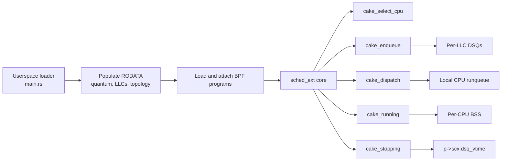
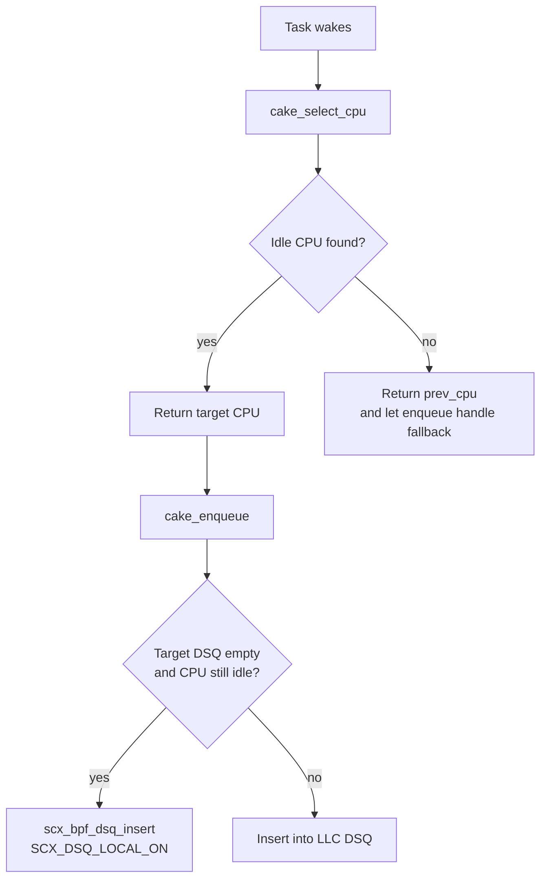
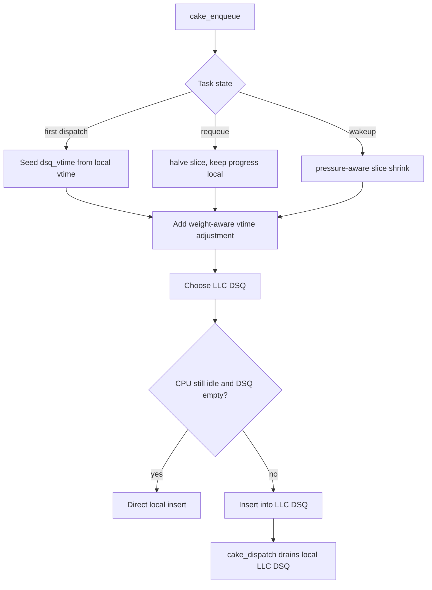
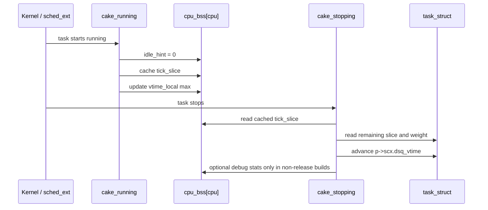
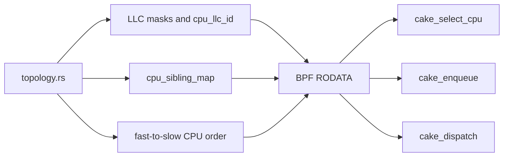

# scx_cake 1.1.1

[](https://opensource.org/licenses/GPL-2.0)
[](https://kernel.org)
[](https://github.com/sched-ext/scx)

`scx_cake` is a `sched_ext` CPU scheduler for Linux that applies CAKE-inspired low-latency ideas to CPU time instead of network packets.

Version `1.1.1` is not the older DRR++ / game-detection scheduler that some comments and historical docs referred to. The current design is centered on:

- topology-aware CPU selection
- direct dispatch to idle CPUs when possible
- per-LLC virtual-time DSQs as the shared fallback
- lean per-task accounting in BPF
- optional debug telemetry in non-release builds

This README is written for three audiences:

- users who want to build and run it
- students who want to understand how a `sched_ext` scheduler is structured
- researchers who want a concise map from policy to code path

> [!WARNING]
> `scx_cake` is experimental scheduler code. It requires a Linux kernel with `sched_ext` support and should be treated like development software.

> [!IMPORTANT]
> The current `1.1.1` scheduler no longer uses the old game-family detector or the old hot-path `GAME / NORMAL / HOG / BG` classifier. Legacy enums and telemetry fields still exist in some debug paths for tooling compatibility, but they are not the active release policy.

## Navigation

- [Quick Start](#quick-start)
- [What scx_cake Is](#what-scx_cake-is)
- [How It Fits Into sched_ext](#how-it-fits-into-sched_ext)
- [Scheduling Paths](#scheduling-paths)
- [Core Mechanics](#core-mechanics)
- [Topology Model](#topology-model)
- [Build Modes](#build-modes)
- [Measuring Performance](#measuring-performance)
- [Source Tour](#source-tour)
- [Current Status](#current-status)

## Quick Start

### Requirements

- Linux kernel `6.12+` with `sched_ext`
- Rust toolchain
- build dependencies required by the main `scx` repository
- root privileges to actually run the scheduler

### Build

```bash
git clone https://github.com/sched-ext/scx.git
cd scx

# Production-oriented build
cargo build --release -p scx_cake

# Debug build with telemetry, TUI, and testing mode
cargo build -p scx_cake
```

### Run

```bash
# Default profile: gaming
sudo ./target/release/scx_cake

# Explicit profile
sudo ./target/release/scx_cake --profile esports

# Custom base quantum in microseconds
sudo ./target/release/scx_cake --quantum 1500
```

### Debug TUI and testing

`--verbose` and `--testing` require a debug build. In release builds, telemetry is compiled out and those flags are disabled at runtime.

```bash
# Live TUI
sudo ./target/debug/scx_cake --verbose

# 10-second in-kernel testing mode
sudo ./target/debug/scx_cake --testing
```

### Profiles

| Profile | Quantum | Intended use |
| :-- | --: | :-- |
| `esports` | `1000 us` | Lowest latency, highest scheduling frequency |
| `gaming` | `2000 us` | Default low-latency desktop / gaming mode |
| `default` | `2000 us` | Currently same as `gaming` |
| `legacy` | `4000 us` | Older or lower-power hardware |
| `battery` | `4000 us` | Lower scheduling overhead |

## What scx_cake Is

At a high level, `scx_cake` tries to keep the common case short:

1. If an idle CPU is available, place the task there directly.
2. If no CPU is idle, push work into an LLC-scoped DSQ ordered by `p->scx.dsq_vtime`.
3. When a task runs or stops, update just enough local state to keep future enqueue decisions cheap.

The current design is intentionally simpler than the historical versions:

- no userspace game detector driving BPF state
- no hot-path 4-class promotion logic
- no reciprocal `vtime_mult` cache in the release fast path
- no task-storage based hot-path bookkeeping

Instead, the fast path mostly works from:

- `task_struct`
- small per-CPU BSS state
- loader-populated topology RODATA

## How It Fits Into sched_ext


```mermaid
flowchart LR
    U[Userspace loader<br/>main.rs] --> R[Populate RODATA<br/>quantum, LLCs, topology]
    R --> B[Load and attach BPF programs]
    B --> S[sched_ext core]

    S --> SC[cake_select_cpu]
    S --> EQ[cake_enqueue]
    S --> DP[cake_dispatch]
    S --> RN[cake_running]
    S --> ST[cake_stopping]

    EQ --> DSQ[Per-LLC DSQs]
    DP --> CPU[Local CPU runqueue]
    RN --> BSS[Per-CPU BSS]
    ST --> VT[p->scx.dsq_vtime]
```

The Rust side does three main jobs:

- detects topology and populates BPF RODATA
- initializes the BPF arena
- optionally runs the debug TUI or testing mode

The BPF side implements the policy through `sched_ext` struct_ops callbacks.

## Scheduling Paths

### Path 1: wakeup to direct dispatch

This is the preferred fast path.


```mermaid
flowchart TD
    W[Task wakes] --> SC[cake_select_cpu]
    SC --> G1{Idle CPU found?}
    G1 -->|yes| CPU[Return target CPU]
    G1 -->|no| PREV[Return prev_cpu<br/>and let enqueue handle fallback]
    CPU --> EQ[cake_enqueue]
    EQ --> DD{Target DSQ empty<br/>and CPU still idle?}
    DD -->|yes| LOCAL[scx_bpf_dsq_insert<br/>SCX_DSQ_LOCAL_ON]
    DD -->|no| SHARED[Insert into LLC DSQ]
```

`cake_select_cpu` currently follows this order:

1. kernel-assisted idle selection
2. hybrid-only fast-to-slow scan if hybrid support is compiled in
3. return `prev_cpu` and fall back to DSQ routing when all CPUs are busy

### Path 2: shared fallback when all CPUs are busy


```mermaid
flowchart TD
    ENQ[cake_enqueue] --> KIND{Task state}
    KIND -->|first dispatch| NOSTAGED[Seed dsq_vtime from local vtime]
    KIND -->|requeue| REQUEUE[halve slice, keep progress local]
    KIND -->|wakeup| WAKE[pressure-aware slice shrink]

    NOSTAGED --> VT[Add weight-aware vtime adjustment]
    REQUEUE --> VT
    WAKE --> VT

    VT --> ROUTE[Choose LLC DSQ]
    ROUTE --> INS{CPU still idle and DSQ empty?}
    INS -->|yes| DIRECT[Direct local insert]
    INS -->|no| DSQ[Insert into LLC DSQ]
    DSQ --> DISP[cake_dispatch drains local LLC DSQ]
```

### Path 3: run-stop feedback loop

`cake_running` and `cake_stopping` form the feedback loop that keeps future enqueue decisions cheap.


```mermaid
sequenceDiagram
    participant K as Kernel / sched_ext
    participant R as cake_running
    participant B as cpu_bss[cpu]
    participant S as cake_stopping
    participant T as task_struct

    K->>R: task starts running
    R->>B: idle_hint = 0
    R->>B: cache tick_slice
    R->>B: update vtime_local max

    K->>S: task stops
    S->>B: read cached tick_slice
    S->>T: read remaining slice and weight
    S->>T: advance p->scx.dsq_vtime
    S->>B: optional debug stats only in non-release builds
```

## Core Mechanics

### 1. CPU selection

`cake_select_cpu` tries to find an idle CPU first. The current code leans on kernel helpers for correctness and affinity handling, then adds scheduler-specific topology steering where appropriate.

Important properties:

- release fast path avoids arena dereferences
- affinity restrictions are still enforced by the kernel helpers
- hybrid-only scan order is precomputed in userspace and passed as RODATA

### 2. Direct dispatch before shared queuing

If the chosen CPU still looks idle and the target LLC DSQ is empty, `cake_enqueue` inserts directly with `SCX_DSQ_LOCAL_ON`. That bypasses the shared DSQ machinery and reduces latency in the common wakeup case.

### 3. Virtual-time ordering

Shared fallback uses `p->scx.dsq_vtime` as the ordering key.

The current source uses an additive weight adjustment derived from `p->scx.weight`:

```text
vtime += runtime + (100 - weight) * 20480
```

That description is about source-level policy. It is not a guarantee about the final generated BPF instructions. In optimized builds, the compiler may lower the shift-and-add form into a constant multiply.

### 4. Per-CPU BSS instead of global hot state

Small per-CPU BSS state is used for:

- `idle_hint`
- `tick_slice`
- `last_pid`
- `vtime_local`
- local dispatch bookkeeping

That keeps the hot path close to CPU-local state instead of bouncing a single global cache line.

### 5. Debug telemetry is compile-gated

In debug builds, `scx_cake` exposes richer telemetry through arena-backed task context and the iter program used by the TUI. In release builds, that machinery is compiled out so the production scheduler does not pay for it.

## Topology Model

`scx_cake` is topology-aware. The Rust loader detects:

- CPU count
- LLC count
- SMT sibling relationships
- hybrid P/E layout when present
- preferred LLC on asymmetric AMD systems

The loader then writes those results into BPF RODATA before attach.

### LLC behavior in 1.1.1

The code still builds LLC-aware DSQs and computes a primary and fallback LLC at startup.

However, the current source also sets:

```c
#define CAKE_LOCAL_CPU_ONLY 1
```

That means the cross-LLC steal path in `cake_dispatch` is compiled out in the current build. The README reflects the behavior that exists today, not the older design space around cross-CCD stealing.

### sched_ext + topology diagram


```mermaid
flowchart LR
    TOPO[topology.rs] --> LLC[LLC masks and cpu_llc_id]
    TOPO --> SMT[cpu_sibling_map]
    TOPO --> HYB[fast-to-slow CPU order]
    LLC --> RODATA[BPF RODATA]
    SMT --> RODATA
    HYB --> RODATA
    RODATA --> SC[cake_select_cpu]
    RODATA --> EQ[cake_enqueue]
    RODATA --> DP[cake_dispatch]
```

## Build Modes

| Build | Intended use | Telemetry | TUI | `--testing` |
| :-- | :-- | :-- | :-- | :-- |
| `cargo build --release -p scx_cake` | normal use | compiled out | unavailable | unavailable |
| `cargo build -p scx_cake` | development and study | enabled when requested | available | available |

Notes:

- release builds warn and disable `--verbose` and `--testing`
- debug builds expose iter-based task telemetry to the TUI
- the BPF arena is initialized in both modes, but debug mode carries much more task telemetry

## Measuring Performance

Performance claims for this scheduler should be grounded in measurement, not just source shape.

This repository includes:

- [perf_stat_cake.sh](./perf_stat_cake.sh)
- [bench/baselines](./bench/baselines)

Example:

```bash
sudo scheds/rust/scx_cake/perf_stat_cake.sh 5 both
```

That collects:

- system-wide `perf stat`
- `perf stat --bpf-prog` for the active `scx_cake` BPF programs

Recommended workflow for changes:

1. keep workload, duration, and machine fixed
2. capture a baseline first
3. compare `BPF cycles`, `BPF instructions`, branch misses, and relevant system counters
4. treat run-to-run noise as real unless repeated measurements show a stable delta

## Source Tour

| File | Role |
| :-- | :-- |
| [src/main.rs](./src/main.rs) | userspace loader, CLI, RODATA setup, attach logic |
| [src/bpf/cake.bpf.c](./src/bpf/cake.bpf.c) | `sched_ext` callbacks and scheduler policy |
| [src/bpf/intf.h](./src/bpf/intf.h) | shared structs, constants, telemetry layout |
| [src/topology.rs](./src/topology.rs) | topology detection and mask construction |
| [src/tui.rs](./src/tui.rs) | debug TUI and iter-driven telemetry consumer |
| [perf_stat_cake.sh](./perf_stat_cake.sh) | `perf stat` helper for live scheduler measurement |
| [docs](./docs) | research notes and design analysis |

### Main callbacks

| Callback | Purpose |
| :-- | :-- |
| `cake_select_cpu` | choose an idle CPU when possible |
| `cake_enqueue` | compute slice / vtime and route to direct insert or LLC DSQ |
| `cake_dispatch` | drain the local LLC DSQ |
| `cake_running` | mark CPU busy and cache local run metadata |
| `cake_stopping` | account consumed runtime back into `dsq_vtime` |
| `cake_tick` | optional load-balance hint path |
| `cake_init_task` / `cake_exit_task` | allocate and free per-task arena state |
| `cake_set_weight` | mirror weight into debug-visible state |

## Current Status

`scx_cake 1.1.1` should be understood as:

- a CAKE-inspired low-latency `sched_ext` scheduler
- a topology-aware scheduler with direct dispatch and LLC-scoped fallback
- a codebase that still carries some legacy debug and telemetry vocabulary from earlier experiments

It should not be described today as:

- a hot-path DRR++ scheduler
- a game-family detector in BPF
- a release scheduler driven by a 4-class `GAME / NORMAL / HOG / BG` policy

## Related Notes

If you want the deeper design history or experiments behind the current code, start with:

- [docs/hot_path_optimization_analysis.md](./docs/hot_path_optimization_analysis.md)
- [docs/idle_path_bubble_reduction_proposal.md](./docs/idle_path_bubble_reduction_proposal.md)
- [docs/benchmark_winner_analysis.md](./docs/benchmark_winner_analysis.md)

