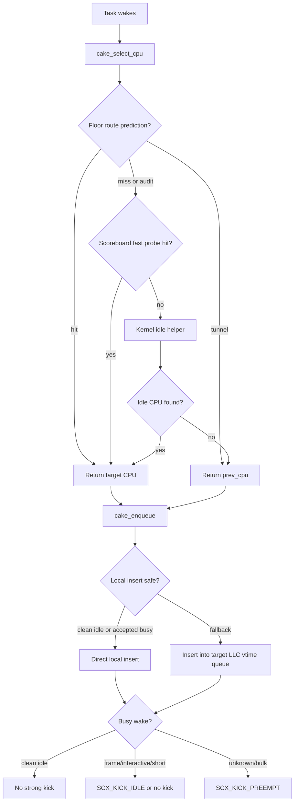
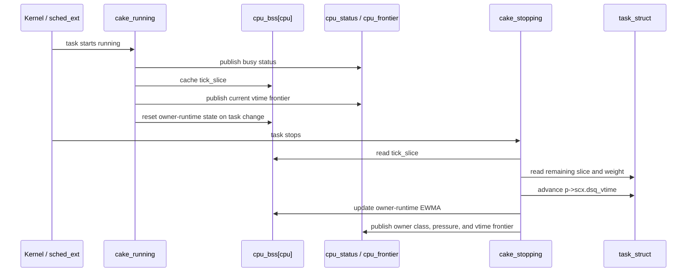

# scx_cake 1.1.2

[](https://opensource.org/licenses/GPL-2.0)
[](https://kernel.org)
[](https://github.com/sched-ext/scx)

`scx_cake` is a performance-oriented `sched_ext` CPU scheduler. It applies CAKE-inspired low-latency ideas to CPU time: keep wakeups short, dispatch directly to good local targets, use per-LLC vtime fallback queues when local handoff is not selected, and make the common path cheap.

The active `1.1.2` design is centered on:

- Cake Scoreboard Dispatch: init-built topology candidates, owner-written CPU
  status lanes, packed confidence, prediction, and task-biased release fast
  probes
- idle-first CPU selection
- direct local inserts for clean idle targets and guarded busy-wake handoff
- optional storm-guard busy-wake A/B policy for wake-storm benchmark work
- per-LLC virtual-time fallback queues when direct local handoff is not selected
- confidence-shaped fast paths that can narrow or skip broad helper work when
  the scorecard is healthy
- lean release hot paths with learned locality compiled out
- lightweight virtual-time accounting through `p->scx.dsq_vtime`
- debug TUI/task snapshots with exact path counters, callback timing, wake/run
  attribution, and runtime A/B controls enabled in debug builds

> [!WARNING]
> `scx_cake` is experimental scheduler code. It requires a Linux kernel with `sched_ext` support and root privileges to run.

## Quick Start

### Requirements

- Linux kernel `6.12+` with `sched_ext`
- Rust toolchain
- build dependencies required by the main `scx` repository
- root privileges to run the scheduler

### Build

```bash
git clone https://github.com/sched-ext/scx.git
cd scx

# Release build for normal use and performance measurement.
# Defaults: gaming / 1000us / queue-policy=local / storm-guard=shield / busy-wake-kick=policy
#           learned-locality=off / wake-chain-locality=off / release-route-pred=off / release-confidence=off
#           release-llc-pending=off / release-local-waiter=on / release-domain-drr=on
cargo build --release -p scx_cake

# Release build with explicit baked hot-path knobs or A/B overrides
SCX_CAKE_PROFILE=esports cargo build --release -p scx_cake
SCX_CAKE_QUANTUM_US=1500 SCX_CAKE_QUEUE_POLICY=local cargo build --release -p scx_cake
SCX_CAKE_STORM_GUARD=shield SCX_CAKE_BUSY_WAKE_KICK=policy cargo build --release -p scx_cake
SCX_CAKE_LEARNED_LOCALITY=off SCX_CAKE_WAKE_CHAIN_LOCALITY=off cargo build --release -p scx_cake
SCX_CAKE_RELEASE_ROUTE_PRED=off SCX_CAKE_RELEASE_CONFIDENCE=off cargo build --release -p scx_cake
SCX_CAKE_RELEASE_LLC_PENDING=on cargo build --release -p scx_cake
SCX_CAKE_RELEASE_LOCAL_WAITER=off cargo build --release -p scx_cake

# Debug build for TUI/capture and runtime A/B work
cargo build -p scx_cake
```

### Run

```bash
# Release uses the profile, quantum, queue, storm, kick, locality, and accelerator knobs baked at build time
sudo ./target/release/scx_cake

# Debug defaults mirror the release benchmark tuple, with learned locality gates off
sudo ./target/debug/scx_cake

# Debug runtime profile / quantum / policy A/B
sudo ./target/debug/scx_cake --profile esports
sudo ./target/debug/scx_cake --quantum 1500
sudo ./target/debug/scx_cake --queue-policy llc-vtime

# Start the debug TUI/capture surface
sudo ./target/debug/scx_cake --verbose

# Headless debug capture when stdout is not an interactive terminal
sudo install -d -m 0700 /tmp/scx_cake
sudo ./target/debug/scx_cake --verbose --diag-dir /tmp/scx_cake --diag-period 30

# A/B enable the learned wake-chain locality guard in a debug build
sudo ./target/debug/scx_cake --verbose --wake-chain-locality=true

# A/B enable all learned locality steering in a debug build
sudo ./target/debug/scx_cake --verbose --learned-locality=true

# A/B force same-CPU busy wakeups to preempt in a debug build
sudo ./target/debug/scx_cake --verbose --busy-wake-kick=preempt

# A/B record, disable, or widen storm-guard busy-wake handoff in a debug build
sudo ./target/debug/scx_cake --verbose --storm-guard=shadow
sudo ./target/debug/scx_cake --verbose --storm-guard=off
sudo ./target/debug/scx_cake --verbose --storm-guard=full
```

### Profiles

Profiles are quantum presets. They do not switch the scheduler into separate policy modes.
Release builds bake profile, quantum, queue policy, storm guard, busy-wake kick,
learned locality, wake-chain locality, release route prediction, and release
confidence, the experimental release LLC-pending service arbiter, and the
release local-waiter service contract at compile time. Use
`SCX_CAKE_PROFILE`, `SCX_CAKE_QUANTUM_US`, `SCX_CAKE_QUEUE_POLICY`,
`SCX_CAKE_STORM_GUARD`, `SCX_CAKE_BUSY_WAKE_KICK`,
`SCX_CAKE_LEARNED_LOCALITY`, `SCX_CAKE_WAKE_CHAIN_LOCALITY`,
`SCX_CAKE_RELEASE_ROUTE_PRED`, `SCX_CAKE_RELEASE_CONFIDENCE`, and
`SCX_CAKE_RELEASE_LLC_PENDING`, and `SCX_CAKE_RELEASE_LOCAL_WAITER` when
building release objects. Debug builds keep `--profile`, `--quantum`, `--queue-policy`,
`--storm-guard`, `--busy-wake-kick`, `--learned-locality`, and
`--wake-chain-locality` as runtime A/B controls.

`--queue-policy local|llc-vtime` is an explicit A/B policy switch, not a
profile. The default `local` keeps busy fallback work in the selected CPU's
local DSQ, matching the benchmark-guided release path. `llc-vtime` keeps the
shared per-LLC vtime fallback path available for comparison.

See [Queue Policy Latency Findings](docs/queue_policy_latency_findings.md) for
the Splitgate 2 / MangoHud captures that motivated keeping the LLC-vtime path
as a first-class A/B option.

The default policy is latency-first. Release builds compile telemetry out,
compile the route predictor, packed-confidence governor, and userspace trust
maps out by default for the current benchmark release diet, bake
`queue-policy=local`, `storm-guard=shield`, and `busy-wake-kick=policy`, and
leave learned locality plus wake-chain locality off unless explicitly enabled. Set
`SCX_CAKE_RELEASE_ROUTE_PRED=on` and `SCX_CAKE_RELEASE_CONFIDENCE=on` to
re-enable the opt-in release predictor/confidence/trust-map path for A/B work. Set
`SCX_CAKE_RELEASE_LLC_PENDING=on` to test the opt-in conservative shared-DSQ
pending arbiter; it is off by default because the current historical data says
shared-service advisory bits are a regression-risk lane until same-hash guardrail
benchmarks prove otherwise. Set `SCX_CAKE_RELEASE_LOCAL_WAITER=off` to A/B the
lean pre-waiter release diet. Set
`SCX_CAKE_LEARNED_LOCALITY=on` and/or
`SCX_CAKE_WAKE_CHAIN_LOCALITY=on` to benchmark the arena-backed locality path.
Debug builds compile the full `--verbose`
capture surface by default: hot callback counters, wake/run timing, task arena
snapshots, runtime A/B knobs, and the live TUI are all available without special
build flags. The `--wake-chain-locality`, `--learned-locality`,
`--busy-wake-kick`, and `--storm-guard` knobs remain runtime A/B controls in
debug builds and default to the release benchmark tuple unless explicitly
changed.

`--wake-chain-locality=false` and `--learned-locality=false` are explicit forms
of the default and are useful when keeping A/B command lines comparable.
`--busy-wake-kick=policy` is the release default; `--busy-wake-kick=preempt`
makes same-CPU busy wakeups preempt immediately, while `--busy-wake-kick=idle`
forces gentler idle kicks for comparison.
`--storm-guard=shield` is the release default and enables conservative extra
local handoff. `--storm-guard=shadow` records busy-wake storm candidates without
changing placement, `--storm-guard=off` disables the guard, and
`--storm-guard=full` enables the broad wake-storm A/B path meant for benchmarks
such as `perf sched messaging`.

| Profile | Quantum | Intended use |
| :-- | --: | :-- |
| `esports` | `750 us` | Most aggressive startup preset for competitive latency tuning |
| `gaming` | `1000 us` | Default low-latency desktop / gaming mode |
| `balanced` | `2000 us` | Balanced desktop / mixed-use preset with lower scheduling overhead |
| `legacy` | `4000 us` | Older or lower-power hardware with a larger slice budget |

## Design

`scx_cake` optimizes for responsiveness and game-oriented throughput. Fairness is treated as a bounded safety property, not the main objective.

The current release experiment is called **Cake Scoreboard Dispatch**. It is a
local-first placement system built around one rule: each CPU publishes its own
compact state, and other CPUs only read that state when choosing where a wakeup
should land. The goal is to make placement decisions from cheap, cache-line-sized
facts instead of rebuilding topology, walking large shared structures, or
touching another CPU's private bookkeeping.

The scheduler tries to keep each decision simple:

1. If confidence says the floor path is healthy, replay the predicted route or
   tunnel directly when the route audit is not due.
2. Probe a small init-built CPU candidate list using the scoreboard.
3. If a clean idle CPU is available, run the task there directly.
4. If the fast probes miss, call the kernel default idle helper as the trusted
   safe fallback.
5. At enqueue, keep clean idle and accepted busy-wake targets local; busy
   fallback work stays local by default, with LLC-vtime retained as an A/B path.
6. When a task runs, stops, or goes idle, that CPU updates its published state.

The release fast path works from:

- `task_struct`
- private per-CPU BSS state for local bookkeeping
- cache-line-aligned owner-written CPU publication lanes
- loader-populated topology RODATA
- per-CPU local DSQs for default busy fallback work
- optional per-LLC vtime DSQs for LLC-vtime A/B runs

Arena-backed task context reads for learned locality, detailed timing, and
verbose policy experiments are debug/capture surfaces. They are not part of the
default release placement path.

The old DRR++ / game-detection design is not the active release policy. Legacy enum names and telemetry fields can still appear in debug-facing code for compatibility, but release scheduling is not driven by `GAME / NORMAL / HOG / BG` classification.

### Cake Scoreboard Dispatch

Cake Scoreboard Dispatch splits scheduler knowledge into three layers:

| Layer | Writer | Reader | Purpose |
| :-- | :-- | :-- | :-- |
| Static topology RODATA | userspace loader at attach | BPF hot path | Precomputed CPU facts: sibling, primary CPU, LLC ID, core ID, per-CPU LLC DSQ, and fast-probe candidates. |
| CPU publication lanes | owning CPU only | remote wake placement | One cache-line `cpu_status` and one cache-line `cpu_frontier` per CPU. These carry idle/accept flags, the owner-published wake-preempt bit, owner class, pressure bucket, and vtime frontier. |
| LLC pending lane | LLC enqueue side, cleared by dispatch miss | dispatch service order | Conservative cache-line `llc_pending` hint saying the shared LLC DSQ may have work. Release-local dispatch uses it to avoid empty helper pulls and to service shared work after bounded cache-residency debt. |
| Private CPU BSS | owning CPU hot callbacks | same CPU hot callbacks | Tick slice, last PID, owner runtime average, and local vtime integration. Remote placement should avoid this line in release. |

This is not "no sharing" in the literal hardware sense. Other CPUs still read a
published status line. The important difference is ownership: each line has one
writer, is 64-byte aligned, and contains only the facts remote CPUs need. That
removes multi-writer contention from the placement signal and keeps private
per-CPU bookkeeping away from cross-CPU wakeup reads.

The loader builds the fast-probe table once:

1. start with the previous CPU
2. add the primary sibling for that core when useful
3. add nearby primary CPUs in the same LLC
4. add the SMT sibling as a later candidate

Release can activate up to four candidates. Slot 0 is the clean idle probe
available to all tasks. Slot 1 is the SMT-aware second probe, and latency-shaped
tasks can use slots 2-3 when row confidence says the extra reads are worth it.
When the probes miss, Cake calls the broad kernel helper. That fallback is not a
learned trust target; it is the known-correct baseline. Confidence decides
whether Cake can avoid paying for it by replaying a successful prediction first,
not whether the fallback itself is safe.

Release also uses the scoreboard after placement. Wake kicks reread the target
CPU status after enqueue. Clean idle targets avoid a strong kick, and accepted
busy wake targets use the target CPU's owner-published wake-preempt bit instead
of rereading private owner runtime fields from the remote CPU. SAT cache/mem or
short-owner rows can stay local with an idle kick; high-priority wakees,
policy-forced preempt mode, or owner-published preempt rows receive
`SCX_KICK_PREEMPT`. Release-local normal/default busy wakees whose target owner
publishes `PREEMPT_WAKE` also receive a bounded local-waiter service contract:
the wakee is inserted at the head of the existing local DSQ, a small per-CPU
waiter debt is charged, and the current owner slice is quenched unless the owner
is SAT cache/mem protected. This turns the status bit into service order rather
than a kick-only hint while avoiding wake-inbox DSQs or LLC-pending machinery.
Dispatch pulls use a separate confidence lane to decide when a cheap
`scx_bpf_dsq_nr_queued()` probe is worth doing before
`scx_bpf_dsq_move_to_local()`. In the default release diet where confidence and
LLC-pending are compiled out, Cake uses the lean direct shared-DSQ pull shape and
does not maintain a shared-service pending cacheline. The opt-in
`SCX_CAKE_RELEASE_LLC_PENDING=on` build adds an `llc_pending` lane that gates
shared-DSQ pull attempts: inserts set the hint, pulls clear before probing, and
the hint is rearmed from queue depth after a pull/refresh. SAT cache/mem owners
then keep running until their local dispatch debt expires, after which pending
shared work receives a bounded service attempt.

When enabled in debug or opt-in release builds, the scoreboard also feeds the
route predictor. Each CPU row carries a packed `decision_confidence` value in
private BSS. Selection only trains and replays the previous CPU row when the
wakeup is executing on that CPU; remote wakeups fall back to the broader
learned/native paths so they do not poison another CPU's local scorecard.
Dispatch/run/stop callbacks update the row owned by the CPU that is actually
executing. The field is a single 64-bit word split into 4-bit lanes, so the
accelerator can read and update multiple policy signals without chasing larger
state. The benchmark release default currently compiles this machinery out;
it remains available behind `SCX_CAKE_RELEASE_ROUTE_PRED=on` plus
`SCX_CAKE_RELEASE_CONFIDENCE=on` for falsification runs.

Each confidence lane starts from a neutral value of `8` when it has not been
written. Successful predictions climb toward `15`; misses drop faster, by two
steps, so stale predictions lose privilege quickly. Small audit counters share
the same packed word and periodically force the scheduler back through the
broader path even when confidence is high.

| Lane | What It Learns | Release Effect |
| :-- | :-- | :-- |
| `sel=early/row4` | Whether early fast probes and the wider four-slot row are paying off. | Chooses two versus four scoreboard probes. Prediction misses go to the kernel default helper. |
| `route=kind:confidence` | Which scoreboard route last succeeded: `prev`, `slot0`, `slot1`, `slot2`, `slot3`, or `tunnel`. | Lets route-ready mode replay the known route before scanning the row again. Native fallback does not overwrite this token. |
| `gear` | Current floor-path gear: recovery, audit, narrow, or floor. | Gates the most aggressive prediction path. |
| `trust/stable/shock` | Whether published CPU status is useful, owner runtime is stable, and the system has seen load shock. | Keeps prediction conservative when ownership changes, pressure rises, or status looks unknown. |
| `disp/pull/kick` | Whether dispatch finds empty queues, whether pull prechecks are useful, and how target owners respond to kicks. | Shapes `scx_bpf_dsq_nr_queued()` prechecks, pull audits, and idle/no/preempt kick behavior. |
| `aud` / `acct_audit` | Route, pull, and accounting audit cadence. | Rechecks broad paths often enough to detect drift instead of getting stuck in a stale fast path. |

Route-ready mode is the first accelerator tier. It requires high route,
early-select, and status-trust confidence without severe load shock. When those
signals line up, `cake_select_route_predict()` can try the cached slot directly
before doing the wider scan or broad native idle helper. Floor mode is stricter:
it additionally requires owner stability and useful pull confidence before Cake
can take the tunnel shortcut. Restricted-affinity tasks,
kthreads, invalid `prev_cpu` values, audit samples, and route misses all drop
back to the normal scoreboard scan and then the kernel default fallback.

Above that sits the userspace confidence governor in debug or opt-in release
builds. When a CPU's route token is peak-stable on `prev`, userspace can enable
`trust.prev_direct` for that CPU. The BPF hot path then checks only the legal
gates and the mandatory idle claim kfunc before returning `prev_cpu`, skipping
the packed-confidence unpack and scoreboard status precheck on the theoretical
floor path. A failed claim is a hard tripwire: BPF blocks that trust generation
immediately, and userspace can only re-promote after a cooldown and a fresh
high-confidence generation. In the default release diet, the governor exits
without polling or writing trust maps because the release predictor/confidence
machinery is compiled out.

The runtime feedback loop is intentionally small:

| Event | Published update |
| :-- | :-- |
| `cake_dispatch` finds no work | mark this CPU idle and accepting wakeups |
| `cake_running` starts a task | mark this CPU busy, reset owner state on task change, publish current vtime frontier |
| `cake_stopping` charges runtime | update owner class, pressure bucket, and runnable-task vtime frontier |

The design is meant to be unfair in a controlled way. Neutral work can still use
the first clean idle probe and the kernel helper. Latency-shaped wake chains get
the extra local/topology probe first, which gives game/render/input-style work a
slightly better chance to avoid the general fallback path.

## Vocabulary

| Term | Meaning in `scx_cake` |
| :-- | :-- |
| `sched_ext` | Kernel framework that lets this BPF scheduler provide scheduling callbacks. |
| `cake_select_cpu` | Chooses an idle CPU when possible and returns a target CPU for enqueue. |
| Cake Scoreboard Dispatch | Release placement system using init-built candidates plus owner-written CPU status/frontier lanes. |
| `cpu_status` | Owner-published per-CPU status lane carrying idle/accept, SAT cache/mem, wake-preempt, owner class, pressure, epoch, and latency-class bits for remote wake decisions. |
| `llc_pending` | Conservative per-LLC shared-DSQ pending hint used by release-local dispatch to avoid empty shared pulls while still servicing domain work after bounded residency debt. |
| `decision_confidence` | Packed per-CPU scorecard used by release prediction and fallback shaping. |
| confidence lane | One 4-bit field inside `decision_confidence`; neutral is `8`, high is `12+`, and success/failure nudges it up or down. |
| route prediction | Attempt to replay the previous-CPU idle route, last successful fast-probe slot, or the stricter floor-mode tunnel route before wider scanning. |
| floor gear | Compact mode derived from the confidence lanes: recovery, audit, narrow, or floor. |
| audit sample | Periodic forced broad-path check used to keep high-confidence shortcuts honest. |
| load shock | Confidence signal raised by unknown owners, bulk owners, high pressure, failed claims, or owner resets. |
| queue policy | CLI-selected fallback queue mode: `local` or `llc-vtime`. |
| direct dispatch | Inserting directly to a target CPU with `SCX_DSQ_LOCAL_ON` when it still looks clean-idle or a busy wake is accepted by published owner status. |
| local ownership | A/B fallback mode where busy work stays assigned to a chosen CPU instead of entering an LLC-shared queue. |
| local DSQ | The kernel dispatch queue for work targeted at a specific CPU. |
| per-LLC vtime DSQ | Default fallback queue keyed by `p->scx.dsq_vtime`, one DSQ per LLC. |
| `cpu_status` | Owner-written per-CPU publication lane with idle/accept bits, owner class, and pressure bucket. |
| `cpu_frontier` | Owner-written per-CPU vtime frontier used to seed or clamp task virtual time without reading private CPU BSS. |
| `cpu_fast_probe` | Loader-built per-CPU candidate table used by release fast idle placement before calling the kernel idle helper. |
| `idle_hint` | A debug-only private mirror of idle state retained for telemetry and non-lean experiments; release placement uses `cpu_status`. |
| `cpu_pressure` | Debug/non-lean raw pressure signal derived from recent consumed slice time; release scoreboard publishes pressure as a bucket inside `cpu_status`. |
| owner runtime EWMA | Per-CPU moving average of the current owner's recent runtime, used by busy-wake policy. |
| busy local wake | A wakeup where the waker is on the same CPU that the wakee is targeting, but that CPU is busy. |
| `SCX_KICK_IDLE` | Gentle kick used when the current owner should be allowed to continue briefly. |
| `SCX_KICK_PREEMPT` | Stronger kick used when the wakee should preempt the current owner. |
| `dsq_vtime` | Per-task virtual time used as lightweight ordering and runtime accounting. |
| quantum | Base time slice. Release bakes it at compile time; debug selects it by profile or `--quantum`. |
| topology RODATA | CPU topology loaded by userspace before BPF attach: CPU count, LLC IDs, SMT siblings, and hybrid ordering. |
| arena task context | Debug/non-release per-task BPF arena storage used for learned locality experiments and telemetry. |
| debug telemetry | TUI, iter records, counters, and timing data available in debug builds only. |

## Scheduling Flow

### Wakeup Path


```mermaid
flowchart TD
    W[Task wakes] --> SC[cake_select_cpu]
    SC --> RP{Floor route prediction?}
    RP -->|hit| C[Return target CPU]
    RP -->|tunnel| P[Return prev_cpu]
    RP -->|miss or audit| FP{Scoreboard fast probe hit?}
    FP -->|yes| C[Return target CPU]
    FP -->|no| KI[Kernel idle helper]
    KI --> I{Idle CPU found?}
    I -->|yes| C
    I -->|no| P[Return prev_cpu]
    C --> E[cake_enqueue]
    P --> E
    E --> D{Local insert safe?}
    D -->|clean idle or accepted busy| L[Direct local insert]
    D -->|fallback| Q[Insert into target LLC vtime queue]
    L --> B{Busy wake?}
    Q --> B
    B -->|clean idle| NK[No strong kick]
    B -->|frame/interactive/short| KIDLE[SCX_KICK_IDLE or no kick]
    B -->|unknown/bulk| KP[SCX_KICK_PREEMPT]
```

`cake_select_cpu` follows this order:

1. floor route prediction when packed confidence says the shortcut is healthy
2. release scoreboard fast probes from the init-built `cpu_fast_probe` table
3. task-biased row expansion for sync/priority/weight-shaped wakeups
4. kernel default idle helper for the safe native fallback
5. topology-specific idle scan when compiled in
6. return `prev_cpu` when no idle CPU is found

`cake_enqueue` then computes slice and virtual time. The default `local` policy
keeps busy fallback work in the selected CPU's local DSQ. `--queue-policy
llc-vtime` inserts busy fallback work into the target LLC's vtime DSQ and lets
`cake_dispatch` pull from that shared arbiter for A/B testing.

### Run / Stop Feedback


```mermaid
sequenceDiagram
    participant K as Kernel / sched_ext
    participant R as cake_running
    participant B as cpu_bss[cpu]
    participant P as cpu_status / cpu_frontier
    participant S as cake_stopping
    participant T as task_struct

    K->>R: task starts running
    R->>P: publish busy status
    R->>B: cache tick_slice
    R->>P: publish current vtime frontier
    R->>B: reset owner-runtime state on task change

    K->>S: task stops
    S->>B: read tick_slice
    S->>T: read remaining slice and weight
    S->>T: advance p->scx.dsq_vtime
    S->>B: update owner-runtime EWMA
    S->>P: publish owner class, pressure, and vtime frontier
```

This loop is the scheduler's feedback path. It keeps future enqueue decisions cheap by storing recent CPU-local state instead of rebuilding a full task model on each wakeup.

## Core Mechanics

### CPU Selection

CPU selection is idle-first. Release builds first ask the confidence scorecard
whether the route predictor is allowed to replay a known route. If
that is not allowed or the prediction misses, Cake tries the scoreboard probes
before consulting the kernel idle-selection helper. The first probe checks a
clean published idle candidate. Later probes are SMT-aware and task-biased, so
latency-shaped wakeups can get extra nearby candidates. If those probes miss,
Cake calls the kernel default helper broadly. The helper is safe and does not
need a confidence ladder.

Busy fallback work is routed by LLC without reading arena-backed task context.
Debug builds can enable learned home/core locality steering for A/B analysis.

Affinity remains a hard constraint. Cake relies on kernel masks and helper paths to keep placement legal.

### Local Ownership

If direct local handoff is not selected, Cake now normally keeps fallback work
on the selected CPU's local queue. This matches the benchmark-guided release
tuple and avoids shared-LLC fallback churn on the stress-ng cache/mem lane.

With `--queue-policy llc-vtime`, fallback work is inserted into the target LLC's
vtime queue instead. `cake_dispatch` then pulls from the local LLC first, tries
other LLCs, and falls back to the local bookkeeping path.

### Virtual-Time Accounting

Cake uses `p->scx.dsq_vtime` as a small ordering and accounting signal. Consumed runtime advances virtual time, and task weight adjusts how fast virtual time moves.

The source-level model is:

```text
vtime += runtime + (100 - weight) * 20480
```

Optimized BPF may lower that expression differently, so the source formula describes policy rather than final instruction shape.

### Busy Local Wake Policy

When a wakeup targets a CPU that appears busy, release builds reread the
published `cpu_status`. If the owner class and pressure say the busy CPU can
accept the wake without harming latency, Cake can keep the task local and use
the scoreboard-shaped kick. Otherwise the task falls back to the target LLC's
vtime queue and unknown or bulk owners can receive a preempt kick. The
owner-runtime guard in the older local-only path remains a debug A/B policy.

## Topology

The Rust loader detects topology with `scx_utils` and writes the BPF-read fields
into RODATA before attach. `build.rs` also bakes `CAKE_MAX_CPUS`,
`CAKE_MAX_LLCS`, single-LLC, and hybrid-core gates from the build host so the BPF
object does not carry dead array width or topology loops.

- CPU count
- LLC count and `cpu_llc_id`
- SMT sibling map
- packed `cpu_meta` facts for release hot-path reads
- per-CPU `cpu_fast_probe` candidate rows
- per-CPU precomputed `cpu_llc_dsq` IDs
- hybrid P/E ordering when present

Asymmetric LLC / V-Cache information is still detected on the Rust side for
display and analysis, but BPF no longer receives a preferred-LLC mask because
there are no hot-path readers for it.

The current build keeps per-CPU local DSQs non-stealable. Cross-LLC fallback
movement happens only through the explicit per-LLC vtime DSQs used by the
LLC-vtime A/B queue policy.

## Release And Debug Builds

| Build | Intended use | Telemetry | TUI |
| :-- | :-- | :-- | :-- |
| `cargo build --release -p scx_cake` | normal use and performance measurement | compiled out | unavailable |
| `cargo build -p scx_cake` | full debug capture and runtime A/B | task snapshots, exact hot-path counters, callback stopwatches, wake/run timing, runtime A/B knobs, and TUI dumps with `--verbose` | available |

Release builds keep the latency-first scheduling policy and compile out
stack-heavy debug counters, hot-path arena telemetry reads, timing
instrumentation, and runtime hot-path knob loads. The release linked BPF object
is intended to stay zero-stack by the strict `r10` disassembly audit. Debug
builds intentionally compile the full capture surface so `--verbose` is the one
switch needed at runtime.

Release build-time knobs:

```bash
SCX_CAKE_PROFILE=esports cargo build --release -p scx_cake
SCX_CAKE_QUANTUM_US=1500 cargo build --release -p scx_cake
SCX_CAKE_QUEUE_POLICY=local cargo build --release -p scx_cake
SCX_CAKE_STORM_GUARD=shield cargo build --release -p scx_cake
SCX_CAKE_BUSY_WAKE_KICK=policy cargo build --release -p scx_cake
SCX_CAKE_RELEASE_ROUTE_PRED=off cargo build --release -p scx_cake
SCX_CAKE_RELEASE_CONFIDENCE=off cargo build --release -p scx_cake
SCX_CAKE_RELEASE_LLC_PENDING=off cargo build --release -p scx_cake
SCX_CAKE_RELEASE_LOCAL_WAITER=on cargo build --release -p scx_cake
SCX_CAKE_RELEASE_DOMAIN_DRR=on cargo build --release -p scx_cake
```

Debug builds can run the live TUI:

```bash
sudo ./target/debug/scx_cake --verbose
```

If `--verbose` is launched without an interactive terminal, scx_cake now runs a
headless diagnostic recorder instead of dropping the capture surface:

```bash
sudo install -d -m 0700 /tmp/scx_cake
sudo ./target/debug/scx_cake --verbose --diag-dir /tmp/scx_cake --diag-period 30
```

The recorder writes `cake_diag_latest.txt` / `cake_diag_latest.json` on the
configured period and a final timestamped `cake_diag_<seconds>.txt` /
`cake_diag_<seconds>.json` pair on shutdown. On Unix, the diagnostic directory
must already exist. The recorder opens each directory path component with
`O_DIRECTORY | O_NOFOLLOW`, then writes files with a dirfd-relative temporary
file plus `renameat()` so an existing symlink at the final output name is
replaced, not followed. This is meant for systemd, tmux/logging wrappers, and
quick gameplay captures where the live TUI is not attached.

Default debug dumps include task snapshots, topology, app summaries,
userspace-derived coverage, exact hot-path frequency counters such as
`hotpath:` / `win.hotpath:`, callback stopwatches, wake wait, SMT, ringbuf, and
long-run flight recorder rows. Debug hot telemetry also compiles and runs the
scoreboard, prediction, and confidence accelerator path, so `--verbose` and TUI
dumps can observe the same machinery being tuned for release.
When the local-waiter service contract is enabled at build time, debug dumps
also include `local_waiter:` / `win.local_waiter:` counters and
`live_data.snapshot` local-waiter 60s fields. These prove whether busy wakeups
are being admitted, rejected, inserted at local head, quenching the current
owner, and draining waiter debt before a release benchmark is treated as a
score signal.

When the domain-DRR service ledger is enabled at build time, release and debug
builds replace the older stress cache/mem `cache_simple_state` +
`throughput_lane` path with per-LLC custom service DSQs for cache and stream
work. Debug dumps add `domain_drr:` / `win.domain_drr:` counters and
`live_data.snapshot` domain-DRR 60s fields so benchmark captures can prove
cache inserts, stream inserts, cache pulls, stream pulls, stale pending hints,
and stream-due arbitration before the wider suite decides whether the
structural rewrite beats the previous path.

Each dump starts with an OBD-style service report generated in userspace:
`service.header`, `readiness`, `readiness.monitors`, `dtc.active`,
`freeze_frames`, `live_data.snapshot`, and `history.*`. These lines summarize
whether the scheduler's diagnostic monitors are passing, warning, failing, or
not ready. Diagnostic codes such as `CAKE-PRED-001`, `CAKE-TRUST-010`, and
`CAKE-FALL-030` point to the exact prediction, trust, fallback, wake-latency,
or telemetry subsystem that needs review. The raw dump still includes
`accelerator.life` / `accelerator.60s` sections for trained CPUs,
route-readiness, floor-readiness, route shape, scoreboard gates, wake target
hit/miss, dispatch hit/miss, and lane-level `fail_flags` explaining what is
preventing route or floor mode.

Per-CPU local queue rows label packed confidence as `conf=...`:
`sel=early/row4`, `route=kind:confidence`, `gear` as the floor mode,
`trust=status`, `stable=owner`, `shock=load`, `aud=route/pull`, and
`acct_audit=account`. Trust governor state is shown separately as `trust=...`
and summarized in `accelerator.*.trust` as active/enabled/blocked CPUs,
demotions, demotion reasons, and trusted-prev attempt/hit/miss counts. A CPU
with no confidence history is shown as `untrained`, not as unpredictable.
Locality, busy-wake, and storm-guard experiments are runtime A/B controls in
debug builds. Release builds bake those hot-path choices with the matching
`SCX_CAKE_*` environment variables so the linked object and benchmark label
stay aligned.

The JSON sidecar is schema version 10 and is serialized from typed Rust structs
with `serde_json`. It carries the same high-level accelerator summary under
`accelerator`, including trained CPUs, route-ready CPUs, floor-ready CPUs,
route/gear counts, trust-prev state, wake target hit/miss, dispatch hit/miss,
storm-guard mode/decision counts, and wake direct/busy/queued totals. It also includes `monitors`,
`active_codes`, `freeze_frames`, `live_data`, and tiered `history` buckets so
longer gameplay captures can be reviewed without parsing the whole text dump.

The TUI is organized around a car-diagnostics shape: `Overview` for the main
scheduler dash, `Live Data` for fast-path readiness and current rates,
`Monitors` for pass/warn/fail readiness checks, `Codes` for active diagnostic
codes and freeze frames, `Apps` for per-process health, `Topology` for CPU
layout/probing, `Trends` for wake graph and recent history, and `Reference` for
field meanings. The `Trends` tab shows the userspace wake graph view: top wake
edges, latency-heavy edges, app wake neighborhoods, recent debug events, and
coverage gaps. The ringbuf wake graph is sampled by one-second epochs in BPF
and weighted in userspace, so `*_est` fields describe estimated shape while
`observed` and `weight_sum` show the actual sampled payload. Pressing `d` in
the TUI writes both a text dump and a JSON sidecar (`tui_dump_<seconds>.txt` and
`tui_dump_<seconds>.json`) so larger offline analysis can use structured
coverage and graph metadata without adding more BPF instruction pressure.

Dump files can be compared without loading BPF:

```bash
cargo run -p scx_cake -- --compare-dump baseline.txt candidate.txt
```

The comparison output includes the service header, readiness monitor counts,
active diagnostic code counts, freeze-frame counts, and DTC warn/fail totals
before the lower-level lifetime/window counters.

## Measuring Performance

Performance claims should be tied to repeated measurements on the same machine and workload.

The primary entry point for benchmarking and policy sweeps is the `./cakebench` launcher script in the repository root:

```bash
# Run a single benchmark (automatically elevates using sudo -E)
./cakebench one stress-ng-cpu-cache-mem

# Run the full suite/matrix
./cakebench cake
```

> [!IMPORTANT]
> **Environment Preservation is Required for GPU Acceleration (e.g. `blender-render`):**
> - **Do NOT run `sudo ./cakebench` directly.** Direct `sudo` resets the `$HOME` environment to `/root`, which breaks Wayland/X11 session socket credentials. This forces Blender to silently fall back to slow CPU software rendering (LLVMpipe).
> - **Execute `./cakebench` directly.** The script automatically executes `sudo -E` for you, preserving the environment.
> - If executing with `sudo` explicitly, always pass the `-E` flag: `sudo -E ./cakebench`.

For raw capture:
```bash
sudo scheds/rust/scx_cake/perf_stat_cake.sh 5 both
```

For manual benchmark-driven policy work, start the debug recorder and use the capture
harness:

```bash
sudo install -d -m 0700 /tmp/scx_cake
sudo ./target/debug/scx_cake --verbose --diag-dir /tmp/scx_cake --diag-period 5
sudo -E scheds/rust/scx_cake/bench/scx_cake_bench_capture.sh perf-sched-thread
```

See [docs/benchmark_capture_workflow.md](./docs/benchmark_capture_workflow.md)
for the full benchmark capture workflow.

Useful signals include:

- system-wide `perf stat`
- `perf stat --bpf-prog` for active `scx_cake` BPF programs
- BPF cycles and instructions
- branch misses
- workload-specific latency or frame-time metrics

## Source Tour

| File | Role |
| :-- | :-- |
| [src/main.rs](./src/main.rs) | userspace loader, CLI, profile/quantum setup, RODATA setup, attach logic |
| [src/bpf/cake.bpf.c](./src/bpf/cake.bpf.c) | scheduler policy and `sched_ext` callbacks |
| [src/bpf/intf.h](./src/bpf/intf.h) | shared structs, constants, and telemetry layout |
| [src/topology.rs](./src/topology.rs) | topology detection and mask construction |
| [src/tui.rs](./src/tui.rs) | debug TUI and iter-driven telemetry consumer |
| [perf_stat_cake.sh](./perf_stat_cake.sh) | `perf stat` helper for live scheduler measurement |
| [docs](./docs) | research notes and design analysis |

### Main Callbacks

| Callback | Purpose |
| :-- | :-- |
| `cake_select_cpu` | release route prediction, scoreboard probes, native idle fallback, and optional hybrid scan; debug can add learned locality steering |
| `cake_enqueue` | compute slice / virtual time and route work through the selected queue policy |
| `cake_dispatch` | pull LLC-vtime work with release confidence prechecks, steal across LLCs when enabled, then keep-running / idle bookkeeping |
| `cake_running` | mark CPU busy and refresh local run metadata |
| `cake_stopping` | charge runtime into virtual time, pressure, and owner-runtime state |
| `cake_enable` | seed `dsq_vtime` and slice when a task becomes schedulable |
| `cake_init` / `cake_exit` | create per-LLC DSQs when needed and record scheduler exit info |
| `cake_tick` | debug-only no-op; release does not register the tick callback |
| `cake_init_task` / `cake_exit_task` | debug/non-release arena allocation and cleanup; release omits these callbacks |
| `cake_set_weight` | debug/non-release telemetry mirror only; hot paths read `p->scx.weight` directly |

## Related Notes

- [docs/hot_path_optimization_analysis.md](./docs/hot_path_optimization_analysis.md)
- [docs/idle_path_bubble_reduction_proposal.md](./docs/idle_path_bubble_reduction_proposal.md)
- [docs/benchmark_winner_analysis.md](./docs/benchmark_winner_analysis.md)
