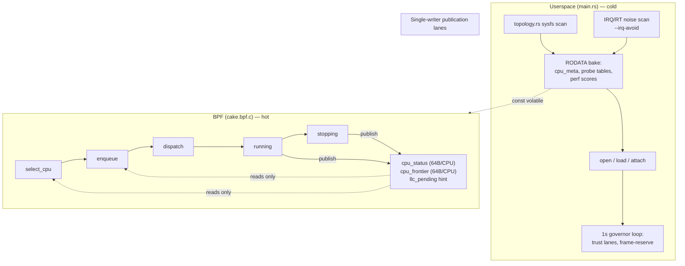
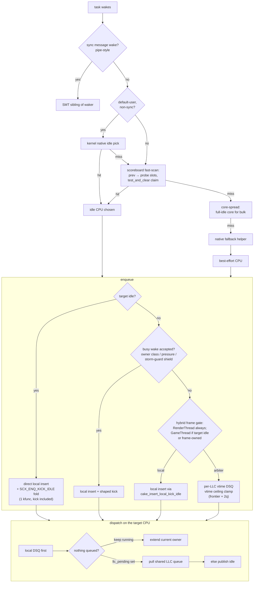
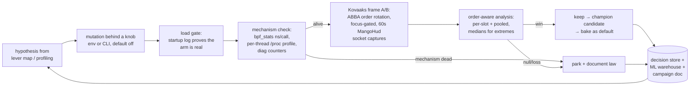

# scx_cake 1.2.0

[](https://opensource.org/licenses/GPL-2.0)
[](https://kernel.org)
[](https://github.com/sched-ext/scx)

`scx_cake` is a `sched_ext` CPU scheduler whose **primary focus is gaming** —
frame consistency, tail latency, and input-to-photon responsiveness — while
remaining a competent **general-purpose scheduler**: desktop, compile, and
benchmark workloads run through the same machinery with service-aware shaping
rather than a separate mode. It applies CAKE-inspired ideas (the bufferbloat
queue discipline) to CPU time: keep the wake path short, publish state from a
single writer, give the latency-critical flow a deterministic fast lane, and
arbitrate everything else fairly.

The current design is the **service-gated hybrid queue** (2026-06-10). It has
been measured side-by-side against Linux EEVDF (including the 7.1-era
HRTICK-at-deadline and POC-idle-selector improvements), `scx_cosmos`, and
`scx_lavd` on the development machine — a Ryzen 7 9800X3D + RTX 4090 running
a CachyOS 7.1-rc7 kernel with one custom sched_ext patch — using an
order-rotated, focus-gated A/B protocol on a focused KovaaK's workload. The
explicit numbers, the test system, and the methodology are in
[Measured results](#measured-results-2026-06-10) so you can judge for
yourself; one machine and one title are a data point, not a universal claim.
The campaign decision log is in
[docs/mutation_campaign_2026-06-10.md](./docs/mutation_campaign_2026-06-10.md).

> [!WARNING]
> `scx_cake` is experimental scheduler code. It requires a Linux kernel with
> `sched_ext` support and root privileges. If the BPF scheduler misbehaves,
> the kernel's `sched_ext` watchdog evicts it and the system falls back to the
> default scheduler automatically — a crashed experiment costs you a hiccup,
> not a hang.

> [!IMPORTANT]
> **AI assistance disclosure.** Code mutation in this project is done with AI
> assistance, and I am stating that openly because users deserve to know how
> the software they run is built. The discipline that makes this workable is
> that **no change lands on trust**: every code change — AI-assisted or not —
> must prove itself through the benchmark gauntlet described in
> [The mutation and testing system](#the-mutation-and-testing-system) (load
> gates, mechanism checks, and order-rotated live game A/Bs) before it
> becomes a default, and changes that fail are parked in-tree with their
> falsification documented.

## Table of contents

1. [Quick start](#quick-start)
2. [Build-time flags (complete)](#build-time-flags-complete)
3. [Runtime flags (complete)](#runtime-flags-complete)
4. [Architecture](#architecture)
5. [Hot paths and cold paths](#hot-paths-and-cold-paths)
6. [Named concepts and code patterns](#named-concepts-and-code-patterns)
7. [The mutation and testing system](#the-mutation-and-testing-system)
8. [Measured results](#measured-results-2026-06-10)
9. [Vocabulary](#vocabulary) and [Gamer terms](#gamer-terms)
10. [User concerns for gaming](#user-concerns-for-gaming)
11. [Source tour](#source-tour)

## Quick start

```bash
git clone https://github.com/sched-ext/scx.git
cd scx

# A plain release build IS the measured champion configuration.
cargo build --release -p scx_cake
sudo ./target/release/scx_cake

# Debug build: TUI, telemetry, runtime A/B knobs
cargo build -p scx_cake
sudo ./target/debug/scx_cake --verbose
```

Requirements: Linux `6.12+` with `sched_ext`, a Rust toolchain, the `scx`
repository's build dependencies, and root to attach.

## Build-time flags (complete)

Release builds bake policy at compile time so the verifier const-folds
branches and dead paths disappear from the JIT output. Every knob is an
environment variable read by `build.rs`. Defaults marked ⭐ are the measured
champion; entries marked 📦 are parked experiments kept for reproducibility
(measured worse or neutral — see the campaign logs before re-enabling).

### Core tuple

| Env | Default | Values | Meaning |
| :-- | :-- | :-- | :-- |
| `SCX_CAKE_PROFILE` | ⭐ `gaming` | `gaming`, `esports`, … | Baked profile preset (quantum and policy seeds). |
| `SCX_CAKE_QUANTUM_US` | ⭐ `1000` | µs | Base slice. Owner-class thresholds derive from it (`short=q/8`, `med=q/4`, `frame=q/2`, `bulk=q−q/8`). |
| `SCX_CAKE_QUEUE_POLICY` | ⭐ `llc-vtime` | `local`, `llc-vtime` | Busy-fallback queue shape. `local` restores the per-CPU local-first design **and compiles in the native-fast-wake game stack** (the two shapes are different compiled programs, not a runtime switch). |
| `SCX_CAKE_HYBRID_QUEUE` | ⭐ `4` | `0`–`4` | Frame gate for the llc-vtime build. `0` off, `1` GameThread+RenderThread local, `2` GT-only 📦, `3` RT-only 📦 (both single-thread gates destabilize 1% lows, σ 83–104 vs 10–40 — measured), `4` RT always + GT onto idle/frame-owned targets only (champion). |
| `SCX_CAKE_STORM_GUARD` | ⭐ `shield` | `off`, `shadow`, `shield`, `full` | Busy-wake handoff envelope under wake storms. |
| `SCX_CAKE_BUSY_WAKE_KICK` | ⭐ `policy` | `policy`, `preempt`, `idle` | Same-CPU busy-wake kick shaping. |

### Release accelerators

| Env | Default | Meaning |
| :-- | :-- | :-- |
| `SCX_CAKE_RELEASE_LLC_PENDING` | ⭐ on | `llc_pending` hint lane: dispatch only pulls the shared LLC queue when the hint says work may exist. |
| `SCX_CAKE_RELEASE_LOCAL_WAITER` | ⭐ on | Head-insert + preempt-kick lane for futex/schbench-style waiter handoffs. |
| `SCX_CAKE_RELEASE_PLANCK_LOCAL` | ⭐ on | Minimal local-insert fast path. |
| `SCX_CAKE_RELEASE_ROUTE_PRED` | 📦 off | Route replay/prediction subsystem (stubbed in champion; large surface, no measured win). |
| `SCX_CAKE_RELEASE_CONFIDENCE` | 📦 off | Packed-confidence floor gears for narrowing probe width. |
| `SCX_CAKE_RELEASE_DOMAIN_DRR` | 📦 off | Per-class domain DRR queues. |
| `SCX_CAKE_CORE_STEAL_DHQ` | 📦 off | Lock-free dequeue (arena) variant of core-steal. |
| `SCX_CAKE_LEARNED_LOCALITY` / `SCX_CAKE_WAKE_CHAIN_LOCALITY` | 📦 off | Learned wake-chain steering (debug/arena surface). |

### Wake-path experiment family

These exist because the wake path is where gaming latency lives; each was an
instrumented A/B. The `NFW_*` group only compiles in `local`-policy builds.

| Env | Default | Measured status |
| :-- | :-- | :-- |
| `SCX_CAKE_NATIVE_FAST_WAKE` | ⭐ on (local builds) | Route default-user wakes through the kernel idle pick + select-side direct insert. Core of the 6-08 `smtstrict` stack that beat cosmos 6/6. |
| `SCX_CAKE_NATIVE_FAST_WAKE_MISS_TUNNEL` | ⭐ on (local) | A native-idle miss is authoritative — tunnel to prev instead of re-probing. |
| `SCX_CAKE_NFW_STRICT_SIBLING` | ⭐ on (local) | Reject warm-prev claims when ANY SMT sibling is busy (fixed a 12× SMT-contention bug vs EEVDF). |
| `SCX_CAKE_DISPATCH_SKIP_RESCUE` | ⭐ on | Skip dispatch idle-rescue probes (−35.5% dispatch ns, no regression). |
| `SCX_CAKE_BUSY_WAKE_GRACE` | ⭐ on | 250µs–4ms pressure-scaled preemption grace for busy wakes (game builds compile it out via profile). |
| `SCX_CAKE_NFW_LEAN_PREV` | 📦 off | Leaner prev-claim; tied avg, won tails, but was the maxFT variance culprit (1.22↔10.96ms). |
| `SCX_CAKE_NFW_MISS_SHARED` | 📦 off | Park wakee in the shared LLC queue on a global idle miss (cosmos-style work conservation). |
| `SCX_CAKE_PREV_IDLE_OVERRIDE` | 📦 off | Prev-CPU idle claim override experiments. |
| `SCX_CAKE_WAKE_PREEMPT_ELAPSED` / `_ADAPTIVE` / `_US` | 📦 off | Elapsed-gated wake preemption (EEVDF-eligibility-like, regime-gated by owner burst length). |
| `SCX_CAKE_KTHREAD_WAKE_PREEMPT` | 📦 off | Kthreads always preempt (GPU-submit chain experiment). |
| `SCX_CAKE_LEAN_WAKE_KICK` | 📦 off | Preempt default wakes unless the owner is frame/interactive class. |
| `SCX_CAKE_SMT_CLEAN_SELECT` / `SCX_CAKE_FRAME_OWNER_SHIELD` | 📦 off | SMT-clean selection and blunt frame-owner preemption shields. |
| `SCX_CAKE_ENQ_SKIP_BUSY_KICK` / `_SKIP_IDLE_KICK` / `SCX_CAKE_FAST_ENQUEUE` | 📦 off | Enqueue ablations (proved the idle kick is load-bearing and the enqueue kfunc floor is irreducible). |
| `SCX_CAKE_LEAN_ACCOUNTING` | 📦 off | Reduced stopping-path accounting. |
| `SCX_CAKE_VTIME_WAKE_FLOOR` | 📦 off | EEVDF-style wake-lag floor at arbiter inserts (measured: hurts 0.1% lows; extreme tails are not vtime queue-jumps). |

### Instrumentation builds

| Env | Default | Meaning |
| :-- | :-- | :-- |
| `SCX_CAKE_GAME_DIAG` | off | Compile the release game-diag recorder: per-CPU action counters (wake routing, kick shapes, queue depths) plus frame-preemptor attribution, dumped headlessly by `--verbose`. ~free when idle; only for capture runs. |
| `SCX_CAKE_FUTEX_TRACE` | off | Futex-lane event tracing for waiter-handoff studies. |

## Runtime flags (complete)

```text
scx_cake [OPTIONS]
```

| Flag | Default | Meaning |
| :-- | :-- | :-- |
| `-p, --profile <PROFILE>` | `gaming` | Profile (debug builds; release uses the baked value). |
| `--quantum <US>` | baked | Override slice in debug builds. |
| `--queue-policy <local\|llc-vtime>` | baked | Debug-only runtime queue policy A/B; release is compile-time. |
| `--storm-guard <off\|shadow\|shield\|full>` | `shield` | Busy-wake storm envelope. |
| `--busy-wake-kick <policy\|preempt\|idle>` | `policy` | Busy-wake kick shaping. |
| `--learned-locality`, `--wake-chain-locality` | off | Debug arena-backed locality steering. |
| `--enq-kick-idle` | **on by default** | Force the `SCX_ENQ_KICK_IDLE` fold (it defaults on; `SCX_CAKE_ENQ_KICK_IDLE=0` disables). The fold lets the local-DSQ insert itself carry the idle kick — one BPF→kernel crossing per idle wake. BTF-probed against the running kernel; falls back to the explicit kick on kernels without the flag. |
| `--irq-avoid <auto\|0\|cpulist>` | **`auto`** | RT/IRQ noise-avoid: at load, sample `/proc/interrupts` (100ms) and FIFO/RR thread wake rates (200ms); demote CPUs hosting ≥2k IRQs/s or ≥300 RT wakes/s in the routing perf scores. `0` disables; an explicit list (`"12,13"`) skips detection. |
| `--frame-reserve` | off 📦 | Reserve the top core exclusively for the frame anchor, with a userspace governor re-picking the core every ~2s. **Parked**: measured to backfire — see [the RT-magnet law](#named-concepts-and-code-patterns). |
| `-v, --verbose` | off | Debug TUI when on a terminal; headless diag snapshots otherwise (release: requires the `GAME_DIAG` build). |
| `--interval <S>` / `--diag-dir <DIR>` / `--diag-period <S>` | `1` / `.` / `60` | Telemetry cadence and headless diag output. |
| `--compare-dump <BASELINE> <CANDIDATE>` | — | Offline TUI-dump diff; exits without loading BPF. |
| `-V, --version` | — | Version. |

Runtime environment variables: `SCX_CAKE_ENQ_KICK_IDLE` (`0` disables the
fold), `SCX_CAKE_IRQ_AVOID` (same values as the flag),
`SCX_CAKE_FRAME_RESERVE` (`1` enables). Flags win over env.

## Architecture


```mermaid
flowchart TB
    subgraph US["Userspace (main.rs) — cold"]
        T[topology.rs sysfs scan] --> R[RODATA bake:<br/>cpu_meta, probe tables,<br/>perf scores]
        N[IRQ/RT noise scan<br/>--irq-avoid] --> R
        R --> A[open / load / attach]
        A --> G[1s governor loop:<br/>trust lanes, frame-reserve]
    end
    subgraph BPF["BPF (cake.bpf.c) — hot"]
        S[select_cpu] --> E[enqueue]
        E --> D[dispatch]
        D --> RU[running] --> ST[stopping]
        ST -->|publish| L
        RU -->|publish| L
    end
    subgraph LANES["Single-writer publication lanes"]
        L["cpu_status (64B/CPU)<br/>cpu_frontier (64B/CPU)<br/>llc_pending hint"]
    end
    R -.const volatile.-> BPF
    L -.reads only.-> S
    L -.reads only.-> E
```

Two structural ideas carry the design:

1. **Cake Scoreboard Dispatch.** Every CPU owns one cache line of published
   state (`cpu_status`: idle/accept/wake-preempt bits, owner class, pressure
   bucket, epoch; `cpu_frontier`: the vtime frontier). Remote placement reads
   these single-writer lines plus immutable topology RODATA — never another
   CPU's private bookkeeping. One writer per line means no multi-writer
   contention on the wake path; write elision
   (`cake_status_same_visible_state`) means a no-op publish never invalidates
   remote cached copies.

2. **Service-gated hybrid queue.** The busy-fallback path splits by thread
   role. The frame pipeline's serial pair (GameThread/RenderThread) keeps the
   deterministic LOCAL handoff; everything else is arbitrated through a
   per-LLC virtual-time queue. Measured law: the pair must share the queue
   shape — gating only one of the two threads destabilizes 1% lows by 3–8×,
   because the GT↔RT handoff is the frame's serial spine.

### The journey of a wakeup (champion build)


```mermaid
flowchart TD
    W[task wakes] --> MS{sync message wake?<br/>pipe-style}
    MS -->|yes| SIB[SMT sibling of waker]
    MS -->|no| BE{default-user,<br/>non-sync?}
    BE -->|yes| NAT[kernel native idle pick]
    NAT -->|hit| OK[idle CPU chosen]
    NAT -->|miss| FS
    BE -->|no| FS[scoreboard fast-scan:<br/>prev → probe slots,<br/>test_and_clear claim]
    FS -->|hit| OK
    FS -->|miss| CS[core-spread:<br/>full-idle core for bulk]
    CS -->|miss| NF[native fallback helper]
    NF --> OK2[best-effort CPU]
    OK --> ENQ
    OK2 --> ENQ
    subgraph ENQ[enqueue]
        I{target idle?} -->|yes| DL["direct local insert<br/>+ SCX_ENQ_KICK_IDLE fold<br/>(1 kfunc, kick included)"]
        I -->|no| BW{busy wake accepted?<br/>owner class / pressure /<br/>storm-guard shield}
        BW -->|yes| DL2[local insert + shaped kick]
        BW -->|no| HG{hybrid frame gate:<br/>RenderThread always;<br/>GameThread if target idle<br/>or frame-owned}
        HG -->|local| DL3[local insert via<br/>cake_insert_local_kick_idle]
        HG -->|arbiter| VT["per-LLC vtime DSQ<br/>vtime ceiling clamp<br/>(frontier + 2q)"]
    end
    DL --> DISP
    DL2 --> DISP
    DL3 --> DISP
    VT --> DISP
    subgraph DISP[dispatch on the target CPU]
        LQ[local DSQ first] --> KR{nothing queued?}
        KR -->|keep running| CUR[extend current owner]
        KR -->|llc_pending set| PULL[pull shared LLC queue]
        PULL --> IDLE[else publish idle]
    end
```

**Design decisions, and why:**

- *Local-first, arbiter-second.* Direct local inserts are the cheapest
  correct handoff (`SCX_DSQ_LOCAL_ON | cpu`); the shared queue exists for
  fairness and work conservation, not as the common case. Local queue depth
  in-game measures ~0 (8 non-zero samples in 2.8M probes).
- *The hybrid gate is owner-conditional for GameThread.* GT→LOCAL onto a
  frame-owned core preserves the pair handoff; GT→arbiter otherwise escapes
  bulk pileups. This single condition is what converted average FPS to parity-
  or-better while keeping the 1%-low/p99 wins (the 2×2 gate ablation is in the
  campaign doc).
- *The idle kick rides the insert.* With the `SCX_ENQ_KICK_IDLE` kernel flag
  (patches in [kernel-patches/](./kernel-patches/), BTF-probed at load), the
  enqueue path is one kfunc instead of two: measured 164.6 → 46.8 ns/call
  in-game with identical kick semantics.
- *Fairness is bounded, not strict.* `dsq_vtime += runtime +
  (100−weight)·20480`, seeded from the published frontier, wake-clamped to
  `frontier + 2 quanta` so sleepers rejoin near the present. The arbiter
  orders fallback work; placement is trusted elsewhere.
- *Routing avoids noisy cores deterministically.* EEVDF dodges IRQ/RT-loaded
  cores statistically via capacity accounting; cake's static routing was
  measured RT-blind (compositor/audio FIFO threads preempting the frame
  pipeline ~400–680/s). `--irq-avoid auto` demotes those cores at load.

## Hot paths and cold paths

Per-callback costs from kernel `bpf_stats` under live KovaaK's (~13k wakes/s;
champion build):

| Path | Temperature | Cost (ns/call) | What happens |
| :-- | :-- | --: | :-- |
| `cake_select_cpu` | hot, ~wake rate | ~53–55 | Message-wake fast path → native bulk escape → scoreboard fast-scan (prev + probe slots, claim via `test_and_clear_cpu_idle`) → core-spread → native fallback. Reads: task_struct, `cpu_status`, RODATA probe packs. |
| `cake_enqueue` | hot, ~wake rate | ~47 (folded) / ~165 (explicit kick) | Idle → direct local insert (+kick fold). Busy → accepted-wake local handoff or hybrid gate or vtime arbiter. The comm-word service classifier and the gate cost ~2 loads. |
| `cake_dispatch` | hot, ~2× ctx-switch rate | ~22–23 | Local DSQ → keep-running slice refresh → `llc_pending`-gated shared pull → idle publication. |
| `cake_running` | hot, ctx-switch rate | ~30–32 | Owner bookkeeping start: last-pid fast path, owner publication on task change (write-elided). |
| `cake_stopping` | hot, ctx-switch rate | ~21 | Vtime integration, owner-runtime EWMA, frontier publication, owner-class/pressure derivation (LUT, no branches). |
| `cake_enable` | cold, task birth | ~8–14 | Seed `dsq_vtime` from the CPU frontier. |
| `cake_init` | cold, once | ~11µs | Create per-LLC + per-CPU DSQs, pin `cpuperf` to max (gaming). |
| loader (`main.rs`) | cold, once | ~0.5s | Topology scan, perf scores, IRQ/RT noise scan (~300ms sampling), RODATA bake, attach. |
| governor loop | cold, 1 Hz | ~10ms/tick worst | Trust-lane tick; frame-reserve RT rescan when enabled. |

Cold paths deliberately absorb work so hot paths don't: the probe tables,
LLC masks, sibling maps, demoted perf order — all baked once into
`const volatile` RODATA, so the verifier const-folds bounds and the JIT sees
immediates. Debug-only surfaces (TUI telemetry, arena task contexts, the
behavioral classifier, ring-buffer events) compile to empty stubs in release
and are dead-code-eliminated — verified by disassembling the release object,
not assumed.

## Named concepts and code patterns

| Pattern | What it is | Why it exists |
| :-- | :-- | :-- |
| **Cake Scoreboard Dispatch** | Init-built candidate tables + owner-published per-CPU lanes as the only cross-CPU placement signal. | Placement from cache-line facts, not shared structures. One writer per line. |
| **Owner publication / write elision** | Only the owning CPU writes its `cpu_status`/`cpu_frontier`; `cake_status_same_visible_state` skips no-op publishes. | A redundant store still invalidates remote cache copies; elision keeps the lanes read-mostly. |
| **Service-gated hybrid queue** | Queue shape chosen per thread role (frame pair LOCAL, rest arbiter). | The two pure shapes trade average vs tails; the gate takes both. |
| **Pair-coherence law** | GameThread and RenderThread must share a queue shape. | Measured: any partial gate destabilizes 1% lows 3–8× (handoff variance re-enters). |
| **Enq-kick-idle fold** | `SCX_ENQ_KICK_IDLE` enq_flag on local inserts; the kernel kicks from inside the insert. | Two kfunc crossings → one on every idle wake (−72% enqueue ns in-game). |
| **Noise-avoid** | Load-time demotion of IRQ-storm/RT-resident cores in routing scores. | FIFO compositor/audio threads preempt anything sched_ext puts under them; dodge deterministically. |
| **The RT-magnet law** 📦 | An exclusively-reserved (mostly idle) core becomes the kernel's *preferred* RT wake/push target — `cpupri` ranks idle CPUs first. | Why `--frame-reserve` is parked: isolation under sched_ext attracts the interference it was built to avoid. Counter-designs are documented in the campaign log. |
| **Comm-word classification** | Service detection via 64-bit word compares on `p->comm` (`GameThread`, `RenderThread`, bench services). | ~2 loads on the hot path. A behavioral classifier exists in debug telemetry but isn't wired into release placement yet — known design smell, honest tradeoff. |
| **Frontier clamp** | Wakee vtime capped to `frontier + 2 quanta`. | Responsiveness-first: sleepers rejoin near the present instead of waiting out accumulated CPU-bound progress. |
| **Keep-running** | Dispatch extends the current owner when nothing is queued. | The cheapest scheduling decision is no decision; ~107k/s in-game. |
| **`llc_pending` hint** | Conservative may-have-work flag for the shared queue. | Idle dispatch never pays for empty shared pulls. |
| **Kfunc-floor honesty** | Enqueue ablations (`FAST_ENQUEUE`, kick-skips) measured zero: the dsq-insert+kick kfunc cost is the floor. | Redesigns target mechanisms, not phantom overhead. |

## The mutation and testing system

`scx_cake` is developed as an instrumented mutation campaign: thousands of
benchmark runs and hundreds of live game captures, each tied to a change-id,
with **null results logged as findings**. Nothing ships on intuition; parked
experiments stay in-tree behind knobs with their falsification documented.


```mermaid
flowchart LR
    IDEA[hypothesis from<br/>lever map / profiling] --> MUT[mutation behind a knob<br/>env or CLI, default off]
    MUT --> GATE[load gate:<br/>startup log proves the<br/>arm is real]
    GATE --> MECH[mechanism check:<br/>bpf_stats ns/call,<br/>per-thread /proc profile,<br/>diag counters]
    MECH -->|mechanism dead| PARK[park + document law]
    MECH -->|alive| AB[Kovaaks frame A/B:<br/>ABBA order rotation,<br/>focus-gated, 60s MangoHud<br/>socket captures]
    AB --> STATS[order-aware analysis:<br/>per-slot + pooled,<br/>medians for extremes]
    STATS -->|win| KEEP[keep → champion candidate<br/>→ bake as default]
    STATS -->|null/loss| PARK
    KEEP --> STORE[(decision store +<br/>ML warehouse +<br/>campaign doc)]
    PARK --> STORE
    STORE --> IDEA
```

The protocol encodes measured measurement-laws:

- **ABBA order rotation.** Arms run in alternated order across cycles because
  slot position alone moves tail metrics more than schedulers do (measured:
  slot-1 advantage up to +5% on 1% lows). Fixed-order tail rankings are
  invalid.
- **Focus gating, fail-closed.** Captures refuse to start unless the game
  window is the active focus; an unfocused scene measures a different
  workload.
- **Stutter-aware estimators.** Rare multi-ms game-side stutters hit both
  arms at a session-dependent rate; at small n the extremes are reported as
  medians or stutter-excluded means, never raw pooled means.
- **Mechanism before frames.** A mutation that can't show its mechanism
  (bpf_stats deltas, preemption attribution, diag counters) doesn't earn
  bench time; a mutation whose mechanism is falsified at the profile gate is
  parked without burning capture cycles.
- **Same-binary arms when possible.** A/B arms differ by one runtime flag on
  the identical binary (e.g. the enq-kick-idle fold), so the delta isolates
  the mechanism.

Tooling (the harness lives in the separate `scx_cake_bench_assets`
repository): a MangoHud-socket capture driver with scheduler-runner staging
(binaries hash-verified and staged by a scoped root runner), `cake-bpfstats`
(per-callback ns via kernel `bpf_stats`), a scheduler-agnostic per-thread
profiler (run%, wait/slice, migrations, involuntary switches), the
`GAME_DIAG` action recorder with frame-preemptor attribution, an ML warehouse
that ingests every run with full build/source lineage, and a decision store
holding keep/park/reject verdicts with their evidence run-ids. Bench-suite
runs (schbench, stress-ng families, sched-pipe/messaging) guard general
scheduling performance alongside the game captures.

In-repo A/B harnesses:
[bench/enq_kick_idle_ab.sh](./bench/enq_kick_idle_ab.sh),
[bench/enq_kick_idle_schbench_ab.sh](./bench/enq_kick_idle_schbench_ab.sh),
[bench/scx_cake_thread_profile.py](./bench/scx_cake_thread_profile.py).

## Measured results (2026-06-10)

These are the numbers from one well-instrumented machine and one title.
They are offered so you can see exactly what was measured and how — not as a
claim about every system or every game. Reproduce them with the bench
harness before trusting them on your hardware.

### Test system

| Component | Value |
| :-- | :-- |
| CPU | AMD Ryzen 7 9800X3D (8C/16T, single CCD, ~5.5 GHz) |
| GPU | NVIDIA RTX 4090 |
| Display | 4K 240 Hz (VRR), MangoHud capture at the socket |
| Kernel | `7.1.0-rc7-1-cachyos-rc-custom` (`uname -r`) — CachyOS rc kernel **plus one custom patch**: `SCX_ENQ_KICK_IDLE` (in [kernel-patches/](./kernel-patches/)) |
| EEVDF baseline | The same kernel's EEVDF, with HRTICK-at-deadline default-on and the CachyOS POC idle selector active — a strong, current baseline |
| Workload | KovaaK's (Proton), focused, ~1005 fps scene for the fresh-instance set |

Protocol: 60s MangoHud socket captures, arm order alternated ABBA across
cycles, focus-gated fail-closed, fresh game instance, extremes reported as
medians / stutter-excluded means (one random 3–4.7 ms game-side stutter hit
each arm exactly once during this set; they land scheduler-independently).

### scx_cake (hybrid4) vs EEVDF — fresh instance, 4-cycle ABBA, n=4/arm

| metric | scx_cake | EEVDF | difference |
| :-- | --: | --: | :-- |
| avg FPS | 1008.6 | 1004.8 | +0.4% (slot-consistent, 3 of 4 cycles) |
| 1% low FPS | 777.2 | 711.9 | +9.2% (zero overlap: lowest cake run 750.0 vs highest EEVDF run 736.5) |
| p99 frametime | 1.288 ms | 1.405 ms | −8.4% (zero overlap: worst cake 1.333 vs best EEVDF 1.358) |
| 0.1% low FPS | 617.7 | 588.5 | +5.0% pooled, +6.8% stutter-excluded |
| max frametime (median) | 1.634 ms | 1.691 ms | −3.3% |
| frametime stddev (median) | 0.0825 | 0.0955 | −13.6% |
| jitter max Δ (median) | 0.694 ms | 0.739 ms | −6.1% |

Across the day's longer-session sets the same build held the 1%-low and p99
advantages with no department lost; cake's tail spreads ran 3–4× tighter
(1%-low σ 10–40 vs 43–103), and EEVDF's tail quality drifted downward over a
multi-hour session while cake's stayed flat.

### scx_cake (hybrid4) vs scx_cosmos — 2-cycle ABBA, n=2/arm

| metric | scx_cake | scx_cosmos | difference |
| :-- | --: | --: | :-- |
| avg FPS | 1330.5 | 1324.6 | +0.4% (won both cycles, incl. from the later slot) |
| 1% low FPS | 980.8 | 957.5 | +2.4% (both cycles) |
| p99 frametime | 1.020 ms | 1.046 ms | −2.5% (both cycles) |
| frametime stddev | 0.078 | 0.081 | −3.7% |
| 0.1% low / max FT / jitter | 753.2 / 1.366 / 0.645 | 767.5 / 1.378 / 0.664 | within slot noise — treat as ties at this n |

(Different scene state than the EEVDF set — ~1330 fps; compare columns within
a table, not across tables.)

### scx_cake (hybrid4) vs scx_lavd — cleanest full cycle, same scene

| metric | scx_cake | scx_lavd | difference |
| :-- | --: | --: | :-- |
| avg FPS | 1327.4 | 1240.4 | +7.0% |
| 1% low FPS | 993.5 | 866.3 | +14.7% |
| 0.1% low FPS | 758.4 | 463.9 | +63% |
| max frametime | 1.327 ms | 4.923 ms | −73% |
| jitter max Δ | 0.577 ms | 4.133 ms | −86% |
| p99 frametime | 1.007 ms | 1.154 ms | −12.7% |

lavd recorded 4–5 ms worst-frames in two of its three runs in this scene; its
strengths may lie elsewhere — these numbers describe this workload on this
machine, nothing broader.

### scx_cake (hybrid4) vs EEVDF — World of Warcraft, 4-cycle ABBA, n=4/arm

A second-title check on a very different workload: an MMO (vkd3d-proton,
player-housing scene, ~475 fps) with naturally heavy tails — the scene
streams in 4–8 ms hitch waves that arrive game-side in alternating cycles and
hit whichever scheduler is up, so extremes are read as medians.

| metric | scx_cake | EEVDF | Δmean | Δmedian | cycles won (cake) |
| :-- | --: | --: | :-- | :-- | :-- |
| avg FPS | 473.1 | 473.4 | −0.1% | −0.3% | 2/4 — parity |
| 1% low | 260.2 | 248.8 | +4.6% | +4.0% | 3/4 |
| p99 frametime | 3.85 ms | 4.03 ms | −4.5% | −3.7% | 3/4 |
| 0.1% low | 195.5 | 183.2 | +6.7% | +7.9% | 2/4 (hitch-wave bimodal) |
| max frametime | 5.79 ms | 6.01 ms | −3.7% | −3.1% | 3/4 |
| frametime stddev | 0.459 | 0.499 | −8.1% | −12.0% | 3/4 |
| jitter (max Δ) | 3.76 ms | 3.95 ms | −4.8% | −3.1% | 3/4 |

Honest grade: at n=4 in a hitch-wave scene none of these pass the
slot-consistency bar the KovaaK's claims meet — read this as "the same
profile, favored" rather than proven: average at parity, tail and smoothness
metrics ahead in three of four cycles each, nothing lost. The shape of the
KovaaK's result generalized to a different engine and workload class.

Reproducibility note: measuring WoW at all required patching MangoHud —
stock 0.8.4's control socket wedges from launch under vkd3d (an early
non-presenting Vulkan instance binds the per-pid socket and never services
it; instance teardown then closes it; the fd also leaks into child
processes). The fix (process-global control socket + teardown guard +
`SOCK_CLOEXEC`) is in the bench-assets repository under `mangohud-patches/`
and is being prepared for upstream. WoW's MangoHud capture prefix is `WoW`,
not `wow`.

### Mechanism measurements

- Enq-kick-idle fold: `cake_enqueue` 164.6 → 46.8 ns/call in-game (−72%) at
  ~13k idle wakes/s; frame metrics unchanged (the saving is real but below
  the frame noise floor — kept because cheaper is cheaper).
- Frame-preemptor attribution: 99.7% of GameThread's involuntary context
  switches are RT-class sandwiches (compositor ~11k wakes/s FIFO, PipeWire
  audio loops, GPU IRQ thread) — invisible to sched_ext, motivating
  `--irq-avoid` and falsifying `--frame-reserve`.

## Vocabulary

| Term | Meaning in `scx_cake` |
| :-- | :-- |
| `sched_ext` | Kernel framework allowing this BPF scheduler to provide the scheduling policy, with a watchdog that evicts misbehaving schedulers. |
| DSQ | Kernel dispatch queue. `SCX_DSQ_LOCAL_ON \| cpu` targets one CPU; cake adds one vtime-ordered DSQ per LLC. |
| `cpu_status` | Owner-published per-CPU cache line: idle/accept/wake-preempt bits, owner class, pressure, epoch, latency class. |
| `cpu_frontier` | Owner-published per-CPU vtime frontier; seeds/clamps task vtime without touching private state. |
| owner class | EWMA-derived class of a CPU's current owner: short / interactive / frame / bulk (thresholds are quantum fractions). |
| `dsq_vtime` | Per-task virtual time (ns): runtime plus a nice-weight adjustment; orders the shared queue. |
| quantum | Base slice; release bakes it (gaming: 1 ms). |
| hybrid gate | The per-thread-role queue-shape decision at busy fallback. |
| probe slots | Loader-built per-CPU candidate CPUs for the fast idle scan, packed for single-load access. |
| keep-running | Dispatch extending the current owner when no work is queued. |
| ABBA | A/B protocol with arm order alternated between cycles. |

## Gamer terms

| Term | Meaning, and what cake does about it |
| :-- | :-- |
| frametime | Time to produce one frame (ms). Scheduling shows up here when the frame pipeline waits for CPU. |
| avg FPS | Throughput. Serial GameThread work caps it; schedulers mostly lose it through placement and handoff overhead. |
| 1% / 0.1% lows | Average FPS of the worst 1% / 0.1% of frames — the hitches you feel. Cake's strongest department (+9.2% zero-overlap vs EEVDF). |
| p99 frametime | 99th-percentile frametime; pacing consistency. |
| jitter | Frame-to-frame time variance. Tight jitter = stable aim feel. |
| stutter | A multi-ms frame. Some stutters are game-side (shader compilation, streaming) and hit any scheduler; measured rate varies by session. |
| frame pacing | Evenness of frame delivery; FT-stddev and jitter measure it. |
| frame pipeline | GameThread → RenderThread → graphics driver → GPU. The GT↔RT handoff is the serial spine cake's hybrid gate protects. |
| input latency | Click-to-photon. Wake latency of the frame pipeline is the scheduler's slice of it. |
| VRR / fps cap | Variable refresh and frame limiting change the workload shape; cake's captures record both — compare like against like. |

## User concerns for gaming

Honest answers to the questions you should ask before running an experimental
scheduler under your games:

- **What if it breaks mid-game?** The `sched_ext` watchdog (5s timeout)
  evicts a stalled BPF scheduler and the system falls back to EEVDF. You get
  a hiccup, not a freeze. `scxctl stop` restores native at any time.
- **Root and kernel requirements.** Attaching needs root and a `6.12+` kernel
  with `sched_ext`. The `SCX_ENQ_KICK_IDLE` optimization additionally wants a
  for-7.2+ kernel (or the included patch); without it cake silently uses the
  explicit-kick fallback — correct, slightly slower.
- **Anti-cheat.** cake never touches game memory or processes — it is kernel
  scheduling policy. No anti-cheat interaction has been observed; the same
  applies to any sched_ext scheduler, but no guarantee is made.
- **Will it help my game?** Measured on a CPU-bound aim trainer at very high
  FPS. GPU-bound titles see less scheduler influence. The honest expectation
  from the data: similar averages, noticeably better and *more repeatable*
  lows. Measure your own title — the bench harness exists for exactly that.
- **Compositor/audio interference is real.** FIFO-priority compositor and
  audio threads preempt any sched_ext scheduler's threads. `--irq-avoid`
  mitigates routing into them; it cannot eliminate RT preemption (nothing
  below RT can).
- **Power and frequency.** The gaming profile pins `cpuperf` to maximum while
  attached — frame consistency over power efficiency. Stop the scheduler to
  return to your governor's behavior.
- **Session drift.** Long game sessions accumulate game-side state (shader
  caches, memory fragmentation); measured EEVDF tail quality drifts with it
  while cake stays flat — but absolute numbers from different session ages
  are not comparable. Restart the game between serious measurement sets.

## Source tour

| File | Role |
| :-- | :-- |
| [src/main.rs](./src/main.rs) | Loader, CLI, RODATA bake, IRQ/RT noise scan, frame-reserve governor, attach loop |
| [src/bpf/cake.bpf.c](./src/bpf/cake.bpf.c) | The scheduler: all `sched_ext` callbacks and policy |
| [src/bpf/intf.h](./src/bpf/intf.h) | Shared structs, scoreboard layout, diag counters |
| [src/topology.rs](./src/topology.rs) | Topology detection and mask construction |
| [src/tui.rs](./src/tui.rs) | Debug TUI and telemetry consumer |
| [kernel-patches/](./kernel-patches/) | `SCX_ENQ_KICK_IDLE` upstream patch + 7.0-stable backport |
| [bench/](./bench) | In-repo A/B harnesses and the per-thread profiler |
| [docs/](./docs) | Research notes, design analysis, mutation-campaign decision logs |

### Main callbacks

| Callback | Purpose |
| :-- | :-- |
| `cake_select_cpu` | message-wake fast path, native bulk escape, scoreboard probes, native fallback, clean direct dispatch |
| `cake_enqueue` | idle direct insert (+kick fold), accepted busy-wake handoff, hybrid frame gate, vtime arbiter |
| `cake_dispatch` | local first, keep-running, `llc_pending`-gated shared pull, idle publication |
| `cake_running` / `cake_stopping` | owner bookkeeping, vtime integration, status/frontier publication |
| `cake_enable` | seed `dsq_vtime` from the published frontier |
| `cake_init` / `cake_exit` | DSQ creation, `cpuperf` pin, exit info |

## Related notes

- [docs/mutation_campaign_2026-06-10.md](./docs/mutation_campaign_2026-06-10.md) — the hybrid-queue campaign: decision log, falsifications, measurement laws
- [docs/hot_path_optimization_analysis.md](./docs/hot_path_optimization_analysis.md)
- [docs/idle_path_bubble_reduction_proposal.md](./docs/idle_path_bubble_reduction_proposal.md)
- [docs/benchmark_winner_analysis.md](./docs/benchmark_winner_analysis.md)
