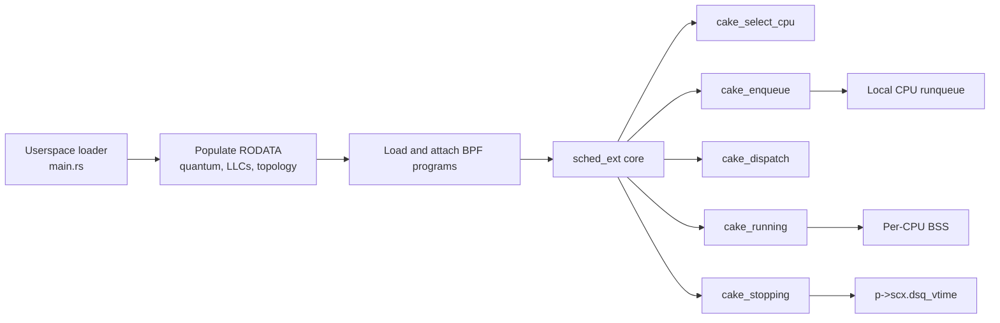
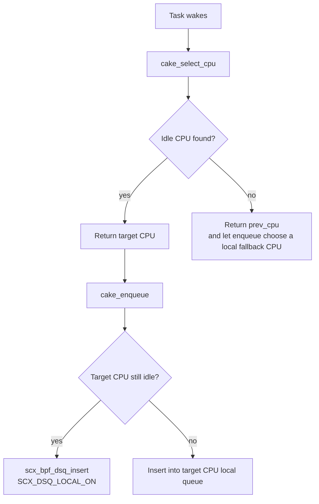
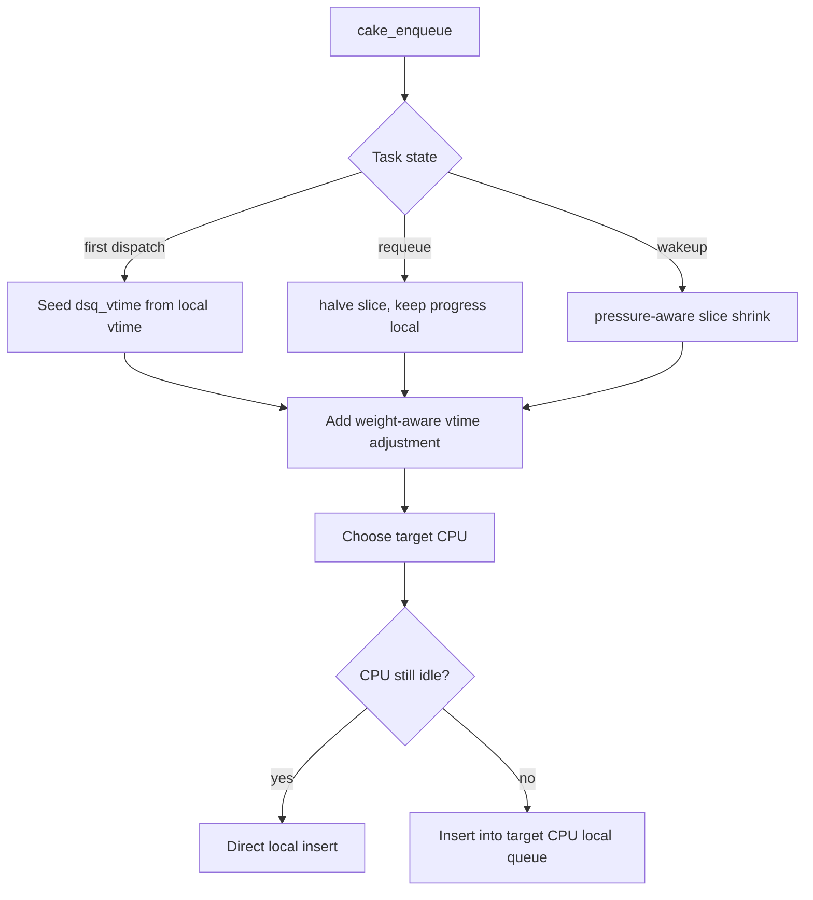
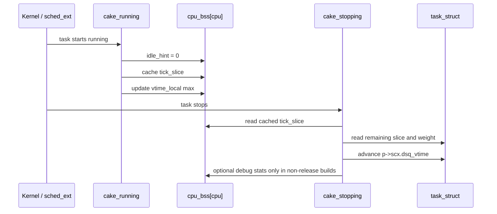
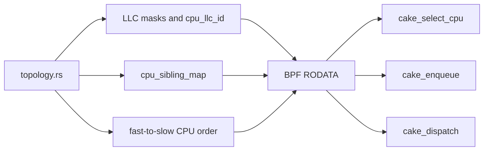

# scx_cake 1.1.1

[](https://opensource.org/licenses/GPL-2.0)
[](https://kernel.org)
[](https://github.com/sched-ext/scx)

`scx_cake` is a `sched_ext` CPU scheduler for Linux that applies CAKE-inspired low-latency ideas to CPU time instead of network packets. The current design is performance-oriented: it prioritizes responsiveness and delivered throughput over fairness as a primary objective.

Version `1.1.1` is not the older DRR++ / game-detection scheduler that some comments and historical docs referred to. The current design is centered on:

- topology-aware CPU selection
- direct dispatch to idle CPUs when possible
- per-CPU local queue ownership as the normal fallback
- lean per-task accounting in BPF
- optional debug telemetry in non-release builds

This README is written for three audiences:

- users who want to build and run it
- students who want to understand how a `sched_ext` scheduler is structured
- researchers who want a concise map from policy to code path

> [!WARNING]
> `scx_cake` is experimental scheduler code. It requires a Linux kernel with `sched_ext` support and should be treated like development software.

> [!IMPORTANT]
> The current `1.1.1` scheduler no longer uses the old game-family detector or the old hot-path `GAME / NORMAL / HOG / BG` classifier. Legacy enums and telemetry fields still exist in some debug paths for tooling compatibility, but they are not the active release policy.

## Navigation

- [Quick Start](#quick-start)
- [What scx_cake Is](#what-scx_cake-is)
- [Scheduler Philosophy](#scheduler-philosophy)
- [v2 Design Note](docs/scx_cake_v2_design.md)
- [How It Fits Into sched_ext](#how-it-fits-into-sched_ext)
- [Scheduling Paths](#scheduling-paths)
- [Core Mechanics](#core-mechanics)
- [Topology Model](#topology-model)
- [Build Modes](#build-modes)
- [Measuring Performance](#measuring-performance)
- [Source Tour](#source-tour)
- [Current Status](#current-status)

## Quick Start

### Requirements

- Linux kernel `6.12+` with `sched_ext`
- Rust toolchain
- build dependencies required by the main `scx` repository
- root privileges to actually run the scheduler

### Build

```bash
git clone https://github.com/sched-ext/scx.git
cd scx

# Production-oriented build
cargo build --release -p scx_cake

# Debug build with optional telemetry and TUI
cargo build -p scx_cake
```

### Run

```bash
# Default profile: gaming
sudo ./target/release/scx_cake

# Explicit profile
sudo ./target/release/scx_cake --profile esports

# Custom base quantum in microseconds
sudo ./target/release/scx_cake --quantum 1500
```

### Debug TUI

`--verbose` requires a debug build. In release builds, telemetry is compiled out and the flag is disabled at runtime.

```bash
# Live TUI
sudo ./target/debug/scx_cake --verbose
```

### Profiles

| Profile | Quantum | Intended use |
| :-- | --: | :-- |
| `esports` | `1000 us` | Lowest latency, highest scheduling frequency |
| `gaming` | `2000 us` | Default low-latency desktop / gaming mode |
| `default` | `2000 us` | Currently same as `gaming` |
| `legacy` | `4000 us` | Older or lower-power hardware with a larger slice budget |
| `battery` | `4000 us` | Lower scheduling overhead profile, even though power efficiency is not the mainline design goal |

## What scx_cake Is

At a high level, `scx_cake` tries to keep the common case short:

1. If an idle CPU is available, place the task there directly.
2. If no CPU is idle, keep runnable ownership local to a chosen CPU instead of pushing work into a shared fallback queue.
3. When a task runs or stops, update just enough local state to keep future enqueue decisions cheap.

That is the central design bias of the scheduler: do as little work as possible in the common case, and only pay for more machinery when the machine is already busy enough to require it.

The current design is intentionally simpler than the historical versions:

- no userspace game detector driving BPF state
- no hot-path 4-class promotion logic
- no reciprocal `vtime_mult` cache in the release fast path
- no task-storage based hot-path bookkeeping

Instead, the fast path mostly works from:

- `task_struct`
- small per-CPU BSS state
- loader-populated topology RODATA

## Scheduler Philosophy

At a high level, a CPU scheduler is the subsystem that allocates scarce CPU execution slots across runnable work. In practice it decides:

- which runnable work gets CPU time
- which CPU that work should run on
- how long it should run before the next decision point
- when migration is worth the cost

`scx_cake` is not trying to be a neutral "share everything evenly" scheduler. Its mainline design goal is to improve game performance and system responsiveness, and it treats fairness as a bounded safety property rather than the primary thing to optimize.

### Priority order

For the current `scx_cake` design, the practical priorities are:

- responsiveness first
- throughput and delivered performance second
- locality when it improves performance
- predictability when it improves frame-time stability or throughput
- fairness only to the extent needed to avoid pathological starvation or collapse
- power efficiency is not a mainline goal

That means `scx_cake` is willing to prefer:

- a shorter wakeup-to-run path over perfectly even CPU sharing
- a cache-warm or topology-friendly placement over abstract fairness
- direct dispatch and cheap hot paths over richer but more expensive policy machinery

The repository still exposes multiple profiles, including `battery`, but the core scheduler philosophy is performance-oriented rather than power-oriented.

### Core Questions

`scx_cake` answers the standard scheduler questions like this:

#### Which tasks run next?

- if a waking task can be sent directly to an idle CPU, do that first
- otherwise queue work directly onto a chosen CPU instead of an LLC-scoped shared queue
- avoid shared intermediate runnable pools when a local queue will do

In other words, the preferred order is:

1. direct idle dispatch
2. direct local ownership of fallback work on a specific CPU
3. keep the current task running if there is no better local queued work to justify a switch

#### Which CPU should a task run on?

- prefer an idle CPU
- prefer locality-friendly placement when it helps performance
- respect hard affinity constraints from `p->cpus_ptr`
- fall back to a specific target CPU rather than an LLC-shared pool when there is no obviously good idle target

The CPU-choice logic is therefore performance-first, but still bounded by the kernel's affinity and scheduling constraints.

#### How long should a task run?

- the base answer is the configured quantum from the selected profile or `--quantum`
- the scheduler may preserve or shrink slices depending on whether the path is a wakeup, requeue, or same-task continuation
- runtime consumed is charged back into `p->scx.dsq_vtime` so future ordering reflects recent CPU use

So Cake is not "run forever until something breaks." It is a bounded-slice scheduler with cheap runtime feedback.

#### When should tasks migrate?

- when wakeup placement finds a better idle target
- when locality-aware steering suggests a better idle target
- otherwise migration is not forced just for the sake of movement

The default bias is that migration is useful only when it buys lower latency or better execution placement. Movement itself is treated as a cost.

#### How do affinity, priority, deadlines, and blocking affect placement?

- affinity: hard constraint; tasks must run within their allowed CPU mask
- priority / weight: affects `p->scx.dsq_vtime` advancement, so weight changes ordering pressure
- deadlines: Cake does not implement hard real-time deadlines; virtual time is still used as a lightweight ordering and accounting signal, without making shared fallback queues the center of the design
- blocking / waking: sleeping tasks can benefit from direct wakeup dispatch and re-enter with less contention than a purely fairness-driven queueing model

### Policy, Mechanism, Feedback

#### Policy

The active policy can be summarized as:

- keep wakeup-to-run latency low
- keep the hot path short
- favor direct dispatch and per-CPU local ownership over shared fallback queuing
- use topology only when it helps delivered performance
- use virtual time to keep fallback behavior bounded where needed
- avoid paying for complex machinery in the common case

#### Mechanism

The current mechanisms used to realize that policy are:

- `cake_select_cpu` for fast idle-first CPU selection
- `SCX_DSQ_LOCAL_ON` for direct dispatch to an idle target CPU
- per-CPU local queue ownership for fallback on single-LLC systems
- `p->scx.dsq_vtime` as a lightweight ordering and accounting key
- per-CPU BSS state such as `idle_hint`, `tick_slice`, `last_pid`, and `vtime_local`
- compile-gated debug telemetry so release builds do not pay for debug machinery

#### Feedback / control

The scheduler updates itself from a small set of repeated signals:

- wakeup events and enqueue flags
- whether a CPU is idle right now
- task weight from `p->scx.weight`
- runtime actually consumed from the current slice
- recent local per-CPU state stored in BSS
- topology information loaded into RODATA at startup

Conceptually, `cake_running` and `cake_stopping` are the control loop:

- `cake_running` refreshes local execution state cheaply
- `cake_stopping` charges consumed runtime back into virtual time
- later enqueue and dispatch decisions reuse that state instead of recomputing everything from scratch

## How It Fits Into sched_ext


```mermaid
flowchart LR
    U[Userspace loader<br/>main.rs] --> R[Populate RODATA<br/>quantum, LLCs, topology]
    R --> B[Load and attach BPF programs]
    B --> S[sched_ext core]

    S --> SC[cake_select_cpu]
    S --> EQ[cake_enqueue]
    S --> DP[cake_dispatch]
    S --> RN[cake_running]
    S --> ST[cake_stopping]

    EQ --> CPU[Local CPU runqueue]
    RN --> BSS[Per-CPU BSS]
    ST --> VT[p->scx.dsq_vtime]
```

The Rust side does three main jobs:

- detects topology and populates BPF RODATA
- initializes the BPF arena
- optionally runs the debug TUI

The BPF side implements the performance-first policy through `sched_ext` struct_ops callbacks.

At startup, the loader opens and loads the BPF skeleton, populates RODATA, initializes the arena, and then attaches the non-struct_ops and struct_ops programs. On shutdown, `scx_cake` exits its run loop, drops the struct_ops link, reports UEI state, and follows the normal `sched_ext` restart path for conditions such as hotplug.

## Scheduling Paths

### Path 1: wakeup to direct dispatch

This is the preferred fast path.


```mermaid
flowchart TD
    W[Task wakes] --> SC[cake_select_cpu]
    SC --> G1{Idle CPU found?}
    G1 -->|yes| CPU[Return target CPU]
    G1 -->|no| PREV[Return prev_cpu<br/>and let enqueue choose a local fallback CPU]
    CPU --> EQ[cake_enqueue]
    EQ --> DD{Target CPU still idle?}
    DD -->|yes| LOCAL[scx_bpf_dsq_insert<br/>SCX_DSQ_LOCAL_ON]
    DD -->|no| LOCALQ[Insert into target CPU local queue]
```

`cake_select_cpu` currently follows this order:

1. learned locality steering for eligible wakeups such as home CPU, home core, or primary sibling
2. kernel-assisted idle selection
3. topology-specific fallback scan when that support is compiled in
4. return `prev_cpu` and let DSQ routing handle the fully busy case

### Path 2: local fallback when all CPUs are busy


```mermaid
flowchart TD
    ENQ[cake_enqueue] --> KIND{Task state}
    KIND -->|first dispatch| NOSTAGED[Seed dsq_vtime from local vtime]
    KIND -->|requeue| REQUEUE[halve slice, keep progress local]
    KIND -->|wakeup| WAKE[pressure-aware slice shrink]

    NOSTAGED --> VT[Add weight-aware vtime adjustment]
    REQUEUE --> VT
    WAKE --> VT

    VT --> ROUTE[Choose target CPU]
    ROUTE --> INS{CPU still idle?}
    INS -->|yes| DIRECT[Direct local insert]
    INS -->|no| LOCALQ[Insert into target CPU local queue]
```

### Path 3: run-stop feedback loop

`cake_running` and `cake_stopping` form the feedback loop that keeps future enqueue decisions cheap.


```mermaid
sequenceDiagram
    participant K as Kernel / sched_ext
    participant R as cake_running
    participant B as cpu_bss[cpu]
    participant S as cake_stopping
    participant T as task_struct

    K->>R: task starts running
    R->>B: idle_hint = 0
    R->>B: cache tick_slice
    R->>B: update vtime_local max

    K->>S: task stops
    S->>B: read cached tick_slice
    S->>T: read remaining slice and weight
    S->>T: advance p->scx.dsq_vtime
    S->>B: optional debug stats only in non-release builds
```

## Core Mechanics

### 1. CPU selection

`cake_select_cpu` tries to find an idle CPU first. The current code combines scheduler-specific locality steering with kernel helpers for idle selection and affinity handling.

Important properties:

- release fast path avoids arena dereferences
- affinity restrictions are still enforced by the kernel mask and helper path
- hybrid-only scan order is precomputed in userspace and passed as RODATA

### 2. Direct dispatch before broader fallback

If the chosen CPU still looks idle, `cake_enqueue` inserts directly with `SCX_DSQ_LOCAL_ON`. On current single-LLC systems, even the non-idle fallback stays local to a chosen CPU instead of going through a shared LLC queue. That reduces latency and avoids shared head-of-line blocking.

### 3. Virtual-time accounting

Cake still uses `p->scx.dsq_vtime` as a lightweight ordering and accounting signal, but the current single-LLC design no longer depends on an LLC-shared fallback queue to make progress.

The current source uses an additive weight adjustment derived from `p->scx.weight`:

```text
vtime += runtime + (100 - weight) * 20480
```

That description is about source-level policy. It is not a guarantee about the final generated BPF instructions. In optimized builds, the compiler may lower the shift-and-add form into a constant multiply.

### 4. Per-CPU BSS instead of global hot state

Small per-CPU BSS state is used for:

- `idle_hint`
- `tick_slice`
- `last_pid`
- `vtime_local`
- local dispatch bookkeeping

That keeps the hot path close to CPU-local state instead of bouncing a single global cache line.

### 5. Debug telemetry is compile-gated

In debug builds, `scx_cake` exposes richer telemetry through arena-backed task context and the iter program used by the TUI. In release builds, that machinery is compiled out so the production scheduler does not pay for it.

## Topology Model

`scx_cake` is topology-aware. The Rust loader detects:

- CPU count
- LLC count
- SMT sibling relationships
- hybrid P/E layout when present
- preferred LLC on asymmetric AMD systems

The loader then writes those results into BPF RODATA before attach.

### LLC behavior in 1.1.1

The code still detects LLC topology and computes LLC metadata at startup.

However, the current source also sets:

```c
#define CAKE_LOCAL_CPU_ONLY 1
```

That means the cross-LLC steal path in `cake_dispatch` is compiled out in the current build. In addition, the current single-LLC fallback path is per-CPU local-first rather than LLC-shared. The README reflects the behavior that exists today, not the older design space around shared LLC queues or cross-CCD stealing.

### sched_ext + topology diagram


```mermaid
flowchart LR
    TOPO[topology.rs] --> LLC[LLC masks and cpu_llc_id]
    TOPO --> SMT[cpu_sibling_map]
    TOPO --> HYB[fast-to-slow CPU order]
    LLC --> RODATA[BPF RODATA]
    SMT --> RODATA
    HYB --> RODATA
    RODATA --> SC[cake_select_cpu]
    RODATA --> EQ[cake_enqueue]
    RODATA --> DP[cake_dispatch]
```

## Build Modes

| Build | Intended use | Telemetry | TUI |
| :-- | :-- | :-- | :-- |
| `cargo build --release -p scx_cake` | normal use and performance measurement | compiled out | unavailable |
| `cargo build -p scx_cake` | development, study, and instrumentation | enabled when requested | available |

Notes:

- release builds warn and disable `--verbose`
- debug builds expose iter-based task telemetry to the TUI
- the BPF arena is initialized in both modes, but debug mode carries much more task telemetry

## Measuring Performance

Performance claims for this scheduler should be grounded in measurement, not just source shape.

This repository includes:

- [perf_stat_cake.sh](./perf_stat_cake.sh)
- [bench/baselines](./bench/baselines)

Example:

```bash
sudo scheds/rust/scx_cake/perf_stat_cake.sh 5 both
```

That collects:

- system-wide `perf stat`
- `perf stat --bpf-prog` for the active `scx_cake` BPF programs

Recommended workflow for changes:

1. keep workload, duration, and machine fixed
2. capture a baseline first
3. compare `BPF cycles`, `BPF instructions`, branch misses, and relevant system counters
4. treat run-to-run noise as real unless repeated measurements show a stable delta

## Source Tour

| File | Role |
| :-- | :-- |
| [src/main.rs](./src/main.rs) | userspace loader, CLI, RODATA setup, attach logic |
| [src/bpf/cake.bpf.c](./src/bpf/cake.bpf.c) | `sched_ext` callbacks and scheduler policy |
| [src/bpf/intf.h](./src/bpf/intf.h) | shared structs, constants, telemetry layout |
| [src/topology.rs](./src/topology.rs) | topology detection and mask construction |
| [src/tui.rs](./src/tui.rs) | debug TUI and iter-driven telemetry consumer |
| [perf_stat_cake.sh](./perf_stat_cake.sh) | `perf stat` helper for live scheduler measurement |
| [docs](./docs) | research notes and design analysis |

### Main callbacks

| Callback | Purpose |
| :-- | :-- |
| `cake_select_cpu` | choose an idle CPU when possible |
| `cake_enqueue` | compute slice / vtime and route to direct insert or a chosen CPU's local queue |
| `cake_dispatch` | handle the residual shared-queue path when it exists |
| `cake_running` | mark CPU busy and cache local run metadata |
| `cake_stopping` | account consumed runtime back into `dsq_vtime` |
| `cake_tick` | optional load-balance hint path |
| `cake_init_task` / `cake_exit_task` | allocate and free per-task arena state |
| `cake_set_weight` | mirror weight into debug-visible state |

## Current Status

`scx_cake 1.1.1` should be understood as:

- a CAKE-inspired low-latency `sched_ext` scheduler
- a scheduler that prioritizes responsiveness and game-oriented performance over fairness as a primary objective
- a topology-aware per-CPU local-first scheduler
- a codebase that still carries some legacy debug and telemetry vocabulary from earlier experiments

It should not be described today as:

- a hot-path DRR++ scheduler
- a game-family detector in BPF
- a release scheduler driven by a 4-class `GAME / NORMAL / HOG / BG` policy

## Related Notes

If you want the deeper design history or experiments behind the current code, start with:

- [docs/hot_path_optimization_analysis.md](./docs/hot_path_optimization_analysis.md)
- [docs/idle_path_bubble_reduction_proposal.md](./docs/idle_path_bubble_reduction_proposal.md)
- [docs/benchmark_winner_analysis.md](./docs/benchmark_winner_analysis.md)
