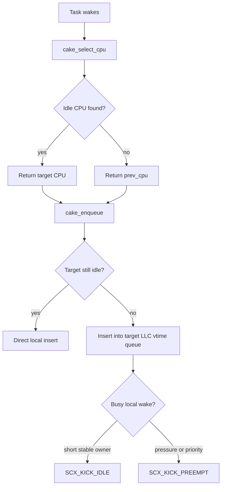
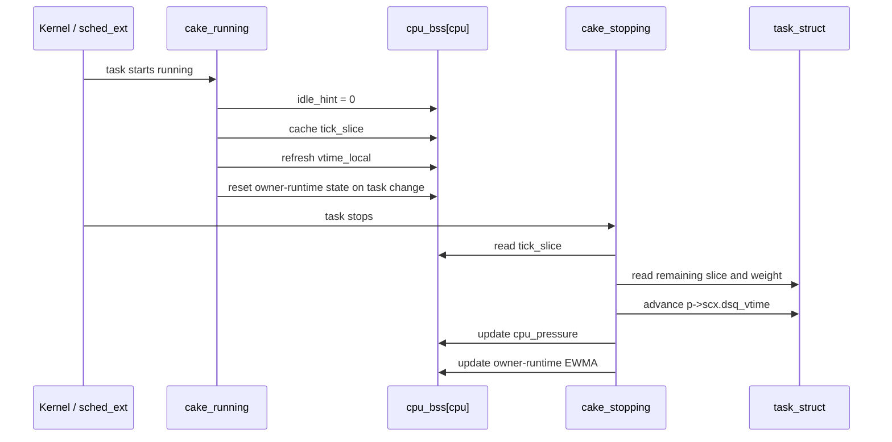

# scx_cake 1.1.1

[](https://opensource.org/licenses/GPL-2.0)
[](https://kernel.org)
[](https://github.com/sched-ext/scx)

`scx_cake` is a performance-oriented `sched_ext` CPU scheduler. It applies CAKE-inspired low-latency ideas to CPU time: keep wakeups short, dispatch directly to idle CPUs, use per-LLC vtime fallback queues when every CPU is busy, and make the common path cheap.

The active `1.1.1` design is centered on:

- idle-first CPU selection
- direct dispatch to idle CPUs
- per-LLC virtual-time fallback queues when all CPUs are busy
- lean release hot paths with learned locality compiled out
- lightweight virtual-time accounting through `p->scx.dsq_vtime`
- debug TUI/task snapshots with stack-heavy hot telemetry opt-in at build time

> [!WARNING]
> `scx_cake` is experimental scheduler code. It requires a Linux kernel with `sched_ext` support and root privileges to run.

## Quick Start

### Requirements

- Linux kernel `6.12+` with `sched_ext`
- Rust toolchain
- build dependencies required by the main `scx` repository
- root privileges to run the scheduler

### Build

```bash
git clone https://github.com/sched-ext/scx.git
cd scx

# Release build for normal use and performance measurement
cargo build --release -p scx_cake

# Default debug build for low-latency TUI/capture work
cargo build -p scx_cake

# Full debug lab build with hot callback telemetry / locality A/B knobs
CAKE_HOT_TELEMETRY=1 CAKE_LOCALITY_EXPERIMENTS=1 CAKE_BENCHLAB=1 cargo build -p scx_cake
```

### Run

```bash
# Default profile: gaming, learned locality gates off
sudo ./target/release/scx_cake

# Explicit profile
sudo ./target/release/scx_cake --profile esports

# Custom base quantum in microseconds
sudo ./target/release/scx_cake --quantum 1500

# A/B test 1.1.1 local-only fallback queues
sudo ./target/release/scx_cake --queue-policy local

# Start the zero-stack debug TUI/capture build
sudo ./target/debug/scx_cake --verbose

# A/B enable the learned wake-chain locality guard in a debug-lab build
sudo ./target/debug/scx_cake --verbose --wake-chain-locality=true

# A/B enable all learned locality steering in a debug-lab build
sudo ./target/debug/scx_cake --verbose --learned-locality=true

# A/B force same-CPU busy wakeups to preempt in a debug-lab build
sudo ./target/debug/scx_cake --verbose --busy-wake-kick=preempt
```

### Profiles

Profiles are quantum presets. They do not switch the scheduler into separate policy modes.

`--queue-policy local|llc-vtime` is an explicit A/B policy switch, not a
profile. The default `llc-vtime` keeps current CPU selection and task
accounting, but routes busy fallback work through per-LLC vtime DSQs. `local`
keeps the 1.1.1 local-only fallback path available for comparison.

See [Queue Policy Latency Findings](docs/queue_policy_latency_findings.md) for
the Splitgate 2 / MangoHud captures that motivated this default.

The default policy is latency-first. Release builds and default debug builds
compile out learned locality, wake-chain locality, busy-wake A/B overrides, hot
callback telemetry, and arena task storage so the linked BPF object stays on the
lean path. The `--wake-chain-locality`, `--learned-locality`, and
`--busy-wake-kick` knobs are debug-lab A/B controls and require rebuilding with
`CAKE_LOCALITY_EXPERIMENTS=1`. In that opt-in build they remain
debug/telemetry A/B controls.

`--wake-chain-locality=false` and `--learned-locality=false` are explicit forms
of the default and are useful when keeping A/B command lines comparable.
`--busy-wake-kick=preempt` makes same-CPU busy wakeups preempt immediately in
debug builds instead of using Cake's owner-runtime guard.

| Profile | Quantum | Intended use |
| :-- | --: | :-- |
| `esports` | `750 us` | Most aggressive startup preset for competitive latency tuning |
| `gaming` | `1000 us` | Default low-latency desktop / gaming mode |
| `balanced` | `2000 us` | Balanced desktop / mixed-use preset with lower scheduling overhead |
| `legacy` | `4000 us` | Older or lower-power hardware with a larger slice budget |

## Design

`scx_cake` optimizes for responsiveness and game-oriented throughput. Fairness is treated as a bounded safety property, not the main objective.

The scheduler tries to keep each decision simple:

1. If a good idle CPU is available, run the task there directly.
2. If all CPUs are busy, route fallback work through the target LLC's vtime queue.
3. If a wakeup targets the same busy CPU, avoid preempting a stable short-running owner.
4. When a task runs or stops, update local state for the next decision.

The release fast path mostly works from:

- `task_struct`
- per-CPU BSS state
- loader-populated topology RODATA
- arena-backed task context for optional learned locality steering after a task has enough history

The old DRR++ / game-detection design is not the active release policy. Legacy enum names and telemetry fields can still appear in debug-facing code for compatibility, but release scheduling is not driven by `GAME / NORMAL / HOG / BG` classification.

## Vocabulary

| Term | Meaning in `scx_cake` |
| :-- | :-- |
| `sched_ext` | Kernel framework that lets this BPF scheduler provide scheduling callbacks. |
| `cake_select_cpu` | Chooses an idle CPU when possible and returns a target CPU for enqueue. |
| queue policy | CLI-selected fallback queue mode: `local` or `llc-vtime`. |
| direct dispatch | Inserting directly to a target CPU with `SCX_DSQ_LOCAL_ON` when it still looks idle. |
| local ownership | A/B fallback mode where busy work stays assigned to a chosen CPU instead of entering an LLC-shared queue. |
| local DSQ | The kernel dispatch queue for work targeted at a specific CPU. |
| per-LLC vtime DSQ | Default fallback queue keyed by `p->scx.dsq_vtime`, one DSQ per LLC. |
| `idle_hint` | Per-CPU hint updated by Cake to avoid unnecessary remote idle checks. |
| `cpu_pressure` | Small per-CPU pressure signal derived from recent consumed slice time. |
| owner runtime EWMA | Per-CPU moving average of the current owner's recent runtime, used by busy-wake policy. |
| busy local wake | A wakeup where the waker is on the same CPU that the wakee is targeting, but that CPU is busy. |
| `SCX_KICK_IDLE` | Gentle kick used when the current owner should be allowed to continue briefly. |
| `SCX_KICK_PREEMPT` | Stronger kick used when the wakee should preempt the current owner. |
| `dsq_vtime` | Per-task virtual time used as lightweight ordering and runtime accounting. |
| quantum | Base time slice selected by profile or `--quantum`. |
| topology RODATA | CPU topology loaded by userspace before BPF attach: CPU count, LLC IDs, SMT siblings, and hybrid ordering. |
| arena task context | Per-task BPF arena storage used for learned locality state and debug telemetry. |
| debug telemetry | TUI, iter records, counters, and timing data available in debug builds only. |

## Scheduling Flow

### Wakeup Path


```mermaid
flowchart TD
    W[Task wakes] --> SC[cake_select_cpu]
    SC --> I{Idle CPU found?}
    I -->|yes| C[Return target CPU]
    I -->|no| P[Return prev_cpu]
    C --> E[cake_enqueue]
    P --> E
    E --> D{Target still idle?}
    D -->|yes| L[Direct local insert]
    D -->|no| Q[Insert into target LLC vtime queue]
    Q --> B{Busy local wake?}
    B -->|short stable owner| KI[SCX_KICK_IDLE]
    B -->|pressure or priority| KP[SCX_KICK_PREEMPT]
```

`cake_select_cpu` follows this order:

1. optional learned locality steering for eligible warm tasks when enabled
2. kernel-assisted idle selection
3. topology-specific idle scan when compiled in
4. return `prev_cpu` when no idle CPU is found

`cake_enqueue` then computes slice and virtual time. The default `llc-vtime`
policy inserts busy fallback work into the target LLC's vtime DSQ and lets
`cake_dispatch` pull from that shared arbiter. `--queue-policy local` preserves
the 1.1.1 local-only fallback path for A/B testing.

### Run / Stop Feedback


```mermaid
sequenceDiagram
    participant K as Kernel / sched_ext
    participant R as cake_running
    participant B as cpu_bss[cpu]
    participant S as cake_stopping
    participant T as task_struct

    K->>R: task starts running
    R->>B: idle_hint = 0
    R->>B: cache tick_slice
    R->>B: refresh vtime_local
    R->>B: reset owner-runtime state on task change

    K->>S: task stops
    S->>B: read tick_slice
    S->>T: read remaining slice and weight
    S->>T: advance p->scx.dsq_vtime
    S->>B: update cpu_pressure
    S->>B: update owner-runtime EWMA
```

This loop is the scheduler's feedback path. It keeps future enqueue decisions cheap by storing recent CPU-local state instead of rebuilding a full task model on each wakeup.

## Core Mechanics

### CPU Selection

CPU selection is idle-first. Release builds use the kernel idle-selection helper
and route busy fallback work by LLC without reading arena-backed task context.
Debug builds can enable learned home/core locality steering for A/B analysis.

Affinity remains a hard constraint. Cake relies on kernel masks and helper paths to keep placement legal.

### Local Ownership

If direct dispatch is not safe, Cake now normally inserts fallback work into a
per-LLC vtime queue. This restores a shared arbiter inside the cache domain while
keeping CPU selection, task accounting, and direct idle dispatch unchanged.

`cake_dispatch` pulls from the local LLC first, then tries other LLCs before
falling back to the local bookkeeping path. With `--queue-policy local`, fallback
work is inserted into the selected CPU's local queue instead, preserving the
1.1.1 local-only comparison mode.

### Virtual-Time Accounting

Cake uses `p->scx.dsq_vtime` as a small ordering and accounting signal. Consumed runtime advances virtual time, and task weight adjusts how fast virtual time moves.

The source-level model is:

```text
vtime += runtime + (100 - weight) * 20480
```

Optimized BPF may lower that expression differently, so the source formula describes policy rather than final instruction shape.

### Busy Local Wake Policy

When a wakeup targets a CPU that appears busy, release builds keep the task on
the target LLC's vtime queue and use a preempt kick for the busy-target case. The
owner-runtime guard remains a debug A/B policy so it can be measured without
adding stack-heavy branches to the release object.

## Topology

The Rust loader detects topology and writes it into BPF RODATA before attach:

- CPU count
- LLC count and `cpu_llc_id`
- SMT sibling map
- hybrid P/E ordering when present
- preferred LLC information on asymmetric AMD systems

The current build keeps per-CPU local DSQs non-stealable. Cross-LLC fallback
movement happens only through the explicit per-LLC vtime DSQs used by the
default queue policy.

## Release And Debug Builds

| Build | Intended use | Telemetry | TUI |
| :-- | :-- | :-- | :-- |
| `cargo build --release -p scx_cake` | normal use and performance measurement | compiled out | unavailable |
| `cargo build -p scx_cake` | low-latency debug capture | task snapshots only | available |
| `CAKE_HOT_TELEMETRY=1 CAKE_LOCALITY_EXPERIMENTS=1 CAKE_BENCHLAB=1 cargo build -p scx_cake` | debug-lab instrumentation | enabled with `--verbose` | available |

Release and default debug builds keep the latency-first scheduling policy but
compile out stack-heavy debug counters, arena task storage, and timing
instrumentation. Both linked BPF objects are intended to stay zero-stack by the
strict `r10` disassembly audit.

Debug builds can run the live TUI:

```bash
sudo ./target/debug/scx_cake --verbose
```

Default debug dumps include task snapshots, topology, app summaries, and
userspace-derived coverage without compiling stack-heavy scheduler telemetry
into hot callbacks. Full wake wait, SMT, ringbuf, BenchLab, and locality A/B
telemetry requires the debug-lab build flags above.

The TUI `Graphs` tab shows the userspace wake graph view: top wake edges, latency-heavy edges, app wake neighborhoods, recent debug events, and coverage gaps. The ringbuf wake graph is sampled by one-second epochs in BPF and weighted in userspace, so `*_est` fields describe estimated shape while `observed` and `weight_sum` show the actual sampled payload. Pressing `d` in the TUI writes both a text dump and a JSON sidecar (`tui_dump_<seconds>.txt` and `tui_dump_<seconds>.json`) so larger offline analysis can use structured coverage and graph metadata without adding more BPF instruction pressure.

Dump files can be compared without loading BPF:

```bash
cargo run -p scx_cake -- --compare-dump baseline.txt candidate.txt
```

## Measuring Performance

Performance claims should be tied to repeated measurements on the same machine and workload.

```bash
sudo scheds/rust/scx_cake/perf_stat_cake.sh 5 both
```

Useful signals include:

- system-wide `perf stat`
- `perf stat --bpf-prog` for active `scx_cake` BPF programs
- BPF cycles and instructions
- branch misses
- workload-specific latency or frame-time metrics

## Source Tour

| File | Role |
| :-- | :-- |
| [src/main.rs](./src/main.rs) | userspace loader, CLI, profile/quantum setup, RODATA setup, attach logic |
| [src/bpf/cake.bpf.c](./src/bpf/cake.bpf.c) | scheduler policy and `sched_ext` callbacks |
| [src/bpf/intf.h](./src/bpf/intf.h) | shared structs, constants, and telemetry layout |
| [src/topology.rs](./src/topology.rs) | topology detection and mask construction |
| [src/tui.rs](./src/tui.rs) | debug TUI and iter-driven telemetry consumer |
| [perf_stat_cake.sh](./perf_stat_cake.sh) | `perf stat` helper for live scheduler measurement |
| [docs](./docs) | research notes and design analysis |

### Main Callbacks

| Callback | Purpose |
| :-- | :-- |
| `cake_select_cpu` | choose an idle or locality-friendly target CPU |
| `cake_enqueue` | compute slice / virtual time and route work through the selected queue policy |
| `cake_dispatch` | pull optional LLC-vtime work, then keep local bookkeeping / same-task continuation |
| `cake_running` | mark CPU busy and refresh local run metadata |
| `cake_stopping` | charge runtime into virtual time, pressure, and owner-runtime state |
| `cake_tick` | intentionally idle in the current pull-driven fallback design |
| `cake_init_task` / `cake_exit_task` | allocate and free per-task arena state |
| `cake_set_weight` | mirror weight into debug-visible state in non-release builds |

## Related Notes

- [docs/hot_path_optimization_analysis.md](./docs/hot_path_optimization_analysis.md)
- [docs/idle_path_bubble_reduction_proposal.md](./docs/idle_path_bubble_reduction_proposal.md)
- [docs/benchmark_winner_analysis.md](./docs/benchmark_winner_analysis.md)
