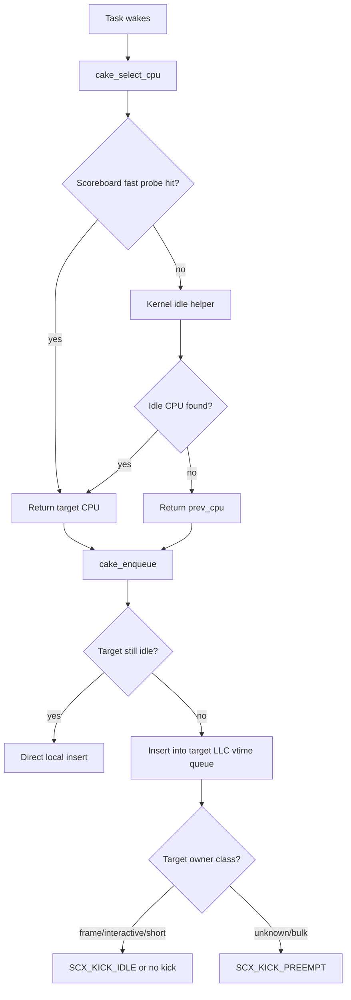
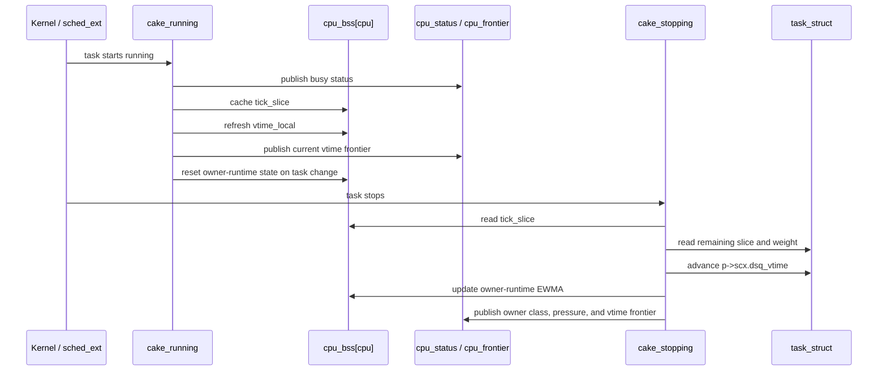

# scx_cake 1.1.1

[](https://opensource.org/licenses/GPL-2.0)
[](https://kernel.org)
[](https://github.com/sched-ext/scx)

`scx_cake` is a performance-oriented `sched_ext` CPU scheduler. It applies CAKE-inspired low-latency ideas to CPU time: keep wakeups short, dispatch directly to idle CPUs, use per-LLC vtime fallback queues when every CPU is busy, and make the common path cheap.

The active `1.1.1` design is centered on:

- Cake Scoreboard Dispatch: init-built topology candidates, owner-written CPU
  status lanes, and task-biased release fast probes
- idle-first CPU selection
- direct dispatch to idle CPUs
- per-LLC virtual-time fallback queues when all CPUs are busy
- lean release hot paths with learned locality compiled out
- lightweight virtual-time accounting through `p->scx.dsq_vtime`
- debug TUI/task snapshots with exact path counters, callback timing, wake/run
  attribution, and runtime A/B controls enabled in debug builds

> [!WARNING]
> `scx_cake` is experimental scheduler code. It requires a Linux kernel with `sched_ext` support and root privileges to run.

## Quick Start

### Requirements

- Linux kernel `6.12+` with `sched_ext`
- Rust toolchain
- build dependencies required by the main `scx` repository
- root privileges to run the scheduler

### Build

```bash
git clone https://github.com/sched-ext/scx.git
cd scx

# Release build for normal use and performance measurement
cargo build --release -p scx_cake

# Debug build for TUI/capture and runtime A/B work
cargo build -p scx_cake
```

### Run

```bash
# Default profile: gaming, learned locality gates off
sudo ./target/release/scx_cake

# Explicit profile
sudo ./target/release/scx_cake --profile esports

# Custom base quantum in microseconds
sudo ./target/release/scx_cake --quantum 1500

# A/B test 1.1.1 local-only fallback queues
sudo ./target/release/scx_cake --queue-policy local

# Start the debug TUI/capture surface
sudo ./target/debug/scx_cake --verbose

# A/B enable the learned wake-chain locality guard in a debug build
sudo ./target/debug/scx_cake --verbose --wake-chain-locality=true

# A/B enable all learned locality steering in a debug build
sudo ./target/debug/scx_cake --verbose --learned-locality=true

# A/B force same-CPU busy wakeups to preempt in a debug build
sudo ./target/debug/scx_cake --verbose --busy-wake-kick=preempt
```

### Profiles

Profiles are quantum presets. They do not switch the scheduler into separate policy modes.

`--queue-policy local|llc-vtime` is an explicit A/B policy switch, not a
profile. The default `llc-vtime` keeps current CPU selection and task
accounting, but routes busy fallback work through per-LLC vtime DSQs. `local`
keeps the 1.1.1 local-only fallback path available for comparison.

See [Queue Policy Latency Findings](docs/queue_policy_latency_findings.md) for
the Splitgate 2 / MangoHud captures that motivated this default.

The default policy is latency-first. Release builds compile telemetry out and
stay on the lean production path. Debug builds compile the full `--verbose`
capture surface by default: hot callback counters, wake/run timing, task arena
snapshots, runtime A/B knobs, and the live TUI are all available
without special build flags. The `--wake-chain-locality`, `--learned-locality`,
and `--busy-wake-kick` knobs remain runtime A/B controls and default to the
latency-first baseline unless explicitly enabled.

`--wake-chain-locality=false` and `--learned-locality=false` are explicit forms
of the default and are useful when keeping A/B command lines comparable.
`--busy-wake-kick=preempt` makes same-CPU busy wakeups preempt immediately in
debug builds instead of using Cake's owner-runtime guard.

| Profile | Quantum | Intended use |
| :-- | --: | :-- |
| `esports` | `750 us` | Most aggressive startup preset for competitive latency tuning |
| `gaming` | `1000 us` | Default low-latency desktop / gaming mode |
| `balanced` | `2000 us` | Balanced desktop / mixed-use preset with lower scheduling overhead |
| `legacy` | `4000 us` | Older or lower-power hardware with a larger slice budget |

## Design

`scx_cake` optimizes for responsiveness and game-oriented throughput. Fairness is treated as a bounded safety property, not the main objective.

The current release experiment is called **Cake Scoreboard Dispatch**. It is a
local-first placement system built around one rule: each CPU publishes its own
compact state, and other CPUs only read that state when choosing where a wakeup
should land. The goal is to make placement decisions from cheap, cache-line-sized
facts instead of rebuilding topology, walking large shared structures, or
touching another CPU's private bookkeeping.

The scheduler tries to keep each decision simple:

1. Probe a small init-built CPU candidate list using the scoreboard.
2. If a clean idle CPU is available, run the task there directly.
3. If the fast probes miss, use fallback confidence to choose full, filtered, or skipped kernel idle selection.
4. If all CPUs are busy, route fallback work through the target LLC's vtime queue.
5. When a task runs, stops, or goes idle, that CPU updates its published state.

The release fast path works from:

- `task_struct`
- private per-CPU BSS state for local bookkeeping
- cache-line-aligned owner-written CPU publication lanes
- loader-populated topology RODATA
- per-LLC vtime DSQs for busy fallback work

Arena-backed task context reads for learned locality, detailed timing, and
verbose policy experiments are debug/capture surfaces. They are not part of the
default release placement path.

The old DRR++ / game-detection design is not the active release policy. Legacy enum names and telemetry fields can still appear in debug-facing code for compatibility, but release scheduling is not driven by `GAME / NORMAL / HOG / BG` classification.

### Cake Scoreboard Dispatch

Cake Scoreboard Dispatch splits scheduler knowledge into three layers:

| Layer | Writer | Reader | Purpose |
| :-- | :-- | :-- | :-- |
| Static topology RODATA | userspace loader at attach | BPF hot path | Precomputed CPU facts: sibling, primary CPU, LLC ID, core ID, per-CPU LLC DSQ, and fast-probe candidates. |
| CPU publication lanes | owning CPU only | remote wake placement | One cache-line `cpu_status` and one cache-line `cpu_frontier` per CPU. These carry idle/accept flags, owner class, pressure bucket, and vtime frontier. |
| Private CPU BSS | owning CPU hot callbacks | same CPU hot callbacks | Tick slice, last PID, owner runtime average, and local vtime integration. Remote placement should avoid this line in release. |

This is not "no sharing" in the literal hardware sense. Other CPUs still read a
published status line. The important difference is ownership: each line has one
writer, is 64-byte aligned, and contains only the facts remote CPUs need. That
removes multi-writer contention from the placement signal and keeps private
per-CPU bookkeeping away from cross-CPU wakeup reads.

The loader builds the fast-probe table once:

1. start with the previous CPU
2. add the primary sibling for that core when useful
3. add nearby primary CPUs in the same LLC
4. add the SMT sibling as a later candidate

Release can activate up to four candidates. Slot 0 is the clean idle probe
available to all tasks. Slot 1 is the SMT-aware second probe, and latency-shaped
tasks can use slots 2-3 when row confidence says the extra reads are worth it.
When the probes miss, Cake does not always call the broad kernel helper. A small
fallback confidence ladder keeps unknown or useful fallback paths full, filters
cold paths through `SCX_PICK_IDLE_CORE` / `SCX_PICK_IDLE_IN_NODE`, and skips very
cold unrestricted fallback paths except for audit samples.

Release also uses the scoreboard after placement. Wake kicks reread the target
CPU status after enqueue: unknown or bulk owners can receive
`SCX_KICK_PREEMPT`, frame/interactive/short owners are protected with
`SCX_KICK_IDLE` or no kick as confidence rises. Dispatch pulls use a separate
confidence lane to decide when a cheap `scx_bpf_dsq_nr_queued()` probe is worth
doing before `scx_bpf_dsq_move_to_local()`.

The runtime feedback loop is intentionally small:

| Event | Published update |
| :-- | :-- |
| `cake_dispatch` finds no work | mark this CPU idle and accepting wakeups |
| `cake_running` starts a task | mark this CPU busy, reset owner state on task change, publish current vtime frontier |
| `cake_stopping` charges runtime | update owner class, pressure bucket, and runnable-task vtime frontier |

The design is meant to be unfair in a controlled way. Neutral work can still use
the first clean idle probe and the kernel helper. Latency-shaped wake chains get
the extra local/topology probe first, which gives game/render/input-style work a
slightly better chance to avoid the general fallback path.

## Vocabulary

| Term | Meaning in `scx_cake` |
| :-- | :-- |
| `sched_ext` | Kernel framework that lets this BPF scheduler provide scheduling callbacks. |
| `cake_select_cpu` | Chooses an idle CPU when possible and returns a target CPU for enqueue. |
| Cake Scoreboard Dispatch | Release placement system using init-built candidates plus owner-written CPU status/frontier lanes. |
| queue policy | CLI-selected fallback queue mode: `local` or `llc-vtime`. |
| direct dispatch | Inserting directly to a target CPU with `SCX_DSQ_LOCAL_ON` when it still looks idle. |
| local ownership | A/B fallback mode where busy work stays assigned to a chosen CPU instead of entering an LLC-shared queue. |
| local DSQ | The kernel dispatch queue for work targeted at a specific CPU. |
| per-LLC vtime DSQ | Default fallback queue keyed by `p->scx.dsq_vtime`, one DSQ per LLC. |
| `cpu_status` | Owner-written per-CPU publication lane with idle/accept bits, owner class, and pressure bucket. |
| `cpu_frontier` | Owner-written per-CPU vtime frontier used to seed or clamp task virtual time without reading private CPU BSS. |
| `cpu_fast_probe` | Loader-built per-CPU candidate table used by release fast idle placement before calling the kernel idle helper. |
| `idle_hint` | A debug-only private mirror of idle state retained for telemetry and non-lean experiments; release placement uses `cpu_status`. |
| `cpu_pressure` | Debug/non-lean raw pressure signal derived from recent consumed slice time; release scoreboard publishes pressure as a bucket inside `cpu_status`. |
| owner runtime EWMA | Per-CPU moving average of the current owner's recent runtime, used by busy-wake policy. |
| busy local wake | A wakeup where the waker is on the same CPU that the wakee is targeting, but that CPU is busy. |
| `SCX_KICK_IDLE` | Gentle kick used when the current owner should be allowed to continue briefly. |
| `SCX_KICK_PREEMPT` | Stronger kick used when the wakee should preempt the current owner. |
| `dsq_vtime` | Per-task virtual time used as lightweight ordering and runtime accounting. |
| quantum | Base time slice selected by profile or `--quantum`. |
| topology RODATA | CPU topology loaded by userspace before BPF attach: CPU count, LLC IDs, SMT siblings, and hybrid ordering. |
| arena task context | Per-task BPF arena storage used for learned locality state and debug telemetry. |
| debug telemetry | TUI, iter records, counters, and timing data available in debug builds only. |

## Scheduling Flow

### Wakeup Path


```mermaid
flowchart TD
    W[Task wakes] --> SC[cake_select_cpu]
    SC --> FP{Scoreboard fast probe hit?}
    FP -->|yes| C[Return target CPU]
    FP -->|no| KI[Kernel idle helper]
    KI --> I{Idle CPU found?}
    I -->|yes| C
    I -->|no| P[Return prev_cpu]
    C --> E[cake_enqueue]
    P --> E
    E --> D{Target still idle?}
    D -->|yes| L[Direct local insert]
    D -->|no| Q[Insert into target LLC vtime queue]
    Q --> B{Target owner class?}
    B -->|frame/interactive/short| KIDLE[SCX_KICK_IDLE or no kick]
    B -->|unknown/bulk| KP[SCX_KICK_PREEMPT]
```

`cake_select_cpu` follows this order:

1. release scoreboard fast probes from the init-built `cpu_fast_probe` table
2. task-biased second probe for sync/priority/weight-shaped wakeups
3. confidence-shaped kernel-assisted idle selection: full, filtered, or skipped
4. topology-specific idle scan when compiled in
5. return `prev_cpu` when no idle CPU is found

`cake_enqueue` then computes slice and virtual time. The default `llc-vtime`
policy inserts busy fallback work into the target LLC's vtime DSQ and lets
`cake_dispatch` pull from that shared arbiter. `--queue-policy local` preserves
the 1.1.1 local-only fallback path for A/B testing.

### Run / Stop Feedback


```mermaid
sequenceDiagram
    participant K as Kernel / sched_ext
    participant R as cake_running
    participant B as cpu_bss[cpu]
    participant P as cpu_status / cpu_frontier
    participant S as cake_stopping
    participant T as task_struct

    K->>R: task starts running
    R->>P: publish busy status
    R->>B: cache tick_slice
    R->>B: refresh vtime_local
    R->>P: publish current vtime frontier
    R->>B: reset owner-runtime state on task change

    K->>S: task stops
    S->>B: read tick_slice
    S->>T: read remaining slice and weight
    S->>T: advance p->scx.dsq_vtime
    S->>B: update owner-runtime EWMA
    S->>P: publish owner class, pressure, and vtime frontier
```

This loop is the scheduler's feedback path. It keeps future enqueue decisions cheap by storing recent CPU-local state instead of rebuilding a full task model on each wakeup.

## Core Mechanics

### CPU Selection

CPU selection is idle-first. Release builds try the Cake scoreboard probes
before consulting the kernel idle-selection helper. The first probe checks a
clean published idle candidate. Later probes are SMT-aware and task-biased, so
latency-shaped wakeups can get extra nearby candidates. If those probes miss,
fallback confidence decides whether the kernel helper runs broadly, only looks
for a fully idle core, only looks inside the target node, or is skipped for that
unrestricted task until the next audit sample.

Busy fallback work is routed by LLC without reading arena-backed task context.
Debug builds can enable learned home/core locality steering for A/B analysis.

Affinity remains a hard constraint. Cake relies on kernel masks and helper paths to keep placement legal.

### Local Ownership

If direct dispatch is not safe, Cake now normally inserts fallback work into a
per-LLC vtime queue. This restores a shared arbiter inside the cache domain while
keeping CPU selection, task accounting, and direct idle dispatch unchanged.

`cake_dispatch` pulls from the local LLC first, then tries other LLCs before
falling back to the local bookkeeping path. With `--queue-policy local`, fallback
work is inserted into the selected CPU's local queue instead, preserving the
1.1.1 local-only comparison mode.

### Virtual-Time Accounting

Cake uses `p->scx.dsq_vtime` as a small ordering and accounting signal. Consumed runtime advances virtual time, and task weight adjusts how fast virtual time moves.

The source-level model is:

```text
vtime += runtime + (100 - weight) * 20480
```

Optimized BPF may lower that expression differently, so the source formula describes policy rather than final instruction shape.

### Busy Local Wake Policy

When a wakeup targets a CPU that appears busy, release builds keep the task on
the target LLC's vtime queue and use a preempt kick for the busy-target case. The
owner-runtime guard remains a debug A/B policy so it can be measured without
adding stack-heavy branches to the release object.

## Topology

The Rust loader detects topology and writes it into BPF RODATA before attach:

- CPU count
- LLC count and `cpu_llc_id`
- SMT sibling map
- packed `cpu_meta` facts for release hot-path reads
- per-CPU `cpu_fast_probe` candidate rows
- per-CPU precomputed `cpu_llc_dsq` IDs
- hybrid P/E ordering when present
- preferred LLC information on asymmetric AMD systems

The current build keeps per-CPU local DSQs non-stealable. Cross-LLC fallback
movement happens only through the explicit per-LLC vtime DSQs used by the
default queue policy.

## Release And Debug Builds

| Build | Intended use | Telemetry | TUI |
| :-- | :-- | :-- | :-- |
| `cargo build --release -p scx_cake` | normal use and performance measurement | compiled out | unavailable |
| `cargo build -p scx_cake` | full debug capture and runtime A/B | task snapshots, exact hot-path counters, callback stopwatches, wake/run timing, runtime A/B knobs, and TUI dumps with `--verbose` | available |

Release builds keep the latency-first scheduling policy and compile out
stack-heavy debug counters, hot-path arena telemetry reads, and timing
instrumentation. The release linked BPF object is intended to stay zero-stack by
the strict `r10` disassembly audit. Debug builds intentionally compile the full
capture surface so `--verbose` is the one switch needed at runtime.

Debug builds can run the live TUI:

```bash
sudo ./target/debug/scx_cake --verbose
```

Default debug dumps include task snapshots, topology, app summaries,
userspace-derived coverage, exact hot-path frequency counters such as
`hotpath:` / `win.hotpath:`, callback stopwatches, wake wait, SMT, ringbuf, and
long-run flight recorder rows. Locality and busy-wake experiments are runtime
A/B controls: they are compiled into debug builds, but the latency-first
baseline stays active until you pass the corresponding option.

The TUI `Graphs` tab shows the userspace wake graph view: top wake edges, latency-heavy edges, app wake neighborhoods, recent debug events, and coverage gaps. The ringbuf wake graph is sampled by one-second epochs in BPF and weighted in userspace, so `*_est` fields describe estimated shape while `observed` and `weight_sum` show the actual sampled payload. Pressing `d` in the TUI writes both a text dump and a JSON sidecar (`tui_dump_<seconds>.txt` and `tui_dump_<seconds>.json`) so larger offline analysis can use structured coverage and graph metadata without adding more BPF instruction pressure.

Dump files can be compared without loading BPF:

```bash
cargo run -p scx_cake -- --compare-dump baseline.txt candidate.txt
```

## Measuring Performance

Performance claims should be tied to repeated measurements on the same machine and workload.

```bash
sudo scheds/rust/scx_cake/perf_stat_cake.sh 5 both
```

Useful signals include:

- system-wide `perf stat`
- `perf stat --bpf-prog` for active `scx_cake` BPF programs
- BPF cycles and instructions
- branch misses
- workload-specific latency or frame-time metrics

## Source Tour

| File | Role |
| :-- | :-- |
| [src/main.rs](./src/main.rs) | userspace loader, CLI, profile/quantum setup, RODATA setup, attach logic |
| [src/bpf/cake.bpf.c](./src/bpf/cake.bpf.c) | scheduler policy and `sched_ext` callbacks |
| [src/bpf/intf.h](./src/bpf/intf.h) | shared structs, constants, and telemetry layout |
| [src/topology.rs](./src/topology.rs) | topology detection and mask construction |
| [src/tui.rs](./src/tui.rs) | debug TUI and iter-driven telemetry consumer |
| [perf_stat_cake.sh](./perf_stat_cake.sh) | `perf stat` helper for live scheduler measurement |
| [docs](./docs) | research notes and design analysis |

### Main Callbacks

| Callback | Purpose |
| :-- | :-- |
| `cake_select_cpu` | choose an idle or locality-friendly target CPU |
| `cake_enqueue` | compute slice / virtual time and route work through the selected queue policy |
| `cake_dispatch` | pull optional LLC-vtime work, then keep local bookkeeping / same-task continuation |
| `cake_running` | mark CPU busy and refresh local run metadata |
| `cake_stopping` | charge runtime into virtual time, pressure, and owner-runtime state |
| `cake_tick` | intentionally idle in the current pull-driven fallback design |
| `cake_init_task` / `cake_exit_task` | allocate and free per-task arena state |
| `cake_set_weight` | mirror weight into debug-visible state in non-release builds |

## Related Notes

- [docs/hot_path_optimization_analysis.md](./docs/hot_path_optimization_analysis.md)
- [docs/idle_path_bubble_reduction_proposal.md](./docs/idle_path_bubble_reduction_proposal.md)
- [docs/benchmark_winner_analysis.md](./docs/benchmark_winner_analysis.md)
