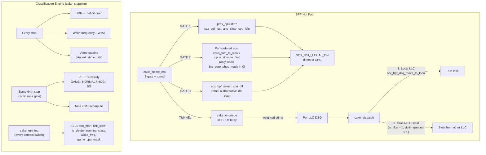
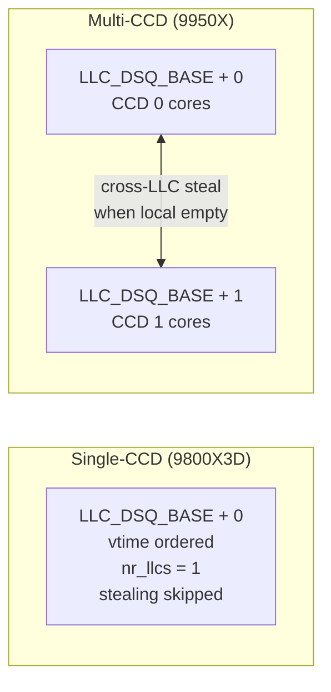

# scx_cake: CAKE DRR++ Adapted for CPU Scheduling

[](https://opensource.org/licenses/GPL-2.0)
[](https://kernel.org)
[](https://github.com/sched-ext/scx)

> **ABSTRACT**: `scx_cake` is an experimental BPF CPU scheduler that adapts the network [CAKE](https://www.bufferbloat.net/projects/codel/wiki/Cake/) algorithm's DRR++ (Deficit Round Robin++) for CPU scheduling. Designed for **gaming workloads** on modern AMD and Intel hardware.
>
> - **4-Class System** — Tasks classified as GAME / NORMAL / HOG / BG by PELT utilization and game family detection
> - **Zero Global Atomics** — Per-CPU BSS arrays with MESI-guarded writes eliminate bus locking
> - **3-Gate select_cpu** — prev_cpu idle → performance-ordered scan → kernel fallback → tunnel
> - **Per-LLC DSQ Sharding** — Eliminates cross-CCD lock contention on multi-chiplet CPUs
> - **EEVDF-Inspired Weighting** — Virtual runtime with sleep lag credit, nice scaling, and tiered DSQ ordering

---

> [!WARNING]
> **EXPERIMENTAL SOFTWARE**
> This scheduler is experimental and intended for use with `sched_ext` on Linux Kernel 6.12+. Performance may vary depending on hardware and user configuration.

> [!NOTE]
> **AI TRANSPARENCY**
> Large Language Models were used for optimization pattern matching and design exploration. All implementation details have been human-verified, benchmarked on real gaming workloads, and validated for correctness.

---

## Navigation

- [1. Quick Start](#1-quick-start)
- [2. Philosophy](#2-philosophy)
- [3. 4-Class System](#3-4-class-system)
- [4. Architecture](#4-architecture)
- [5. Configuration](#5-configuration)
- [6. Build Modes](#6-build-modes)
- [7. TUI Guide](#7-tui-guide)
- [8. Performance](#8-performance)
- [9. Vocabulary](#9-vocabulary)

---

## 1. Quick Start

```bash
# Prerequisites: Linux Kernel 6.12+ with sched_ext, Rust toolchain

# Clone and build
git clone https://github.com/sched-ext/scx.git
cd scx && cargo build --release -p scx_cake

# Run (requires root)
sudo ./target/release/scx_cake

# Run with live stats TUI
sudo scx_cake -v
```

---

## 2. Philosophy

Traditional schedulers (CFS, EEVDF) optimize for **fairness** — if a game and a compiler both run, each gets 50% CPU time. For gaming, this creates two problems:

1. **Latency inversion**: A 50µs input handler waits behind a 50ms compile job
2. **Frame jitter**: Game render threads get preempted mid-frame by background work

**scx_cake's answer**: Detect the game process family automatically (Steam, Wine/Proton, native games) and give it scheduling priority. Non-game tasks are classified by PELT CPU utilization into NORMAL, HOG, or BG classes with progressively lower priority. The system self-tunes — no manual configuration needed.

This is the same insight behind network CAKE: short flows (DNS, gaming packets) should not be delayed by bulk flows (downloads). scx_cake applies this to CPU time.

---

## 3. 4-Class System

`scx_cake` classifies every task into one of four classes. Classification uses PELT (Per-Entity Load Tracking) utilization from the kernel and automatic game family detection via process tree analysis.

### Class Hierarchy

| Class      | DSQ Weight Range | Typical Workload                                                     |
| :--------- | :--------------- | :------------------------------------------------------------------- |
| **GAME**   | [0, 5120]        | Game process tree + audio daemons + compositor (during GAMING state) |
| **NORMAL** | [8192, 13312]    | Default — interactive desktop tasks                                  |
| **HOG**    | [16384, 21504]   | High PELT utilization (≥78% CPU) non-game tasks                      |
| **BG**     | [49152, 54272]   | Low PELT utilization non-game tasks during GAMING                    |

> [!TIP]
> **Lower weight = dispatches first.** Non-overlapping weight ranges guarantee class ordering: all GAME tasks dispatch before any NORMAL task, all NORMAL before any HOG, etc.

### How Classification Works

1. **Game detection**: Two-phase detection scans for Steam environment variables and Wine `.exe` processes. Detected game TGIDs and their parent PID are written to BPF BSS. The entire process family (game + wineserver + audio + compositor) is promoted to GAME class.
2. **PELT-based classification**: Every 64th stop, the scheduler reads the kernel's `util_avg` for each task. Tasks with ≥78% CPU utilization are classified as HOG; lower-utilization non-game tasks become BG during GAMING state, or NORMAL otherwise.
3. **Audio/Compositor protection**: PipeWire daemons and Wayland compositors are detected at startup and baked into RODATA. During GAMING state, they receive GAME-level priority for latency parity with game threads.
4. **Waker-boost chain**: Tasks woken by GAME threads inherit GAME priority for one scheduling cycle. This automatically promotes game pipeline threads (sim→render→present) without explicit classification.

### Game Detection Deep Dive

Game detection runs in the **Rust TUI polling loop** (userspace, every refresh interval) and writes results to BPF BSS. The BPF side never scans `/proc` — it only reads the pre-resolved `game_tgid`, `game_ppid`, and `sched_state` from BSS.

**Detection Pipeline** (priority order):

1. **Phase 1 — Steam**: For each PPID group with ≥`GAME_MIN_THREADS` threads, read `/proc/<ppid>/environ` looking for `SteamGameId=` or `STEAM_GAME=`. If found, validate that the group contains a real game binary (not just `steam`, `steamwebhelper`, or `pressure-vessel`). Confidence: **100** (instant lock).
2. **Phase 2 — Wine/Proton .exe**: For remaining PPIDs with ≥`GAME_MIN_THREADS`, read `/proc/<ppid>/cmdline` looking for any argument ending in `.exe`. Covers Heroic Launcher, Lutris, manual Wine launches. Confidence: **90** (5-second holdoff).

**TGID Resolution**: Once a winning PPID is found, resolve the actual game TGID by:

- Building per-TGID max `pelt_util` across all threads in the PPID group
- Sorting TGIDs by descending PELT (the game's render loop consumes ms, infra exes consume µs)
- Filtering through a Windows infrastructure blocklist: `services.exe`, `winedevice.exe`, `pluginhost.exe`, `svchost.exe`, `explorer.exe`, `wineboot.exe`, `crashhandler.exe`, etc.
- Extracting the game name from `/proc/<tgid>/cmdline` (for `.exe`) or `/proc/<tgid>/comm` (for native)

**Hysteresis State Machine**:

- **Holdoff timer**: Lower-confidence candidates wait before locking (Steam=instant, .exe=5s). The same candidate must persist across multiple polls to lock.
- **Sticky incumbent**: Once locked, a game stays locked until its `/proc/<tgid>` disappears (process exits). A challenger can only displace it with **strictly higher** confidence.
- **Exit detection**: Every poll checks if `/proc/<game_tgid>` still exists. On exit → `tracked_game_tgid = 0`, `sched_state` transitions from GAMING → IDLE.

**BSS Propagation**: The resolved state is written to BPF BSS every refresh:

```
bss.game_tgid       = tracked_game_tgid    // for existence checks + display
bss.game_ppid       = tracked_game_ppid    // primary family signal for BPF classification
bss.game_confidence  = game_confidence      // 0/90/100
bss.sched_state      = IDLE | COMPILATION | GAMING
```

The BPF classification engine in `cake_init_task` and `cake_stopping` reads `game_ppid` to decide if a task belongs to the game family. All scheduling behavior changes (class assignment, DSQ weights, quantum caps, CPUPERF boost) flow from `sched_state`.

### DRR++ Deficit Tracking

Adapted from network CAKE's flow fairness:

- Each task starts with a **deficit** (quantum + new-flow bonus ≈ 10ms credit)
- Each execution bout consumes deficit proportional to runtime
- When deficit exhausts → new-flow bonus removed → task competes normally
- GAME tasks skip deficit drain entirely — their new-flow bonus persists forever

### EEVDF-Inspired Weighting

scx_cake uses a virtual runtime system inspired by EEVDF:

- **Sleep lag credit**: Tasks that yield voluntarily (game threads at vsync, audio callbacks) accumulate credit that reduces their DSQ weight on the next wakeup — dispatching them ahead of continuous consumers.
- **Nice scaling**: Per-task `nice_shift` (0-12) scales runtime cost. High `nice` priority → less vruntime cost → dispatches sooner. Computed once per 64 stops from `p->scx.weight`.
- **Capacity scaling**: On heterogeneous CPUs (P/E cores), E-core runtime is scaled by CPU capacity so tasks running on slower cores accumulate proportionally less vruntime.
- **CPUPERF steering**: During GAMING state, GAME tasks signal max CPU frequency boost (1024); non-GAME tasks use reduced boost (768). Check-before-write avoids redundant kfunc calls.

---

## 4. Architecture

### Overview


```mermaid
flowchart TD
    subgraph HOT["BPF Hot Path"]
        SELECT["cake_select_cpu<br/>3-gate + tunnel"] --> |GATE 1| PREV["prev_cpu idle?<br/>scx_bpf_test_and_clear_cpu_idle"]
        SELECT --> |GATE 2| SCAN["Perf-ordered scan<br/>cpus_fast_to_slow / cpus_slow_to_fast<br/>(only when big_core_phys_mask != 0)"]
        SELECT --> |GATE 3| KERNEL["scx_bpf_select_cpu_dfl<br/>kernel authoritative idle scan"]
        SELECT --> |TUNNEL| ENQ["cake_enqueue<br/>all CPUs busy"]

        PREV --> LOCALON["SCX_DSQ_LOCAL_ON<br/>direct to CPU"]
        SCAN --> LOCALON
        KERNEL --> LOCALON

        ENQ --> |"weighted vtime"| LLCDSQ["Per-LLC DSQ"]
        LLCDSQ --> DISPATCH["cake_dispatch"]
        DISPATCH --> |"1. Local LLC<br/>scx_bpf_dsq_move_to_local"| LOCAL["Run task"]
        DISPATCH --> |"2. Cross-LLC steal<br/>(nr_llcs > 1, victim queued > 1)"| STEAL["Steal from other LLC"]
    end

    subgraph CLASSIFY["Classification Engine (cake_stopping)"]
        EVERY["Every stop"] --> DEFICIT["DRR++ deficit drain"]
        EVERY --> WFREQ["Wake frequency EWMA"]
        EVERY --> VTIME["Vtime staging<br/>(staged_vtime_bits)"]
        GATE64["Every 64th stop<br/>(confidence gate)"] --> RECLASS["PELT reclassify<br/>GAME / NORMAL / HOG / BG"]
        GATE64 --> NICE["Nice shift recompute"]
        RUNNING["cake_running<br/>(every context switch)"] --> STAMP["BSS: run_start, tick_slice,<br/>is_yielder, running_class,<br/>wake_freq, game_cpu_mask"]
    end
```

### Source Files

| File           | Lines  | Purpose                                                          |
| :------------- | :----- | :--------------------------------------------------------------- |
| `cake.bpf.c`   | ~3,300 | All BPF ops + classification engine + BenchLab                   |
| `intf.h`       | ~690   | Shared structs, constants, telemetry definitions                 |
| `bpf_compat.h` | ~38    | Relaxed atomics compatibility shim                               |
| `main.rs`      | ~750   | Rust loader, CLI, profiles, topology, audio/compositor detection |
| `topology.rs`  | ~270   | CPU topology detection (CCDs, P/E cores, V-Cache, SMT)           |
| `calibrate.rs` | ~305   | ETD inter-core latency measurement (CAS ping-pong)               |
| `tui.rs`       | ~4,500 | Terminal UI: debug view, live matrix, BenchLab, topology         |

### Ops Callbacks

| Callback                  | Role                                                       | Hot/Cold          |
| :------------------------ | :--------------------------------------------------------- | :---------------- |
| `cake_select_cpu`         | 3-gate idle CPU selection + kfunc tunneling                | **Hot**           |
| `cake_enqueue`            | Weighted vtime insert into per-LLC DSQ                     | **Hot**           |
| `cake_dispatch`           | Local LLC → cross-LLC steal                                | **Hot**           |
| `cake_running`            | BSS staging: run_start, is_yielder, game_cpu_mask, cpuperf | **Hot** (minimal) |
| `cake_stopping`           | Confidence-gated reclassification + DRR++ + vtime staging  | **Warm**          |
| `cake_yield`              | Yield count telemetry (stats-gated)                        | **Cold**          |
| `cake_runnable`           | Preempt count + wakeup source telemetry (stats-gated)      | **Cold**          |
| `cake_set_cpumask`        | Event-driven affinity update (replaces polling)            | **Cold**          |
| `cake_init_task`          | Arena + task_storage allocation, initial classification    | **Cold** (once)   |
| `cake_exit_task`          | Arena deallocation                                         | **Cold** (once)   |
| `cake_init` / `cake_exit` | DSQ creation, arena init, UEI                              | **Cold** (once)   |

### Data Structures

**Dual-storage architecture**:

- **`cake_task_hot`** (BPF task_storage, ~10ns lookup) — CL0 scheduling-critical fields used every stop: `task_class`, `deficit_u16`, `packed_info`, `warm_cpus`, `staged_vtime_bits`, `nice_shift`, `sleep_lag`, `cached_cpumask`
- **`cake_task_ctx`** (BPF Arena, ~29ns TLB walk) — Telemetry-only fields, gated behind `CAKE_STATS_ACTIVE`. Dead in release builds.
- **`cake_cpu_bss`** (BSS array, L1-cached) — Per-CPU hot fields: `run_start`, `tick_slice`, `is_yielder`, `cached_now`, `idle_hint`, `waker_boost`, `cached_perf`

**Per-CPU arena** (`cake_per_cpu`, conditional sizing):

- Release: 64B/CPU (CL0 only, 1 page total)
- Debug: 128B/CPU (CL0 + CL1 telemetry, 2 pages total)

### DSQ Architecture


```mermaid
flowchart LR
    subgraph SINGLE["Single-CCD (9800X3D)"]
        DSQ0["LLC_DSQ_BASE + 0<br/>vtime ordered<br/>nr_llcs = 1<br/>stealing skipped"]
    end

    subgraph MULTI["Multi-CCD (9950X)"]
        DSQ1["LLC_DSQ_BASE + 0<br/>CCD 0 cores"] <-->|"cross-LLC steal<br/>when local empty"| DSQ2["LLC_DSQ_BASE + 1<br/>CCD 1 cores"]
    end
```

- **Vtime encoding**: `now_cached + dsq_weight` — class weight ranges guarantee ordering (GAME always before NORMAL)
- **RODATA gate**: `if (nr_llcs <= 1) return;` skips all cross-LLC stealing on single-CCD systems

### Zero Global State

| Anti-pattern                | scx_cake                                      |
| :-------------------------- | :-------------------------------------------- |
| Global atomics              | **0** (except game_cpu_mask, transition-only) |
| Volatile variables          | **0**                                         |
| Division in hot path        | **0** (shift-based µs conversion: `>> 10`)    |
| Global vtime writes         | **0** (per-task only)                         |
| RCU lock/unlock in hot path | **0**                                         |

### Kfunc Tunneling

`select_cpu` caches `scx_bpf_now()` in per-CPU BSS (`cpu_bss[cpu].cached_now`). `enqueue` reuses this value, saving ~15ns (1 kfunc trampoline entry) on the all-busy path.

### VPROT: Preemption Protection

When a GAME task enters the DSQ during GAMING state and all CPUs are busy, `cake_enqueue` actively preempts a non-GAME task:

1. **O(1) victim finding**: `__builtin_ctzll(~game_cpu_mask)` — single `tzcnt` instruction (1 cycle on Zen 4). Bits set in `~game_cpu_mask` correspond to CPUs running non-GAME tasks.
2. **VPROT guard**: Before preempting, check if the victim has run long enough to justify interruption. The protection threshold is computed as:
   - **Base**: `tick_slice >> 4`, clamped to [125µs, 500µs]
   - **Per-class scaling**:
     - **NORMAL**: 75% (×3>>2) — useful interactive work, strong protection
     - **BG**: 50% (>>1) — background tasks, moderate protection
     - **HOG**: 25% (>>2) — bulk CPU consumers, minimal protection
3. **Preempt decision**: If `elapsed >= vprot_ns` → `scx_bpf_kick_cpu(victim, SCX_KICK_PREEMPT)`. Otherwise → suppressed (counted as `nr_vprot_suppressed` in stats).

This ensures GAME tasks never wait in the DSQ for a natural context switch while still protecting tasks from micro-slicing. The per-class scaling means HOG tasks (compilers, render farms) get preempted quickly while NORMAL desktop tasks get reasonable protection.

### Starvation Guard

The tiered DSQ weight system intrinsically prevents starvation:

- **Non-overlapping weight ranges** guarantee that within each class, tasks compete fairly on vtime (runtime cost determines ordering)
- **New-flow bonus** gives newly-woken tasks a vtime advantage, preventing permanent queue-back
- **Deficit drain** ensures long-running tasks lose their new-flow bonus and compete normally
- **Sleep lag credit** rewards voluntary yielders, preventing inversion where a yielding task falls behind a continuous consumer

The clock domain fix in `cake_running` (using `scx_bpf_now()` instead of `p->se.exec_start`) prevents a subtle starvation bug: after ~22 minutes, accumulated IRQ time drift in `exec_start` would exceed the u32 wrap boundary, corrupting elapsed-time checks and causing unconditional preemption (priority inversion).

### Scheduler States

The userspace TUI drives state machine transitions written to BPF BSS:

| State           | Value | Trigger                            | Effect                                   |
| :-------------- | :---- | :--------------------------------- | :--------------------------------------- |
| **IDLE**        | 0     | No game or compiler detected       | Baseline — NORMAL/HOG classes only       |
| **COMPILATION** | 1     | ≥2 compiler processes at ≥78% PELT | Cluster co-scheduling for build locality |
| **GAMING**      | 2     | Game detected (Steam/.exe/family)  | Full priority system: GAME/HOG/BG active |

### Loader Intelligence

The Rust loader (`main.rs`) performs significant one-time work at startup, baking results into BPF RODATA (immutable after load):

**Prefcore Ranking → Core Steering Arrays**:

- Reads `/sys/devices/system/cpu/cpu*/cpufreq/amd_pstate_prefcore_ranking` for each CPU
- Sorts by descending rank (fastest first), grouping SMT siblings together: `[best_phys, best_smt, second_phys, second_smt, ...]`
- Populates `cpus_fast_to_slow` (GAME scan order) and `cpus_slow_to_fast` (non-GAME scan order) in RODATA
- 0xFF sentinel terminates the array on CPUs without prefcore rankings

**Audio Stack Detection** (2-phase):

1. **Phase 1 — Comm scan**: Searches `/proc/*/comm` for known audio daemons: `pipewire`, `wireplumber`, `pipewire-pulse`, `pulseaudio`, `jackd`, `jackdbus`
2. **Phase 2 — PipeWire socket scan**: Reads `/proc/net/unix` to find the PipeWire socket inode (`/run/user/<uid>/pipewire-0`), then scans `/proc/*/fd` for processes holding a file descriptor to that inode. This catches audio mixer daemons (`goxlr-daemon`, `easyeffects`, etc.) without brittle comm lists.

- Up to 8 audio TGIDs baked into `audio_tgids[]` RODATA. During GAMING, BPF promotes matching tasks to GAME class.

**Compositor Detection**:

- Scans `/proc/*/comm` for known Wayland/X11 compositors: `kwin_wayland`, `kwin_x11`, `mutter`, `gnome-shell`, `sway`, `Hyprland`, `weston`, `labwc`, `wayfire`, `river`, `gamescope`
- Up to 4 compositor TGIDs baked into `compositor_tgids[]` RODATA. During GAMING, compositors receive GAME-level priority — essential for frame presentation latency parity.

**Topology Arrays**:

- `cpu_sibling_map[]` — SMT sibling pairs (Gate 2 class-mismatch filter)
- `cpu_llc_id[]` — Per-CPU LLC assignment (DSQ sharding)
- `llc_cpu_mask[]`, `core_cpu_mask[]` — Bitmask sets for LLC/core grouping
- `big_core_phys_mask`, `little_core_mask`, `vcache_llc_mask` — Intel hybrid + V-Cache topology

---

## 5. Configuration

### Profiles (`--profile, -p`)

| Profile     | Quantum | Starvation | Use Case                              |
| :---------- | :------ | :--------- | :------------------------------------ |
| **gaming**  | 2ms     | 100ms      | **(Default)** Balanced for most games |
| **esports** | 1ms     | 50ms       | Competitive FPS, ultra-low latency    |
| **legacy**  | 4ms     | 200ms      | Older CPUs, reduced overhead          |
| **battery** | 4ms     | 200ms      | Power-efficient for handhelds/laptops |
| **default** | 2ms     | 100ms      | Alias for gaming                      |

### CLI Arguments

| Argument                  | Default  | Description                             |
| :------------------------ | :------- | :-------------------------------------- |
| `--profile, -p <PROFILE>` | `gaming` | Select preset profile                   |
| `--quantum <µs>`          | profile  | Base time slice in microseconds         |
| `--new-flow-bonus <µs>`   | profile  | Extra deficit for newly woken tasks     |
| `--starvation <µs>`       | profile  | Max run time before forced preemption   |
| `--verbose, -v`           | `false`  | Enable live TUI stats display           |
| `--interval <secs>`       | `1`      | TUI refresh interval                    |
| `--testing`               | `false`  | Automated benchmarking mode (see below) |

### Testing Mode

`--testing` runs an automated benchmark for CI and regression testing:

1. **Warmup**: 1 second pause for the scheduler to stabilize
2. **Collection**: 10 seconds of operation, sampling per-CPU BSS dispatch counters
3. **Output**: Single-line JSON to stdout:

```json
{
  "duration_sec": 10.0,
  "total_dispatches": 1847263,
  "dispatches_per_sec": 184726.3
}
```

The scheduler exits automatically after printing. Requires a **debug build** (release builds silently ignore `--testing`). Useful for comparing scheduling throughput across code changes.

### Yield-Gated Quantum

Instead of per-tier multipliers, scx_cake uses a **yield-gated quantum** system:

- **Yielders** (cooperative tasks that voluntarily yield): Get full quantum ceiling (up to 2ms default)
- **Non-yielders** (bulk consumers): Get PELT-scaled slice, capped per class
- **GAME during GAMING**: 2x quantum ceiling (tasks yield at vsync, so they'll never consume it all)
- **HOG/BG during GAMING**: Halved caps (forces more preemption points for GAME tasks)

> [!NOTE]
> **Higher weight = dispatches later.** GAME [0-5120] dispatches before NORMAL [8192-13312] dispatches before HOG [16384-21504] dispatches before BG [49152-54272]. Within each class, PELT utilization and runtime cost provide fine-grained ordering.

### Examples

```bash
# Default gaming profile
sudo scx_cake

# Competitive gaming
sudo scx_cake -p esports

# Gaming with custom quantum and live stats
sudo scx_cake --quantum 1500 -v

# Battery-friendly for laptop gaming
sudo scx_cake -p battery
```

---

## 6. Build Modes

`scx_cake` has two build modes that control whether telemetry instrumentation is compiled into the BPF code.

### Release Mode (`cargo build --release`)

- `build.rs` passes `-DCAKE_RELEASE=1` to Clang
- **All `#ifndef CAKE_RELEASE` blocks are dead-code eliminated** — arena telemetry, per-task counters, gate hit tracking, BenchLab, and the entire `cake_task_ctx` arena struct are compiled out
- `CAKE_STATS_ENABLED` is a compile-time constant `0` — Clang eliminates all telemetry branches at BPF compile time
- Per-CPU arena blocks shrink from 128B (debug) to 64B (release)
- **TUI still works** but only shows aggregate BSS stats (gate latencies, dispatch counts). Per-task arena fields (gate hit %, callback durations, quantum breakdown) are unavailable

> [!TIP]
> Use `--release` for production gaming. The telemetry overhead is small (~2-5%), but eliminating it gives the tightest possible scheduling latency.

### Debug Mode (`cargo build`)

- `CAKE_RELEASE` is **not defined** — all telemetry code is compiled in
- `CAKE_STATS_ENABLED` becomes a volatile BSS read of `enable_stats`, controllable at runtime
- `CAKE_STATS_ACTIVE` = `CAKE_STATS_ENABLED && !bench_active` — telemetry is suppressed during BenchLab runs to avoid measuring measurement overhead
- Full per-task arena telemetry: gate hit counters, callback duration timers, quantum utilization, waker chain, LLC placement, dispatch gap tracking
- **Required for**: full TUI live matrix, BenchLab benchmarks, per-task gate analysis

```bash
# Production (release) — minimal overhead, limited TUI
cargo build --release -p scx_cake
sudo ./target/release/scx_cake -v

# Development (debug) — full telemetry, complete TUI
cargo build -p scx_cake
sudo ./target/debug/scx_cake -v
```

---

## 7. TUI Guide

The TUI is activated with `--verbose` / `-v` and provides real-time visibility into every scheduling decision. It requires a **debug build** for full per-task telemetry.

### Tabs

Navigate between tabs with `Tab` / `→` (next) and `Shift-Tab` / `←` (previous).

| Tab                 | Content                                                                                |
| :------------------ | :------------------------------------------------------------------------------------- |
| **Dashboard**       | Aggregate stats header + live task matrix with per-task scheduling data                |
| **Topology**        | CPU topology map: CCDs, P/E cores, V-Cache, SMT siblings, core-to-core latency heatmap |
| **BenchLab**        | In-kernel kfunc microbenchmarks: 60+ operations with ns-precision timing               |
| **Reference Guide** | Quick reference for column meanings, keybindings, and terminology                      |

### Dashboard: Aggregate Stats

The top section shows system-wide scheduling statistics aggregated from per-CPU BSS counters:

- **Gate hit rates**: Gate 1 (prev_cpu idle) %, Gate 2 (perf-ordered scan) %, Gate 3 (kernel fallback) %, Tunnel %
- **Dispatch stats**: DSQ queued, consumed, local dispatches, cross-LLC steals, dispatch misses
- **Flow stats**: New flow dispatches, old flow dispatches, DRR++ deficit activity
- **Game state**: Detected game name, TGID, PPID, thread count, sched_state (IDLE/COMPILATION/GAMING)
- **EEVDF stats**: Sleep lag applications, vprot suppression count, nice shift distribution

### Dashboard: Live Task Matrix

The scrollable table shows one row per task with these columns:

| Column     | Meaning                                                                             |
| :--------- | :---------------------------------------------------------------------------------- |
| **CPU**    | Last CPU the task ran on                                                            |
| **PID**    | Process ID                                                                          |
| **ST**     | Liveness: ●LIVE (BPF-tracked + running), ○IDLE (alive, no BPF data), ✗DEAD (exited) |
| **COMM**   | Task command name (from `/proc/PID/comm`)                                           |
| **CLS**    | Task class: GAME 🎮, NORM, HOG 🔥, BG                                               |
| **VCSW**   | Voluntary context switches (delta per interval)                                     |
| **AVGRT**  | Average runtime per execution bout (µs)                                             |
| **MAXRT**  | Maximum single-run duration (µs)                                                    |
| **GAP**    | Average dispatch gap — time between consecutive runs (µs)                           |
| **JITTER** | Scheduling jitter — variance in dispatch timing (µs)                                |
| **WAIT**   | Average wait time in DSQ before dispatch (µs)                                       |
| **RUNS/s** | Scheduling frequency — how often this task runs per second                          |
| **CPU**    | Current/last CPU placement (core ID)                                                |
| **SEL**    | `select_cpu` callback duration (ns)                                                 |
| **ENQ**    | `enqueue` callback duration (ns)                                                    |
| **STOP**   | `stopping` callback duration (ns)                                                   |
| **RUN**    | `running` callback duration (ns)                                                    |
| **G1**     | Gate 1 (prev_cpu idle) hit percentage for this task                                 |
| **G3**     | Gate 3 (kernel scan) hit percentage for this task                                   |
| **DSQ**    | DSQ tunnel (all busy) hit percentage                                                |
| **MIGR/s** | CPU migrations per second                                                           |
| **TGID**   | Thread Group ID (process leader PID)                                                |
| **Q%F**    | Quantum full — % of runs where task consumed entire time slice                      |
| **Q%Y**    | Quantum yield — % of runs where task yielded voluntarily                            |
| **Q%P**    | Quantum preempt — % of runs where task was preempted                                |
| **WAKER**  | PID of the last task that woke this task                                            |
| **NICE**   | Nice shift value (0-12) — EEVDF vruntime scaling factor                             |

Tasks are grouped by TGID (process) with collapsible headers. The detected game family is highlighted.

### Topology Tab

Displays the detected CPU topology in a visual format:

- **CCD map**: Which cores belong to which LLC/CCD
- **P/E core identification**: Big cores vs Little cores (Intel hybrid)
- **V-Cache detection**: Asymmetric LLC sizes across CCDs
- **SMT siblings**: Logical CPU pairs sharing a physical core
- **Core-to-core latency matrix**: Press `b` to run an ETD (Empirical Topology Discovery) benchmark measuring CAS ping-pong latency between every core pair. Results display as a color-coded heatmap.

### BenchLab Tab

In-kernel microbenchmark suite measuring the real cost of scheduling primitives:

- **60+ benchmarked operations**: kfunc trampolines, BSS reads, arena lookups, RODATA constants, data structure accesses, idle cascades, classification paths
- Each operation shows: **ID**, **Name**, **Category** (Data Read, Synchronization, Idle Selection, etc.), **Type** (K=kfunc, C=cake-internal), and **measured latency in nanoseconds**
- Press `b` to trigger a benchmark run (runs in-kernel, suppresses telemetry during measurement)
- Results persist across runs; press `c` to copy to clipboard for external analysis

### Keybindings

| Key               | Action                                                              |
| :---------------- | :------------------------------------------------------------------ |
| `q` / `Esc`       | Quit                                                                |
| `Tab` / `→`       | Next tab                                                            |
| `Shift-Tab` / `←` | Previous tab                                                        |
| `↑` / `↓`         | Scroll table / bench results                                        |
| `t`               | Jump to top of table                                                |
| `s`               | Cycle sort column (PID → PELT → Runs/s → CPU → Gate1% → ...)        |
| `S`               | Toggle sort direction (ascending ↔ descending)                      |
| `f`               | Toggle filter: BPF-tracked only ↔ all system tasks                  |
| `Enter`           | Collapse/expand PPID group (Dashboard)                              |
| `Space`           | Collapse/expand TGID group (Dashboard)                              |
| `x`               | Fold/unfold all PPID groups (Dashboard)                             |
| `c`               | Copy current tab data to clipboard                                  |
| `d`               | Dump full snapshot to timestamped file (`tui_dump_<epoch>.txt`)     |
| `r`               | Reset all BSS stats counters to zero                                |
| `b`               | Run benchmark (BenchLab on most tabs, core latency on Topology tab) |
| `+` / `=`         | Faster refresh rate (halve interval, min 250ms)                     |
| `-`               | Slower refresh rate (double interval, max 5000ms)                   |

### Data Export

Two export methods are available from any tab:

- **Clipboard** (`c`): Copies the current tab's data as formatted text. On Dashboard, includes aggregate stats + full task matrix. On BenchLab, includes all benchmark results with categories.
- **File dump** (`d`): Writes a complete snapshot to `tui_dump_<epoch>.txt` in the current working directory. Includes all stats, task matrix, and metadata. Useful for before/after comparisons or sharing with developers.

---

## 8. Performance

### Target Hardware

| Component | Specification                       |
| :-------- | :---------------------------------- |
| CPU       | AMD Ryzen 7 9800X3D (1 CCD, 8C/16T) |
| Kernel    | Linux 6.12+ with sched_ext          |

### Design Targets

- **Sub-microsecond scheduling decisions** — Select CPU + enqueue under 100ns typical
- **Zero bus lock contention** — No global atomics means no scaling regression under load
- **Consistent 1% lows** — Tiered weight system prevents frame time spikes from background work
- **Automatic game detection** — Two-phase Steam/Wine detection with holdoff hysteresis

### Benchmarks

- [schbench](https://github.com/brendangregg/schbench) — Scheduler latency microbenchmark
- Arc Raiders — AAA game stress testing (frame rates, 1% lows)
- Splitgate 2 — Competitive FPS latency testing

> [!NOTE]
> Throughput workloads (compilers, render farms) will perform **worse** than CFS/EEVDF. This scheduler explicitly trades throughput for latency — the same tradeoff network CAKE makes for packets.

### Comparison with Other sched_ext Schedulers

| Feature                 | scx_cake                            | scx_bpfland                    | scx_lavd                       | scx_cosmos                        |
| :---------------------- | :---------------------------------- | :----------------------------- | :----------------------------- | :-------------------------------- |
| **Primary goal**        | Gaming latency                      | General-purpose interactive    | Latency-sensitive workloads    | General-purpose + gaming          |
| **Task classification** | 4-class (GAME/NORMAL/HOG/BG)        | Interactive vs batch (2-class) | Urgency score (continuous)     | Latency criticality (multi-level) |
| **Game detection**      | Automatic (Steam/Wine/process tree) | None                           | Behavioral (latency patterns)  | None                              |
| **DSQ structure**       | Per-LLC vtime-ordered               | Per-LLC + shared               | Global ordered                 | Per-LLC                           |
| **Idle CPU selection**  | 3-gate custom + kernel fallback     | Kernel default                 | Custom idle scan               | Kernel default + LLC preference   |
| **EEVDF features**      | Sleep lag, nice scaling, vprot      | None                           | Urgency scoring                | None                              |
| **Core steering**       | Prefcore-aware (P/E, V-Cache)       | LLC-aware                      | LLC-aware                      | LLC-aware                         |
| **Global atomics**      | 0 (MESI-guarded BSS)                | Minimal                        | Some                           | Minimal                           |
| **When to choose**      | Gaming-first, multi-game families   | Desktop daily driver           | Mixed interactive + throughput | Desktop with gaming needs         |

> [!NOTE]
> scx_cake is **not** a general-purpose scheduler. It makes explicit tradeoffs that benefit gaming at the cost of throughput workloads. For daily desktop use without gaming, `scx_bpfland` or `scx_cosmos` may be better choices.

---

## 9. Vocabulary

### Core Concepts

| Term            | Definition                                                                                                                               |
| :-------------- | :--------------------------------------------------------------------------------------------------------------------------------------- |
| **CAKE**        | [Common Applications Kept Enhanced](https://www.bufferbloat.net/projects/codel/wiki/Cake/). Network AQM algorithm this scheduler adapts. |
| **DRR++**       | Deficit Round Robin++. Network algorithm balancing fair queuing with strict priority.                                                    |
| **PELT**        | Per-Entity Load Tracking. Kernel mechanism providing exponentially-decayed CPU utilization per task (`util_avg`).                        |
| **Class**       | Classification level (GAME/NORMAL/HOG/BG). Controls DSQ weight, quantum cap, and preemption policy.                                      |
| **Deficit**     | Per-task credit from DRR++. New tasks get bonus credit; GAME tasks skip deficit drain entirely.                                          |
| **Quantum**     | Base time slice a task is allotted before a scheduling decision.                                                                         |
| **Sleep Lag**   | EEVDF credit for voluntary yields. Reduces DSQ weight on next wakeup, so yielders dispatch first.                                        |
| **Waker Boost** | Transitive priority inheritance: tasks woken by GAME threads get GAME-level priority for one cycle.                                      |
| **Staged Bits** | Pre-computed scheduling state packed into a single u64 by `cake_stopping`, consumed by `cake_enqueue` to avoid redundant computation.    |
| **Jitter**      | Variance in scheduling latency between consecutive events. Low jitter = consistent frame delivery.                                       |

### Architecture

| Term                    | Definition                                                                                     |
| :---------------------- | :--------------------------------------------------------------------------------------------- |
| **Task Storage**        | BPF local storage attached to each task. 10ns lookup; holds CL0 hot scheduling fields.         |
| **Arena**               | BPF memory region for per-task telemetry data. 29ns TLB walk; dead in release builds.          |
| **BSS**                 | Zero-initialized BPF global data. Per-CPU arrays (`cpu_bss`) provide L1-cached hot fields.     |
| **Kfunc Tunneling**     | Caching kfunc return values in per-CPU BSS to avoid redundant trampoline calls.                |
| **MESI Guard**          | Read-before-write pattern: skip store if value unchanged, preventing cache invalidation.       |
| **RODATA Gate**         | Compile-time constant that eliminates entire code paths (e.g., single-CCD skips stealing).     |
| **Confidence Gate**     | Reclassification runs every 64th stop. 63/64 stops reuse cached task_class from task_storage.  |
| **BenchLab**            | In-kernel microbenchmark suite measuring kfunc costs, data access patterns, and gate cascades. |
| **Bitfield Coalescing** | Packing fields written together into adjacent bits for fused clear/set ops.                    |

### Hardware

| Term              | Definition                                                                                              |
| :---------------- | :------------------------------------------------------------------------------------------------------ |
| **CCD**           | Core Complex Die. Physical chiplet containing cores (9800X3D: 1 CCD, 9950X: 2 CCDs).                    |
| **LLC**           | Last Level Cache (L3). Cores in same LLC communicate ~3-5x faster than cross-LLC.                       |
| **SMT**           | Simultaneous Multi-Threading. Two logical CPUs per physical core.                                       |
| **P/E Cores**     | Intel hybrid architecture: Performance cores (fast) and Efficiency cores (power-saving).                |
| **V-Cache**       | AMD 3D V-Cache. Asymmetric LLC sizes across CCDs (e.g., 96MB vs 32MB on 9800X3D).                       |
| **ETD**           | Empirical Topology Discovery. Measures inter-core CAS latency at startup for display.                   |
| **Cache Line**    | 64-byte block of memory. Smallest unit the CPU loads from RAM. Foundation of data layout.               |
| **MESI Protocol** | Cache coherency protocol (Modified/Exclusive/Shared/Invalid). Unnecessary writes trigger invalidations. |

### Performance

| Term                | Definition                                                                              |
| :------------------ | :-------------------------------------------------------------------------------------- |
| **Hot Path**        | Code on every scheduling decision: select_cpu → enqueue → dispatch.                     |
| **Cold Path**       | Infrequent code: task init, reclassification (every 64th stop).                         |
| **Direct Dispatch** | `SCX_DSQ_LOCAL_ON` — task goes directly to a CPU's local queue, bypassing the DSQ path. |
| **1% Lows**         | Average framerate of the slowest 1% of frames. Key metric for stutter.                  |
| **Branchless**      | Code avoiding `if/else` to prevent CPU pipeline stalls from branch misprediction.       |

### Anti-Patterns

| Term                   | Definition                                                                                    |
| :--------------------- | :-------------------------------------------------------------------------------------------- |
| **False Sharing**      | Performance penalty when CPUs write to different data on the same 64-byte cache line.         |
| **Cache Invalidation** | Forcing other cores to discard cached data via unnecessary writes. Causes bus locking.        |
| **Micro-slicing**      | Preempting tasks too frequently. Queued interruptions degrade throughput and increase jitter. |
| **Volatile**           | Compiler hint preventing optimization. Clogs LSU, breaks ILP/MLP parallelism. Avoid in BPF.   |

---

**License**: GPL-2.0
**Maintainer**: RitzDaCat
