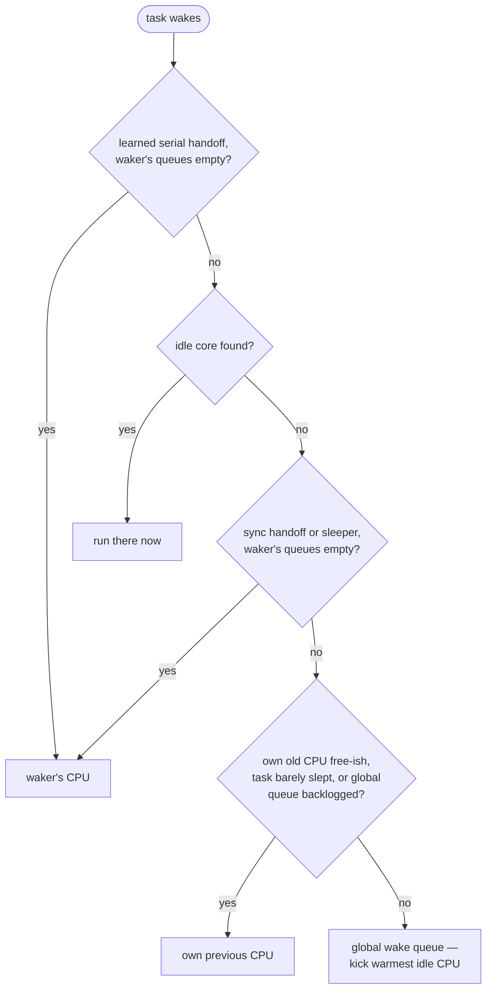

# 🍰 scx_cake

**A pluggable CPU scheduler for Linux, built for gaming.**

Steady frame times, low input lag, small worst-case stutters —
while staying a competent general-purpose scheduler.

**The mission: a scheduler I would want to use for gaming.**

[How it works](#how-it-works) ·
[Performance](./docs/PERFORMANCE.md) ·
[Design](#the-design-in-one-page) ·
[Docs](#source-tour) ·
[Contributing](#contributing)

---

The name and philosophy come from CAKE, the network queue manager that
fixed router bufferbloat: keep queues short, give latency-critical work a
fast path by construction, share the rest fairly.

It runs via `sched_ext`, which loads schedulers as sandboxed BPF programs.
If the scheduler misbehaves, the kernel watchdog evicts it and the default
scheduler is back within seconds.

1.2.0 is a clean-slate rewrite. Development is measurement-driven: changes
must survive interleaved benchmark A/B, and placement changes must survive
live-game frame A/B. AI-assisted code goes through the same
no-change-lands-on-trust gate. How performance is measured, and where
results stand: [`docs/PERFORMANCE.md`](./docs/PERFORMANCE.md).

## Getting it running

| | |
|---|---|
| **Kernel** | 7.1+ with `CONFIG_SCHED_EXT=y` — check `zgrep SCHED_EXT /proc/config.gz`. Gaming distro kernels (CachyOS et al.) qualify |
| **Build** | `cargo build --release -p scx_cake` from the scx repo root (Rust toolchain + clang ≥ 17) |
| **Run** | `sudo ./target/release/scx_cake` |
| **Is it active?** | `cat /sys/kernel/sched_ext/root/ops` prints `cake_…` |
| **Stop** | <kbd>Ctrl</kbd>+<kbd>C</kbd> detaches it; the default scheduler resumes immediately |
| **If evicted** | the exit reason lands in `dmesg` (grep `sched_ext`) |

The binary takes `-v` and `-V` and nothing else — that is the point.
(`intf.h` carries no policy switches; the only cflag inputs are the build
host's CCD/CPU counts. Experiments are A/B'd as two git commits, never a
build flag — see [`DESIGN.md`](./DESIGN.md).)

## How it works

A CPU scheduler answers one question thousands of times per second: *this
task just became runnable — where should it run, and does anything need to
get out of the way?*

Most of the time a core is free and the answer is easy: cake hands the task
straight to it, preferring cores whose caches still hold its data. When
every core is busy, the core rule:

| the task… | goes to… | because… |
|---|---|---|
| just **woke up** and is *waiting more than it runs* | one **shared waiting line** every core checks | the first core to free up anywhere picks it up. A well-served wake queues on its own core instead |
| **used up its turn** | **its own core's line** | its data is still hot in that cache; it loses nothing by waiting there |

Four refinements exist specifically for games, each measured on a real one:

- **Keep a busy thread on its own core.** Linux's default idle-search
  prefers a wholly-free core over the task's own still-warm one; for a
  render thread that trade is backwards, so cake claims the old core first
  when free.
- **Never queue behind an equally busy peer.** If the core a task wants is
  held by another well-served task, it goes to the shared line instead.
- **Bound the worst case pessimistically.** The turn-length cap reads the
  frame clock (the display's measured refresh cadence) conservatively, so a
  brief mis-measure can never widen it.
- **Never hand a wake to a CPU that is busy with hardware** — next section.

### Interrupt-aware placement

The kernel steers device interrupts — GPU, NVMe, network — onto specific
cores ("sinks"). A task placed on one stops every time an interrupt fires.
Cake vetoes those cores on three time scales, all measured, none
configured:

| time scale | signal | how it is kept | on a hit |
|---|---|---|---|
| **average** | the CPU spends real *time* in interrupt handlers (time share, not event counts) | the loader re-measures on a 1–16 s cadence that slows as the set proves stable; the cut is the widest gap in the host's own sorted distribution — no Hz threshold, never a one-shot sample at attach | chronic sinks leave the placement set |
| **this instant** | inside a handler right now | handler entry/exit tracepoints keep a per-CPU bit | the pick retries once toward any clean idle CPU |
| **near future** | the next timer tick fires before the task could land | per-CPU next-tick time vs the measured wake-hop cost (the time for a wake to reach another CPU and start running) | that pick is refused |

How this is measured: [`docs/PERFORMANCE.md`](./docs/PERFORMANCE.md).

### Life of a wake under load

```mermaid
flowchart TD
    W([task wakes]) --> H{learned serial handoff,<br/>waker's queues empty?}
    H -- yes --> WC[waker's CPU]
    H -- no --> I{idle core found?}
    I -- yes --> DD[run there now]
    I -- no --> S{sync handoff or sleeper,<br/>waker's queues empty?}
    S -- yes --> WC
    S -- no --> P{own old CPU free-ish,<br/>task barely slept, or global<br/>queue backlogged?}
    P -- yes --> PC[own previous CPU]
    P -- no --> G[global wake queue —<br/>kick warmest idle CPU]
```

Every concrete target passes the chronic-sink and mid-handler vetoes first;
the tick look-ahead additionally guards the idle pick, its retry, and the
kicked sibling. Fairness comes from a per-task virtual-time clock: tasks
that have consumed less CPU run first, weighted by nice level.

## The design in one page

<b>Vocabulary — eight terms carry everything</b>

 

| term | meaning |
|---|---|
| **DSQ** | dispatch queue, sched_ext's queue primitive. One per CPU plus one global **wake queue** |
| **vtime** | virtual runtime: CPU time consumed, weighted by priority. Lower = runs sooner |
| **frontier** | the highest vtime reached — the fairness clock's "now" |
| **sleeper vs peer** | vtime well behind the frontier = just slept, earned credit, fast service; at the frontier = ran all along, can wait |
| **slice** | per-task turn length: twice its own measured burst, floored at one context-switch cost, capped at half a frame |
| **starved** | waiting longer than it runs, computed from counters the kernel already keeps. Cake's main discriminator |
| **frame clock** | the display's real cadence, measured by voting on thread wake rates. Follows 60/144/240 Hz and VRR with no configuration |
| **sink** | a CPU the kernel steers device interrupts onto — see the veto table above |

<b>The rest of the mechanism — edge cases, preemption, dispatch</b>

 

- a woken task stays on its old core when cache warmth outweighs the shared
  line's speed;
- a sleeping partner takes over its waker's core — two tasks ping-ponging a
  message run fastest sharing one core;
- the backlog gate exists because a saturated machine must not scatter
  wakes — it would tear communicating pairs apart;
- preemption has two opposite gates: claiming an empty-ish home may kick an
  occupant only while it has barely started (under 1/32 of a frame slice)
  and the wakee leads on fairness; with no idle CPU anywhere, an occupant
  is kicked only once it has run a real fraction of a frame, is not a
  pipeline stage, and the wakee's fairness clock is earlier;
- expired tasks requeue on their own CPU and advertise via a per-CPU "may
  hold work" mark. Dispatch drains own queue vs wake queue by earliest
  vtime (with hysteresis so the global queue's lock isn't stampeded), then
  ring-steals from neighbors, then keeps running what it has;
- fairness accounting is nearly free: the turn charge is the delta of the
  kernel's own `sum_exec_runtime`, weighted by a reciprocal table, and new
  tasks start exactly at the frontier.

The mechanism-level version of all of this — every rule, threshold, and
receipt — is [`DESIGN.md`](./DESIGN.md).

## Compared to other scx schedulers

`scx_lavd`, `scx_bpfland`, and `scx_rusty` are mature, feature-rich
schedulers built on heuristics and tracked state. Cake's bet: zero per-task
state, zero tunables, one algorithm small enough to audit in an afternoon —
adaptivity comes from classifying the current scheduling state, and the
only learned state is one per-CPU three-bit handoff-confidence hint.

## Source tour

| file | contents |
|---|---|
| `src/bpf/cake.bpf.c` | the scheduler — 8 callbacks, ~1.5k lines, about a third comments explaining the why |
| `src/bpf/intf.h` | the constant surface: build-host CPU/CCD counts, the `SLICE_NS` boot seed, frame-clock bands, and the IDs shared with the loader |
| `src/main.rs` | the loader: attach, exit reporting, hardware probes, frame-clock publish, sink monitor |
| [`STATE.md`](./STATE.md) | **start here** — current state, the experiment ledger, and the `§` rationale registry every source comment resolves to |
| [`DESIGN.md`](./DESIGN.md) | the full design: every rule, constant, invariant |
| [`docs/PERFORMANCE.md`](./docs/PERFORMANCE.md) | how performance is measured and where results stand |
| [`docs/`](./docs/README.md) | live investigations; the campaign gate log in [`docs/archive/`](./docs/archive/) |

## Contributing

Bug and stall reports welcome via GitHub issues — include
`dmesg | grep sched_ext` and your CPU/kernel. Behavioral changes must
survive the interleaved A/B discipline above, so PRs should come with
benchmark evidence, not just reasoning.

---

GPL-2.0 · built on <a href="https://github.com/sched-ext/scx">sched_ext</a>

