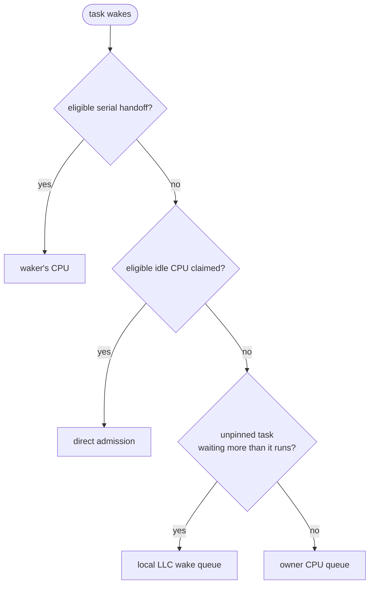

# 🍰 scx_cake

**A pluggable CPU scheduler for Linux, built for gaming.**

Steady frame times, low input lag, small worst-case stutters —
while staying a competent general-purpose scheduler.

**The mission: a scheduler I would want to use for gaming.**

[How it works](#how-it-works) ·
[Performance](./docs/PERFORMANCE.md) ·
[Design](#the-design-in-one-page) ·
[Docs](#source-tour) ·
[Contributing](#contributing)

---

The name and philosophy come from CAKE, the network queue manager that
fixed router bufferbloat: keep queues short, give latency-critical work a
fast path by construction, share the rest fairly.

It runs via `sched_ext`, which loads schedulers as sandboxed BPF programs.
If the scheduler misbehaves, the kernel watchdog evicts it and the default
scheduler is back within seconds.

1.2.0 is a clean-slate rewrite. Development is measurement-driven: changes
must survive interleaved benchmark A/B, and placement changes must survive
live-game frame A/B. AI-assisted code goes through the same
no-change-lands-on-trust gate. How performance is measured, and where
results stand: [`docs/PERFORMANCE.md`](./docs/PERFORMANCE.md).

## Getting it running

| | |
|---|---|
| **Kernel** | 6.12+ with `CONFIG_SCHED_EXT=y` — check `zgrep SCHED_EXT /proc/config.gz`. Kernels with the 7.1 kfuncs take the fastest paths; older ones take compat fallbacks. Gaming distro kernels (CachyOS et al.) qualify |
| **Build** | `cargo build --release -p scx_cake` from the scx repo root (Rust toolchain + clang ≥ 17) |
| **Run** | `sudo ./target/release/scx_cake` |
| **Is it active?** | `cat /sys/kernel/sched_ext/root/ops` prints `cake_…` |
| **Stop** | <kbd>Ctrl</kbd>+<kbd>C</kbd> detaches it; the default scheduler resumes immediately |
| **If evicted** | the exit reason lands in `dmesg` (grep `sched_ext`) |

Run without options for the default policy. Use `-v` for diagnostics, `-V`
for the version, or `--print-topology` to inspect the host without attaching.
`--help` lists the supported construct overrides (`--toggle NAME=0|1`).
The loader measures topology at startup; no build-host topology is baked in.

Stale options from `scx_loader` or another launcher, such as `--profile gaming`,
`--profile=performance`, or `-p powersave`, produce a warning and are ignored
along with their values. Supported options still apply; otherwise Cake uses
its default policy. Unknown or malformed toggle specifications are also
warned about and ignored. Missing values for supported options (for example,
a bare `--toggle`) remain command-line errors.

## How it works

A CPU scheduler answers one question thousands of times per second: *this
task just became runnable — where should it run, and does anything need to
get out of the way?*

Most of the time a core is free and the answer is easy: cake hands the task
straight to it, preferring cores whose caches still hold its data. When
every core is busy, the core rule:

| the task… | goes to… | because… |
|---|---|---|
| just **woke up** and is *waiting more than it runs* | a **shared wake queue** for its last-level cache (LLC) | nearby CPUs can serve it while keeping its data close. Eligible idle CPUs can also receive work directly |
| **used up its turn** | **its own core's line** | its data is still hot in that cache; it loses nothing by waiting there |

Placement also considers cache warmth, available cores, and interrupt load:

- **Keep a busy thread on its own core.** Linux's default idle-search
  prefers a wholly-free core over the task's own still-warm one; for a
  render thread that trade is backwards, so cake claims the old core first
  when free.
- **Avoid unnecessary waiting behind a busy peer.** An eligible wake can
  claim an idle CPU or use the shared wake queue when its home CPU is busy.
- **Adapt the time slice to the task.** Cake uses measured runtime and task
  age to choose a slice, capped at 1.5 ms and floored by a startup handoff
  estimate. It no longer samples a frame clock.
- **Prefer CPUs with less interrupt work** when suitable alternatives exist
  — next section.

### Interrupt-aware placement

The kernel steers device interrupts — GPU, NVMe, network — onto specific
cores ("sinks"). A task placed on one stops every time an interrupt fires.
Cake uses three signals to prefer cleaner CPUs, while keeping noisy CPUs
available when needed:

| time scale | signal | how it is kept | on a hit |
|---|---|---|---|
| **average** | time spent in interrupt handlers | the loader samples at a 1–16 s interval and separates unusually busy CPUs using the observed distribution | prefer eligible CPUs outside that group |
| **this instant** | a handler is running now | entry/exit tracepoints track per-CPU interrupt depth | prefer an eligible CPU without active interrupt work |
| **near future** | the next timer tick may arrive before the task lands | compare the next tick with the measured wake-hop time, when available | steer eligible choices away from imminent tick work |

How this is measured: [`docs/PERFORMANCE.md`](./docs/PERFORMANCE.md).

### Life of a wake under load

```mermaid
flowchart TD
    W([task wakes]) --> H{eligible serial handoff?}
    H -- yes --> WC[waker's CPU]
    H -- no --> I{eligible idle CPU claimed?}
    I -- yes --> DD[direct admission]
    I -- no --> P{unpinned task<br/>waiting more than it runs?}
    P -- yes --> G[local LLC wake queue]
    P -- no --> PC[owner CPU queue]
```

This is the common path; affinity, seat ownership and forced requeues add
exceptions described in [`DESIGN.md`](./DESIGN.md). Interrupt load guides
placement, with eligible noisy CPUs still usable when necessary. Virtual
runtime orders service using CPU time consumed and nice-level weights.

## The design in one page

<b>Scheduling terms</b>

 

| term | meaning |
|---|---|
| **DSQ** | dispatch queue, sched_ext's queue primitive. Cake uses owner queues and shared wake queues per LLC; wide CPU-ID spans fall back to one shared wake queue |
| **vtime** | virtual runtime: CPU time consumed, weighted by priority. Lower = runs sooner |
| **frontier** | the highest vtime reached — the fairness clock's "now" |
| **sleeper vs peer** | vtime well behind the frontier = just slept, earned credit, fast service; at the frontier = ran all along, can wait |
| **slice** | a task's CPU time budget, based on its measured runtime and age, capped at 1.5 ms and floored by a startup handoff estimate |
| **starved** | waiting longer than it runs, computed from counters the kernel already keeps. Cake's main discriminator |
| **seat** | a CPU associated with a pipeline-stage task; placement avoids giving another task that CPU when a suitable alternative exists |
| **sink** | a CPU the kernel steers device interrupts onto — see the veto table above |

<b>The rest of the mechanism — edge cases, preemption, dispatch</b>

 

- Cache-warm placement and serial handoffs preserve useful CPU locality.
- Seat ownership protects pipeline stages while respecting task affinity.
- Preemption considers the waiting task's slice and the current occupant's
  service; a kick does not guarantee immediate execution.
- Dispatch checks remote offers, its owner queue and its local wake pool,
  then looks for eligible work in other queues.
- Runtime accounting charges CPU time using reciprocal nice-level weights.

Policy details, hardware fallbacks and known limits are in
[`DESIGN.md`](./DESIGN.md).

Cake keeps per-task placement history and seat state, plus per-CPU queue
and interrupt information. The default policy needs no profile selection;
construct toggles support diagnosis and comparisons.

## Source tour

| file | contents |
|---|---|
| `src/bpf/cake.bpf.c` | CPU selection, queues, dispatch, service accounting and task lifecycle |
| `src/bpf/intf.h` | constants, topology limits and IDs shared with the loader |
| `src/main.rs` | command-line parsing, hardware probes, attach/restart, IRQ monitoring and tests |
| `src/core_performance.rs` | runtime core-capacity and preferred-core discovery |
| `tests/cli.rs` | launcher argument regression tests without scheduler attachment |
| [`DESIGN.md`](./DESIGN.md) | current policy, known limits and retained construct names |
| [`STATE.md`](./STATE.md) | historical experiment notes and rationale; may describe older builds |
| [`docs/PERFORMANCE.md`](./docs/PERFORMANCE.md) | how performance is measured and where results stand |
| [`docs/`](./docs/README.md) | live investigations; the campaign gate log in [`docs/archive/`](./docs/archive/) |

## Contributing

Bug and stall reports welcome via GitHub issues — include
`dmesg | grep sched_ext` and your CPU/kernel. Behavioral changes must
survive the interleaved A/B discipline above, so PRs should come with
benchmark evidence, not just reasoning.

---

GPL-2.0 · built on <a href="https://github.com/sched-ext/scx">sched_ext</a>

