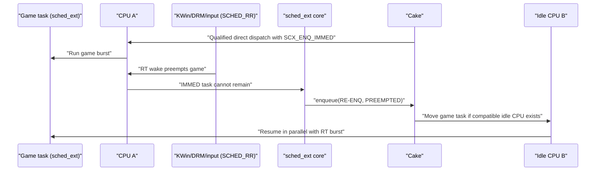

# Game render pipeline and sched_ext investigation

Date: 2026-07-23

Status: source and live-runtime investigation; proposed experiment only

## Objective

Determine whether `sched_ext` can reduce input-to-presentation latency or
frame-time jitter in the Linux Wayland gaming path without adding frame
sampling, a KWin-to-BPF telemetry channel, application identity, configuration
knobs, or recurring work to a nanosecond-sensitive hot path.

The narrow engineering question is:

> Can scx_cake keep an ordinary game render task from waiting behind a short
> KWin, DRM, or input real-time burst on one CPU when another compatible CPU is
> idle?

The target outcomes are lower game-thread wake-to-run and burst-completion
p99/p99.9/max, followed by better whole-game frame-time tails. The invariants
are unchanged:

- KWin, DRM, input, color, synchronization, and scanout correctness cannot
  regress.
- The scheduler remains workload-neutral. No executable, Steam ID, focus,
  window title, PID, or cgroup name identifies a game.
- The release policy has no per-frame telemetry, clocks, maps, task storage,
  logging, or user-space scheduler hints.
- A static code argument, successful build, or visible mechanism firing is not
  a performance result.
- A candidate that helps a synthetic collision but loses the accepted
  benchmark suite or live-game gates is rejected.

## Executive finding

There is a real sched_ext opportunity, but it is not to schedule KWin itself.

On this system KWin's main compositor thread, both per-output DRM commit
threads, and the libinput thread run as `SCHED_RR` priority 1. Linux schedules
these real-time threads above sched_ext. Cake cannot make them run sooner and
must not try to outrank them.

Game main, simulation, render-submission, and worker threads normally use the
ordinary scheduling class and can be controlled by sched_ext. The relevant
collision is:

1. Cake direct-dispatches a waking game task to an idle CPU.
2. A KWin main, libinput, or DRM commit `SCHED_RR` thread wakes on that CPU.
3. Linux correctly preempts the game task.
4. Without special handling, sched_ext can leave the game task at the head of
   that CPU's local queue until the real-time burst completes, even if another
   compatible CPU is idle.

Linux 7.1 exposes an event-driven contract intended for this shape:
`SCX_ENQ_IMMED`. An IMMED task that cannot stay on its CPU is re-enqueued to
the BPF scheduler with `SCX_TASK_REENQ_PREEMPTED`. Cake can then move it to
another idle CPU. No compositor hook or sampling loop is required.

This is a candidate, not a measured win. Migration and extra BPF/kernel work
may cost more than waiting out very short real-time bursts. It must be
qualified narrowly and measured against current Cake and native EEVDF.

## Evidence identity

### Live system snapshot

Collected on 2026-07-23:

| Component | Observed identity or state |
| --- | --- |
| Kernel | `7.1.4-1-cachyos` |
| Live BTF SHA-256 | `0ebe2673b570a1f66dbd70b280d5056ac406a6044f9c5889484c6de9aac404db` |
| sched_ext | `disabled` during this investigation |
| scx repository | branch `s1d-restore-20260722`, HEAD `cb1d638b54533be1972398f8ef57e65a3ae987ab` |
| Cake BPF source SHA-256 | `339754253b603ed61dcc78788291c0089c271374602d4e8ebe6d169db5a41b34` |
| Cake interface SHA-256 | `b735fc4ce596c198d1ba0024603ec278d42f4444814fe722cbe792571e27b863` |
| KWin package | `6.7.3-1.1`, package description identifies latency experiment revision 14 |
| KWin package integrity | `pacman -Qkk kwin`: 2,256 files, zero altered |
| KWin experimental policy | disabled; current process reports stock behavior |
| libinput | `1.31.3-1.1` |
| libdrm | `2.4.134-1.1` |
| NVIDIA userspace | `610.43.03-1` |
| Xwayland | `24.1.13-1.1` |

The local Linux checkout explains the implementation, while live BTF is the
authority for the ABI available to the running kernel. No kernel build receipt
was re-established in this investigation, so the checkout is
`source_reference_only`. Live BTF independently confirms:

- `SCX_ENQ_IMMED = 1 << 33`;
- `SCX_TASK_IMMED`;
- `SCX_TASK_REENQ_PREEMPTED`.

### Current outputs

| Output | Active mode | VRR | Color state | Frame interval |
| --- | --- | --- | --- | --- |
| DP-2 | 3840×2160 at 240.02 Hz, scale 1.5 | Automatic | HDR and WCG enabled | about 4,166,319 ns |
| DP-3 | 1920×1080 at 59.99 Hz | Automatic | HDR and WCG enabled | about 16,669,445 ns |

Each output owns a KWin `RenderLoop` and DRM commit thread. They do not share a
single refresh deadline, but they still share KWin's main thread, the GPU,
memory bandwidth, and CPU capacity.

### Live KWin scheduling classes

| Thread | Linux policy | sched_ext controls it? |
| --- | --- | --- |
| `kwin_wayland` main, TID 1140 | `SCHED_RR`, priority 1 | No |
| `DP-2`, TID 1156 | `SCHED_RR`, priority 1 | No |
| `DP-3`, TID 1157 | `SCHED_RR`, priority 1 | No |
| `libinput-connec`, TID 1158 | `SCHED_RR`, priority 1 | No |
| QDBus, QML, Vulkan-analysis and other KWin helpers | ordinary | Yes, when attached |

The source matches the runtime shape:

- `src/utils/realtime.cpp` calls `pthread_setschedparam()` with
  `SCHED_RR | SCHED_RESET_ON_FORK` at the minimum RT priority.
- `src/main_wayland.cpp` promotes the KWin main thread.
- `src/backends/libinput/connection.cpp` promotes the libinput thread.
- `src/backends/drm/drm_commit_thread.cpp` promotes each atomic commit thread.

The exact installed revision-14 source is retained by the compositor project
as the pre-revision-15 snapshot under:

```text
/home/ritz/Documents/Repo/linux-interactive-latency/artifacts/build/kwin/src/
  kwin-6.7.3.pre-rev15-20260723-140605/
```

## Complete interactive render pipeline

```mermaid
flowchart LR
    A["Mouse or keyboard report"] --> B["USB xHCI IRQ and HID decode"]
    B --> C["evdev event"]
    C --> D["KWin libinput thread (SCHED_RR)"]
    D --> E["KWin input dispatch (SCHED_RR main)"]
    E --> F["Wayland or Xwayland client event"]
    F --> G["Game input, simulation, and render threads (sched_ext)"]
    G --> H["Vulkan/OpenGL command submission"]
    H --> I["GPU execution and completion fence"]
    I --> J["Wayland surface commit and buffer readiness"]
    J --> K{"KWin presentation path"}
    K -->|"eligible"| L["Direct scanout"]
    K -->|"not eligible"| M["KWin composition and color conversion"]
    L --> N["Per-output DRM commit thread (SCHED_RR)"]
    M --> N
    N --> O["DRM atomic commit and NVIDIA display path"]
    O --> P["VRR/fixed-refresh latch"]
    P --> Q["Physical scanout to photons"]
```



The diagram contains CPU scheduling, GPU execution, synchronization, and
display timing. sched_ext can directly change only the ordinary CPU-thread
parts. It cannot schedule the GPU, monitor, IRQ hard handler, or higher-class
RT threads.

## Stage-by-stage ownership

| Stage | What happens | Primary wait or jitter source | Cake's authority |
| --- | --- | --- | --- |
| USB report | Device produces an interrupt transfer | Device poll interval, controller service | None over hardware; indirect CPU interference only |
| HID/evdev | Kernel decodes the report and publishes input events | IRQ/softirq service and kernel contention | Limited; not ordinary game-task placement |
| libinput | KWin's libinput thread reads and decodes device events | RT wake and short processing burst | No; thread is `SCHED_RR` |
| KWin input dispatch | KWin routes pointer/key events to the focused surface | Main-loop readiness and Wayland write | No; main thread is `SCHED_RR` |
| Game receives input | Client thread wakes and consumes the event | Wake-to-run, lock handoff, CPU placement | Yes |
| Simulation | Game updates state for the next frame | CPU execution, job graph, contention | Yes |
| Render submission | Game builds and submits GPU work | CPU wake/run, driver calls, internal locks | Yes for user CPU threads |
| GPU rendering | NVIDIA GPU executes submitted work | GPU queue and workload | No direct authority |
| Buffer commit | Client attaches/commits a buffer and synchronization state | Client wake, socket, acquire-fence readiness | Yes for client CPU work; not GPU fence completion |
| KWin decision | Direct scanout eligibility or composition | Main-thread RT work, effects, overlays, scaling, color | No |
| Composition | KWin renders the scene into an output buffer | GPU work and synchronization | KWin submit thread no; GPU no |
| DRM commit | Per-output thread waits until the target and submits atomic state | Fence readiness, safety margin, driver behavior | No; thread is `SCHED_RR` |
| Display | Hardware latches and scans the frame | VRR range, vblank, link and panel behavior | None |

## How a game produces a frame

### Native Wayland

1. KWin sends seat input and frame/presentation feedback over Wayland.
2. The game wakes an ordinary main/input/render task.
3. Game simulation and job workers calculate the next state.
4. The render thread records and submits Vulkan/OpenGL work.
5. The client exports or reuses a graphics buffer, normally a dma-buf.
6. Explicit synchronization can associate acquire and release points with the
   surface buffer. Otherwise the supported implicit/fallback synchronization
   path applies.
7. The client commits its Wayland surface.
8. KWin applies the transaction only when its dependencies are ready, damages
   the relevant output, and requests presentation.

### Xwayland

An X11 game has an extra translation boundary:

```text
game -> X11 Present/DRI3 -> Xwayland -> Wayland surface -> KWin
```

The same later KWin, DRM, VRR, and scanout paths apply. sched_ext still sees
ordinary game and Xwayland CPU threads, but it does not receive a trustworthy
dependency edge saying which one owns the next frame. Inferring that from
names or correlated wakeups would violate Cake's workload-neutral design.

### Game CPU/GPU overlap

Games commonly pipeline CPU simulation for one frame with GPU execution or
presentation of another. “Frame latency” is therefore not one scheduler delay.
The scheduler can improve:

- input-event wake-to-run;
- job handoff wake-to-run;
- render-thread burst completion;
- time from GPU/fence readiness notification to client/KWin CPU handling;
- interference tails caused by unrelated ordinary CPU work.

It cannot eliminate:

- game-engine buffering;
- GPU execution time;
- an unfinished acquire fence;
- a required composition/color transform;
- DRM/NVIDIA commit serialization;
- the display's latch and scanout time.

## How KWin presents the frame

### Per-output render scheduling

Each output has a `RenderLoop`. `scheduleRepaint()` requests a frame, and the
loop selects a render start from:

- the predicted presentation time;
- predicted render duration;
- the output/DRM presentation safety margin;
- the compositor wake allowance;
- the active presentation mode.

The timerfd work in the compositor project improves when the RT KWin main
thread is awakened. It does not change how Cake schedules the game. The two
mechanisms are complementary:

- timerfd: tighter KWin wake precision;
- sched_ext candidate: tighter ordinary game-thread service around RT bursts.

### Direct scanout

When one fullscreen surface is eligible, KWin can present the client's buffer
directly on a DRM plane:

```text
client buffer -> synchronization check -> atomic plane test/commit -> scanout
```

This removes KWin's composition render pass. It does not remove KWin's
eligibility, synchronization, atomic-test, commit, or presentation work.
Scaling, format/modifier support, effects, overlays, capture, and color
pipeline requirements can make direct scanout invalid.

HDR/WCG is important on this host. An SDR game on an HDR output still requires
a correct SDR-to-output transform. Direct scanout is only valid if the DRM
plane color pipeline can represent that transform. Bypassing it for latency
would be a correctness failure.

### Composited presentation

If direct scanout is unavailable:

1. KWin collects visible surfaces and damage for that output.
2. It samples the game buffer plus other layers.
3. Effects, scaling, blending, tone/color transforms, and cursor handling are
   applied as required.
4. KWin submits GPU work for the compositor output buffer.
5. The output buffer and its readiness state are handed to the DRM path.

Composition can add hundreds of thousands of nanoseconds or more depending on
the scene and color path. That is large at 240 Hz, but it is GPU/compositor
work, not a delay that sched_ext can directly delete.

### Explicit synchronization and NVIDIA

KWin 6.7.3 supports the Wayland `linux-drm-syncobj-v1` protocol and tracks
buffer acquire/release points. On the audited NVIDIA path, KWin does not pass
the plane `IN_FENCE_FD` in the same way as other drivers because of the
retained NVIDIA compatibility exclusion. The DRM commit thread checks buffer
readiness in userspace before submission.

The scheduler may reduce ordinary CPU wake delay around fence handling, but it
cannot make an unfinished GPU fence signal earlier. A future event-driven
NVIDIA readiness change belongs to the compositor/DRM investigation, not
Cake's policy.

### DRM atomic commit and page flip

Each active output has its own `DrmCommitThread`:

1. KWin queues a prospective atomic state.
2. The commit thread waits until the calculated target minus safety margin.
3. It verifies that required buffers are ready.
4. It submits the nonblocking DRM atomic commit.
5. Only one transaction is treated as committed/in-flight for the output.
6. The page-flip event records completion and lets the next pending state
   advance.

The threads are independent per output, but the main KWin thread and GPU remain
shared. A 59.99 Hz secondary output does not impose a 16.67 ms scheduler tick
on the 240 Hz output. It can still create work, GPU contention, or an RT commit
burst that overlaps the primary output's game task.

### VRR

VRR changes when hardware may latch a frame; it does not bypass the pipeline.
KWin selects an adaptive presentation mode when policy and surface conditions
permit. A ready frame can be presented at a variable interval inside the
display's supported range. A late game task, late fence, composition pass, or
late atomic commit still increases input age or misses the earliest eligible
latch.

At 240.02 Hz, one nominal refresh interval is about 4,166,319 ns. At 480 FPS,
one produced-frame interval is 2,083,333 ns. A recurring 50,000 ns,
300,000 ns, or 1,000,000 ns delay is therefore material even if it does not
always cause a full-frame miss.

## Linux scheduling-class boundary

The relevant class ordering is:

```text
deadline work -> real-time work -> sched_ext work -> ordinary fair work
```

While Cake is active, game tasks admitted to sched_ext replace the ordinary
fair-class policy, but RT KWin work still preempts them. This is the correct
safety relationship. The optimization must improve what happens to the
preempted game task, not weaken RT service.

### What current Cake already does

The current source already contains two relevant mechanisms:

1. **Cadence-proportional sleeper depth (`S1d`).**
   `cake_cadence_depth()` approximates mean burst length from
   `sum_exec_runtime >> log2(nvcsw | 1)`. It uses shifts and existing task
   state rather than division, maps, clocks, or task storage. Short-burst
   wake/sleep tasks receive bounded earlier service.
2. **RT-owned home avoidance (`M8`).**
   In `cake_enqueue()`, Cake reads the target CPU's current task. If it is
   `SCHED_FIFO`, `SCHED_RR`, or `SCHED_DEADLINE`, Cake avoids treating that
   CPU as an empty/free home and routes the wake toward shared service.

S1d has retained scheduler evidence recorded in `STATE.md`. The M8/RT-dodge
game gate remains pending; its presence in source is not proof of a live-game
benefit.

These are useful but incomplete:

- `select_cpu()` can direct-insert onto an idle local DSQ and return without
  calling `enqueue()`. The M8 check is therefore bypassed on that fast path.
- M8 observes only the task running at enqueue time. It cannot predict an RT
  thread that wakes just after the game starts running.
- When RT later preempts a normal scx task, the default kernel behavior keeps
  the task at the head of that CPU's local DSQ if it has slice remaining.

The uncovered case is a placement that was correct when made and becomes wrong
because a higher-class task arrives afterward.

## Proposed candidate: RT-preemption escape

### Kernel contract

For a task inserted onto a local DSQ with `SCX_ENQ_IMMED`, the kernel promises
that it either runs and remains on that CPU or is re-enqueued to the BPF
scheduler. It must not silently linger on a local DSQ after it can no longer
stay on the CPU.

In `put_prev_task_scx()` the 7.1 reference implementation does this when an
IMMED scx task with slice remaining is preempted by a higher class:

1. set `SCX_TASK_REENQ_PREEMPTED`;
2. call the scheduler's enqueue operation with `SCX_ENQ_REENQ`;
3. clear the temporary reason after the callback.

The kernel also exposes a built-in `SCX_EV_REENQ_IMMED` event counter. It can
provide a low-frequency mechanism signature without adding a Cake telemetry
write to every event.

### Proposed flow



### Candidate policy shape

The first candidate should be deliberately small:

```c
select_cpu:
    use current Cake placement
    if direct idle dispatch and task satisfies the existing short-burst gate:
        insert on local DSQ with SCX_ENQ_IMMED
    else:
        preserve current behavior

enqueue:
    if SCX_ENQ_REENQ and reason == SCX_TASK_REENQ_PREEMPTED:
        ask the default selector for a compatible idle CPU
        if a genuinely idle CPU exists:
            insert on that CPU's local DSQ with SCX_ENQ_IMMED
            return
        preserve current Cake continuation behavior
```

`scx_bpf_select_cpu_dfl()` is explicitly callable from `ops.enqueue()` on the
audited kernel. Using it only on the rare preempted-reenqueue path preserves
topology and affinity handling without a custom CPU scan.

The fallback should initially remain current Cake behavior. Reclassifying every
failed escape as a global wake would be a second behavioral change and would
confound the first experiment.

### Admission question

The key unresolved design choice is which direct admissions receive IMMED
protection.

Candidate A should reuse an existing, workload-neutral Cake distinction:

- genuine waking activation;
- direct idle placement;
- short-burst cadence according to current S1d state.

Candidate B can mark every direct idle wake as the opposed control if A's
classifier misses the collision. Neither is a runtime toggle or application
rule; they are separately built and measured candidates.

Do not introduce a new millisecond threshold merely to recognize a game.
Any retained boundary must derive from an existing Cake service law or a
measured, general scheduling invariant.

## Cost model and risks

`SCX_ENQ_IMMED` is event-driven and adds no sampling, but it is not free.

### Cost paid on every protected direct wake

- an additional enqueue flag;
- kernel IMMED state/accounting;
- extra flag checks on scheduling transitions;
- possible `nr_immed` accounting/cacheline activity;
- larger linked BPF path if qualification is not folded into existing state.

### Cost paid only after an RT collision

- re-entry into `ops.enqueue()`;
- reason-mask checks;
- one default CPU-selection kfunc call;
- a possible cross-CPU migration;
- lost cache warmth and NUMA/topology effects;
- a second IMMED insertion.

### Behavioral risks

- Migrating can cost more than waiting for a very short RT burst.
- Broad IMMED admission can increase cold execution and migration churn.
- A repeated RT source could bounce a task between CPUs.
- Pinned or migration-disabled tasks cannot escape and must preserve forward
  progress.
- IMMED protection persists across some kernel save/restore and preemption
  transitions until a fresh enqueue; the exact lifecycle must be tested.
- Direct insertion bypasses Cake's custom vtime queue. The candidate must not
  create unfairness or an unbounded service credit.
- An extra helper or branch on Cake's dominant direct-wake path may regress
  workloads even when no RT collision occurs.

This is why the candidate cannot be promoted on source elegance or a mechanism
counter alone.

## Designs deliberately rejected for the first experiment

### Per-frame KWin-to-BPF hints

Do not have KWin update a BPF map, call a syscall, change scheduling attributes,
or publish a frame deadline on every frame. That would:

- add work and cacheline traffic to the compositor/game boundary;
- couple Cake to a compositor-specific protocol;
- create ordering and stale-hint problems;
- require identity/configuration policy;
- risk slowing frames that do not need scheduler intervention.

### Periodic scheduler sampling

Do not poll KWin state, GPU state, focus, frame rate, runqueue RT utilization,
or presentation timestamps. The kernel already emits the exact event of
interest when an IMMED task is displaced.

### Raw runqueue RT-pressure reads on every wake

Live BTF makes low-level runqueue information reachable, but reading a remote
RT utilization/cacheline and calling another kfunc on every wake is a larger
hot-path tax than the first hypothesis requires. If the event-driven escape
works but reacts too late, a small scalar kernel kfunc for RT pressure can be
considered as a separate kernel-lane experiment.

### Static CPU reservation or game pinning

Dedicated game/compositor cores can reduce interference in one topology but
discard capacity, add configuration, and can worsen worker scaling. It is not
a universal Cake law.

### Raising the game to real-time

Giving the game RT priority would invert safety, allow an uncontrolled game
thread to delay input/commit work, and bypass Cake. It is not acceptable.

## Measurement plan without production sampling

### Phase 0: static cost and verifier gate

For baseline, Candidate A, and Candidate B:

- preserve exact source, binary, linked BPF object, kernel, boot, and BTF
  identity;
- compare linked BPF section sizes and instruction counts for `select_cpu` and
  `enqueue`;
- inspect generated BPF instructions around the new branches and kfunc call;
- run formatting, unit, build, verifier-load, activation, and restoration
  gates;
- reject verifier expansion, unsafe state growth, or activation instability
  before performance testing.

These checks establish cost and attribution, not a win.

### Phase 1: deterministic collision workload

Add one suite-owned workload through the exact-pair broker:

```text
periodic short ordinary burst
    +
periodic short SCHED_RR interference
    +
controlled idle-capacity cases
```

Test at representative cadences:

- 240 Hz: 4,166,667 ns period;
- 480 Hz: 2,083,333 ns period;
- an 8 kHz short-event stress shape: 125,000 ns period;
- no-RT control;
- one idle compatible CPU;
- fully busy system;
- pinned-task negative control.

Primary measurements:

- ordinary task wake-to-run p50/p95/p99/p99.9/max;
- burst completion p50/p95/p99/p99.9/max;
- time spent runnable behind the RT task;
- migration count and migration-after-RT-collision count;
- throughput and fairness of background compute;
- watchdog, stall, and restoration status.

The built-in `SCX_EV_REENQ_IMMED` delta is the mechanism signature. Read it
outside the timed interval or at low frequency from the harness. Do not add a
per-event BPF map update to the scored candidate.

Use the sanctioned sequence:

```text
bash cakebench artifact ensure
bash cakebench native-pair --receipt-b <receipt> --workload <slug> --smoke
bash cakebench native-pair --receipt-b <receipt> --workload <slug> --readiness
bash cakebench native-pair --receipt-b <receipt> --workload <slug> --execute --blocks 2
```

Only a promising candidate earns the 8-block confirmation. Never prefix the
suite with `sudo`.

### Phase 2: existing regression suite

Compare native EEVDF, current S1d Cake, and the candidate on the complete
accepted suite. Pay special attention to:

- `perf-sched-pipe`;
- futex and mutex handoff;
- schbench-light tails;
- saturated schbench;
- ccm cache/memcpy;
- pinned kernel-thread/watchdog survival.

The direct-wake flag cost can regress these even if no RT collision occurs.

### Phase 3: live game A/B

Use repeated native/current-Cake/candidate blocks through:

```text
bash cakebench game ab --game <id>
```

Keep KWin capture and diagnostic telemetry off for score-bearing arms. Preserve
the same:

- game and scene;
- cap versus uncapped state;
- warm-up;
- output topology;
- HDR/WCG and VRR state;
- overlays;
- background-load regime.

Capture game/application or MangoHud frame metrics:

- average FPS;
- 1% and 0.1% lows;
- frame-time p50/p95/p99/p99.9/max;
- frame-time variance and jitter;
- CPU/GPU utilization;
- stability and visual correctness.

Use KWin bounded capture only in separate diagnostic runs if the whole-game
result shows a change that needs attribution. The compositor observer must not
be running during the primary performance comparison.

### Phase 4: input-to-photon validation

Scheduler wake-to-run is not input-to-photon proof. A final claim needs an
external high-speed-camera/LED or photodiode setup that correlates physical
input with display response. Compare distribution tails, not one best sample.

## Keep, iterate, and reject gates

Keep for further research only if:

- the mechanism fires in the intended RT-collision workload;
- wake-to-run or burst-completion tail confidence clears the declared
  superiority threshold;
- no-RT controls do not regress beyond the noninferiority bound;
- migration and linked BPF cost remain bounded;
- the 2-block existing-suite screen is clean enough to justify confirmation.

Promote toward default only if:

- the 8-block suite clears every required guard;
- repeated live-game A/B improves the complete gaming metric set;
- no input, KWin, DRM, HDR/WCG, VRR, direct-scanout, NVIDIA, or watchdog
  regression appears;
- independent holdout blocks reproduce the win.

Reject if:

- the candidate mainly increases migration without shortening tails;
- current M8 avoidance already captures the measurable opportunity;
- waiting out the RT burst is cheaper than migrating;
- direct-wake callback cost creates losses outside the collision;
- it moves a scheduler metric without improving whole-frame behavior.

## Open questions

1. How often is an ordinary game thread actually preempted by KWin/libinput/DRM
   RT on this host while another compatible CPU is idle?
2. What are the RT burst duration distributions for KWin main, DP-2, DP-3, and
   libinput during 240 Hz gaming?
3. Does S1d's existing short-burst state select the useful game/render events
   precisely enough, or is all-direct-wake IMMED cheaper overall?
4. Is the migration cost smaller than the remaining RT burst at the p99 tail?
5. Does the secondary 59.99 Hz output create enough overlapping RT work to
   matter to the primary 240.02 Hz game path?
6. Do NVIDIA fence-readiness polling bursts create a measurable collision
   signature, or are main/input bursts dominant?
7. Does `SCX_EV_REENQ_IMMED` provide sufficient causality, or is a separate
   non-scored diagnostic build required?

## Source map

### scx_cake

- `scheds/rust/scx_cake/src/bpf/cake.bpf.c`
  - `cake_cadence_depth()`
  - `cake_select_cpu()`
  - `cake_enqueue()`
  - current `rt_owned` avoidance
- `scheds/rust/scx_cake/src/bpf/intf.h`
- `scheds/rust/scx_cake/DESIGN.md`
- `scheds/rust/scx_cake/STATE.md`

### sched_ext kernel reference

- `/home/ritz/Documents/Repo/linux/kernel/sched/ext/ext.c`
  - `put_prev_task_scx()`
  - `SCX_EV_REENQ_IMMED`
- `/home/ritz/Documents/Repo/linux/kernel/sched/ext/internal.h`
  - `SCX_ENQ_IMMED`
  - `SCX_ENQ_REENQ`
- `/home/ritz/Documents/Repo/linux/kernel/sched/ext/idle.c`
  - `scx_bpf_select_cpu_dfl()`
- live authority: `/sys/kernel/btf/vmlinux`

### KWin 6.7.3 revision-14 source snapshot

Root:

```text
/home/ritz/Documents/Repo/linux-interactive-latency/artifacts/build/kwin/src/
  kwin-6.7.3.pre-rev15-20260723-140605/
```

Relevant files:

- `src/utils/realtime.cpp`
- `src/main_wayland.cpp`
- `src/backends/libinput/connection.cpp`
- `src/core/renderloop.cpp`
- `src/compositor.cpp`
- `src/backends/drm/drm_commit_thread.cpp`
- `src/backends/drm/drm_output.cpp`
- `src/backends/drm/drm_commit.cpp`
- `src/wayland/linux_drm_syncobj_v1.cpp`
- `src/wayland/transaction.cpp`

Related compositor reports:

- `/home/ritz/Documents/Repo/linux-interactive-latency/docs/END_TO_END_INTERACTIVE_PIPELINE.md`
- `/home/ritz/Documents/Repo/linux-interactive-latency/docs/WAYLAND_FRAME_PIPELINE.md`
- `/home/ritz/Documents/Repo/linux-interactive-latency/docs/VRR_TIMING_AUDIT_2026-07-15.md`
- `/home/ritz/Documents/Repo/linux-interactive-latency/docs/NVIDIA_FENCE_AND_COMMIT_QUEUE.md`
- `/home/ritz/Documents/Repo/linux-interactive-latency/docs/HDR_SDR_COLOR_PIPELINE_AUDIT.md`

## Decision

The compositor should not continuously report frame state to Cake. KWin's
critical threads are already RT, and a per-frame bridge would spend work on
every frame to solve an intermittent scheduling collision.

The highest-value first sched_ext experiment is an isolated
`SCX_ENQ_IMMED` RT-preemption escape for state-qualified direct wakes. It uses
an existing kernel event at the exact point where the original placement
becomes invalid, pays the relocation work only after a collision, and preserves
Cake's workload-neutral, event-driven design.

No performance conclusion is recorded until the candidate is built, activated,
restored, exact-pair tested, and passed through whole-game A/B.
