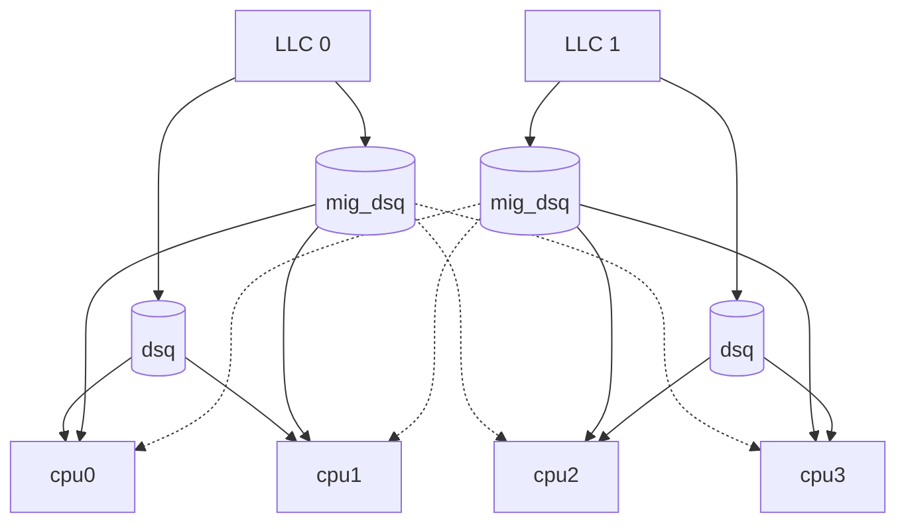

# scx_p2dq

## Overview

A simple pick 2 load balancing scheduler with multi-layer queueing.

The `p2dq` scheduler is a general purpose scheduler that uses a pick two
algorithm for load balancing tasks across last level caches (LLCs) and NUMA
nodes. `p2dq` uses in kernel task dispatch queues (DSQs) and BPF arena based
queues (ATQs) depending on configuration.

The scheduler handles all scheduling decisions in BPF and the userspace
component is only for metric reporting and some integrations with other
subsystems such as power management.

### How it works

`p2dq` has a number of task queues for different purposes (and subject to
change). For a high level on how tasks are enqueued see the following diagram
for a system that has two LLCs and four CPUs with two CPUs per LLC. For each
LLC there are generally three DSQs; the LLC DSQ (`dsq`), per CPU DSQ, and
migration (`mig_dsq`). Tasks that are considered migration eligible are placed
in the migration dsq.

When a CPU is ready to run a task it will look at all the DSQs and try to find
the DSQ with the most eligible task based on virtual runtime (`vtime`) for the
LLC to ensure fairness across the DSQs. If no task is found then the CPU will
try to enqueue tasks from the DSQs in the following order: CPU, LLC, and
migration.

If no tasks are found then `p2dq` does pick two load balancing. In the pick two
process the load balancer randomly selects two LLCs and compares the relative
load. The LLC with the most load is chosen and the migration DSQ is attempted
to be consumed. If that fails then the second migraiton DSQ is attempted.

## Use Cases

`p2dq` can perform well in a variety of workloads including interactive workloads
such as gaming, desktop, batch processing and server applications. Tuning of of
`p2dq` for each use case is required.

`p2dq` can also be extended to create other schedulers. One example is
[`scx_chaos`](https://github.com/sched-ext/scx/tree/main/scheds/rust/scx_chaos),
which is a scheduler that can introduce entropy into a system via scheduling.
`p2dq` makes use of [BPF arenas](https://lwn.net/Articles/1019885/) for many
parts of the scheduler including topology awareness, task state tracking, and
task queueing.

### Gaming

`p2dq` can work well as a gaming scheduler with some tuning. A list of relevant
options for gaming:
 - `--deadline` adds deadline scaling of timeslices.
 - `--task-slice` creates more stable slice durations for better consistency.
   Overrides other slice scaling methods.
 - `--autoslice` auto scaling of interactive slice duration based on
   utilization of interactive tasks.
 - `--freq-control` for controling CPU frequency with certain drivers.
 - `--cpu-priority` uses a min-heap to schedule on CPUs based on a score of
   most recently used and preferred core value. **Requires kernel support for
   `sched_core_priority` symbol** - typically available on systems with hybrid
   CPU architectures (e.g., Intel Alder Lake P/E-cores, AMD with preferred cores)
   when using appropriate CPU frequency governors (e.g., `amd-pstate`, Intel HWP).
   The scheduler will automatically disable this feature and warn if kernel support
   is unavailable.
 - `--sched-mode` can use the performance mode to schedule on Big cores.
 - `--idle-resume-us` how long a CPU stays idle before dropping to a lower C-state.

### Big/Little Support

`p2dq` has support for Big/Little architectures and the scheduling can be set
with `--sched-mode`. The performance mode biases to scheduling on big cores.
The efficiency mode biases to scheduling on little cores and the default mode
schedules interactive tasks on efficiency cores and high throughput tasks on
big cores.

### Configuration

The main idea behind `p2dq` is being able to classify which tasks are interactive
and using a separate dispatch queue (DSQ) for them. Non interactive tasks
can have special properties such as being able to be load balanced across
LLCs/NUMA nodes. The `--autoslice` option will attempt to scale DSQ time slices
based on the `--interactive-ratio`. DSQ time slices can also be set manually
if the duration/distribution of tasks that are considered to be interactive is
known in advance. `scxtop` can be used to get an understanding of time slice
utilization so that DSQs can be properly configured. For desktop systems keeping
the interactive ratio small (ex: <5) and using a small number of queues will
give a general performance with autoslice enabled.

### Kernel Requirements

Some features require specific kernel support:

- **`--cpu-priority`**: Requires kernel with `sched_core_priority` symbol, typically
  available on:
  - Kernels with hybrid CPU support (`CONFIG_SCHED_MC`)
  - Systems with Intel HWP (Hardware P-states) or AMD P-state support
  - Appropriate CPU frequency governor loaded (e.g., `amd-pstate`)
  - Recent kernel versions (check with: `grep sched_core_priority /proc/kallsyms`)

  Not available on: older kernels, virtual machines, or systems without hybrid CPU
  support. The scheduler will automatically detect and disable this feature with a
  warning if unavailable.

- **`--atq-enabled`**: Requires BPF arena support (kernel 6.12+)

## Things you probably shouldn't use `p2dq` for

- Workload that require advanced cgroup features such as CPU bandwidth
  throttling.

## Support

Create an [Issue](https://github.com/sched-ext/scx/issues/new?labels=scx_p2dq&title=scx_p2dq:%20New%20Issue&assignees=hodgesds&body=Kernel%20version:%20(fill%20me%20out)%0ADistribution:%20(fill%20me%20out)%0AHardware:%20(fill%20me%20out)%0A%0AIssue:%20(fill%20me%20out))

## FAQ

- Why does `p2dq` do poorly in benchmark XYZ?
  - The design of `p2dq` makes some workloads perform worse than others. In
    particular if you run benchmarks that spin up load quickly across many
    cores `p2dq` may have less throughput due to the load balancing and the
    "stickiness" of tasks to last level caches (LLCs). If you run the system at
    full CPU saturation (100% CPU utilization) then `p2dq` may perform worse
    compared to other schedulers due to the scheduler overhead.
  - Some benchmarks really prefer when tasks stay sticky to their current CPU.
    The general design for `p2dq` is to enqueue tasks to run on queues
    (DSQs/ATQs) at the LLC level. This can improve work conservation, but if
    the workload is heavily dependent on the iTLB then `p2dq` may perform worse
    than other schedulers.
- Is `p2dq` production ready?
  - `p2dq` has been tested on various services at Meta and has shown similar
    performance to EEVDF without causing incidents.
- What features are missing?
  - Hotplug support is not supported if you hotplug a CPU then the scheduler
    will get kicked.
  - Advanced features such as cgroup CPU bandwidth throttling.
- What things sort of work?
  - Big/Little core support.
  - Power management features ([idle resume](https://docs.kernel.org/admin-guide/pm/cpuidle.html#power-management-quality-of-service-for-cpus)).
