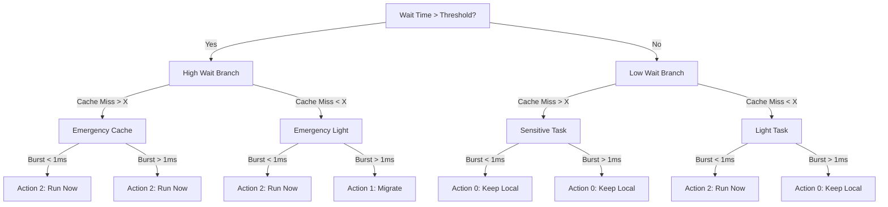

# SCX_RDTAI: Real-time Decision Tree AI Scheduler

SCX_RDTAI is an experimental scheduler built on the `sched_ext` framework. It uses a **Hybrid AI Architecture** where a high-level "Brain" in Rust optimizes scheduling policy, while a low-level "Muscle" in BPF executes decisions in nanoseconds using a multi-level Decision Tree.

## 🧠 The Decision Tree (Current Logic)

The scheduler implements a 4-level Binary Decision Tree with 15 nodes. Every time a task needs a CPU, BPF "walks" this tree based on real-time hardware telemetry.

### Decision Tree Diagram


## 🛠 Features
- **Wait Time (ns)**: Direct measurement of task starvation.
- **Cache Misses**: Integrated with hardware **PMU** (Performance Monitoring Unit) to protect cache-heavy tasks.
- **Burst Time (ns)**: Automatically identifies "Interactive" vs "Batch" workloads.
- **Dynamic Optimization**: The Rust Tuner adjusts thresholds every 100ms based on system utilization.

## 🏃 Actions Definition
- **Action 0 (Keep Local)**: Prioritizes cache locality. Keeps the task on its previous CPU to reuse warm caches.
- **Action 1 (Migrate)**: Prioritizes load balancing. Moves the task to a different CPU domain to prevent overloading.
- **Action 2 (Run Now)**: Prioritizes responsiveness. Ignores locality and balancing to get the task executing immediately.

## 📊 Monitoring
To see real-time tree decisions and hardware metrics:
```bash
sudo cat /sys/kernel/debug/tracing/trace_pipe | grep rdtai
```
Example Output:
`rdtai: task gcc[1234] tree action: 2 (wait: 500432, burst: 12000, cache: 15)`
